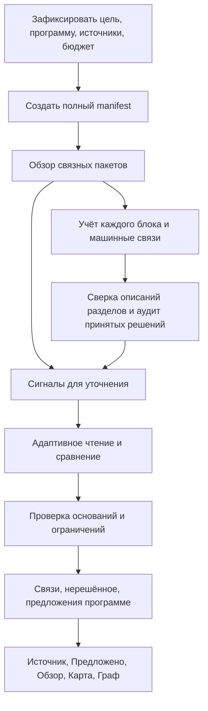

# Исследовательский протокол и исполнение

Это собственная адаптация для Tentex. Основания и границы переноса RLM/FrugalGPT описаны в [продуктовом исследовании](../COVERAGE_PLANNING/02-research-layer.md); экономия и качество здесь не объявляются доказанными. Сначала проверяется A/B, затем при наличии пользы подзадачи и разные модели.

## 1. Один контроллер, три вида работы

Общий worker получает `coverage_research` и вызывает предметный обработчик `coverage.research`. Он использует BackgroundJob, текущий ModelGateway и короткие транзакции, но не общий `_mark_finished`, который безусловно делает done=total. BackgroundJob.done/total отражают первичный manifest; дополнительные счётчики research/synthesis отдаются отдельно.

Контроллер определяет оставшуюся работу и лимиты, модель возвращает структурированное решение или разрешённое действие. Модель не задаёт внешний список blocks, не снимает manual и не подтверждает программу. Свободный код, shell и интернет не нужны для первого варианта. Документ может содержать инструкции, но это данные для анализа.

Исполнение первой версии последовательное внутри одного run: это проще контролировать и не умножает AI-параллелизм. Другие проекты используют уже существующие слоты. Часть углублений выполняется между пакетами, чтобы пользователь видел пользу рано; контроллер резервирует оценённый остаток первичного обхода и долю на итоговую сверку. Если резерва на всё не хватает, запуск может быть частичным с явным предупреждением; гарантируется учёт незавершённого, а не бесплатное завершение при любом бюджете.

## 2. Полный обзор

Перед обзором действует общий контракт подготовки: перечисленные адаптеры сохраняют структуру и локаторы, а известные потери извлечения обозначают отдельно. Разбиение и ограничения PDF/DOCX/MD/аудио/web/Typst конкретизированы в [разборе, §§5–6](05-architecture-review.md). Новый агент для нарезки материала не нужен.

1. Из manifest выбрать последовательные блоки одной структурной области в пределах token budget. Заголовки — ориентир, не доказательство смысла. Служебные блоки тоже входят, содержательные вкрапления не теряются.
2. Большой блок детерминированно разделить на интервалы. Передать target IDs/границы, контекстное окно и отдельный список context-only IDs. Лимит учитывает выход схемы и reasoning, а не только вход.
3. Передать профиль и дерево программы; для большого дерева — обзор ветвей и инструмент чтения любой ветви. Нельзя ограничить допустимые темы только результатом top-k поиска.
4. Получить для каждого target fragment/интервала: исход, topic IDs, назначения, supporting spans, необходимые context refs, alternatives/research signals. Отдельно — короткое описание содержания раздела **без принуждения к названиям программы**.
5. Проверить полноту и ссылки. **Изоляция обязательна, а не условна** (измерено 18.09.2026, [контракт §2](06-verified-contract.md#2-контракт-1-изоляция-пакета-обязательна)): единица публикации и receipt — решение по одному target, а не ответ модели. Корректные самостоятельные block results публикуются сразу; не прошедшее проверку решение остаётся нерешённым **в одиночку**. Отбраковка целого пакета вдвое снижает долю разобранного материала при большей стоимости. Никогда не засчитывать отсутствующий ID как outside.
6. Опубликовать допустимые машинные связи, создать/объединить вопросы исследования. Продвинуть счётчик только для полностью прочитанных блоков.

Внутри пакета использовать серверные короткие aliases и разрешать диапазоны одинаковых решений с исключениями. Код раскрывает их по порядку пакета, сверяет все targets и отдельно учитывает повторённые заголовки/шапки как context-only. Проверка границ не доказывает одинакового смысла всего диапазона: это отдельный предмет пилота. Сохранять целыми формулу с обозначениями, условие задачи, fenced code и строку таблицы, насколько позволяет лимит; слишком большой элемент имеет явное разбиение или context_unavailable, а не бесконечный retry.

Исход `outside_program` не означает `irrelevant_to_goal`. Выражение «продвинутая тема» также не повод отбросить фрагмент: его сохраняют и учитывают пожелания пользователя при рекомендации и предложении программы.

## 3. Как возникают задачи углубления

Сигналы модели: неразрешённая ссылка, конкурирующие темы, новая тема, конфликт определений, OCR/изображение, контекст за пределами пакета. Сигналы контроллера: последовательные outside/unresolved блоки, слишком широкие/повторяющиеся привязки, частично разобранный большой блок, несовместимые результаты одной пары. Сверка разделов дополнительно ищет концепции, которые первичная модель ошибочно спрятала внутри широкой темы.

Выборочный аудит включает случайные уверенные решения с фиксированным seed и рискованные: очень широкая тема, служебное с терминами, недостаточный контекст. Доля задаётся протоколом пилота. Самооценка confidence не является единственным фильтром. Аудит сильной моделью — дополнительное свидетельство, не эталон.

Объединять соседние сигналы только при общем вопросе и пересекающейся области, в пределах одного section/window limit. Межисточниковое сравнение хранит отдельные исходные области. Task key включает kind, scope, question fingerprint, snapshot/protocol version. Один сигнал не должен создавать бесконечные дубликаты.

Синтез включает все описания разделов порциями. Промежуточное сведение сохраняет первичные refs и нерешённые понятия; кандидаты группируются по терминам/ветвям, FTS и пересечению связей. Исследователь проверяет гипотезы по исходникам, включая уже linked блоки. Нет единственного запроса со всеми сводками и нет обязательного попарного сравнения всей коллекции. Потеря понятия в краткой сводке проверяется аудитом; полнота учёта не гарантирует полноту обнаружения смыслов.

## 4. Инструменты и память

| Инструмент | Проверяемый контракт |
|---|---|
| `read_range(material_id, revision, block/fragment_ids, cursor)` | Только разрешённые версии и предел ответа; exact IDs, текст, качество, continuation. Truncated=true требует продолжения для вывода о всей области |
| `read_neighbors(target, before, after)` | Контекст с заголовками; не меняет manifest state соседей |
| `read_section(target, cursor)` | Начало/структура раздела и порционное чтение; не выдаёт произвольные первые страницы за полную главу |
| `read_program(node_ids / branch / cursor)` | Текущий снимок цели и определений тем; полный доступ к разрешённому дереву |
| `search_materials(query, scope, cursor)` | BM25 по разрешённой области, актуальная версия, лимит, сведения об усечении. Отсутствие hits — не доказательство отсутствия темы |
| `read_evidence(result_id)` | Сохранённый результат с первичными refs, версиями и статусом; пересказ не заменяет оригинал |
| `inspect_page(page_ref)` | Если выбранная модель умеет vision и бюджет позволяет — оригинальная страница/asset через шлюз; иначе конкретная причина unavailable_visual, без догадки |
| `subquestion(question, bounded_scope)` | Только вариант C после эксперимента, один уровень, общий бюджет, результат с refs; у ребёнка этот инструмент отсутствует |
| `finish(result)` | Проверка target accounting, основания, причины остановки и конфликтов до публикации |

Начальная модель может возвращать JSON action вместо vendor-specific function calling: строгая схема шлюза уже есть. Разрешённые действия исполняет контроллер. Не создавать ChatSession, чтобы пользоваться инструментами exam-чата; вызывать доменные функции и проверять разрешения отдельно. Переиспользовать search_project_materials с обязательным ограничением scope, а не передавать результаты поиска других материалов модели и надеяться на prompt.

Поиск сейчас ограничен активной ревизией и числом результатов; полноценная cursor-пагинация инструмента — будущая доработка, не свойство нынешнего вызова. Проверка snapshot и FTS-query читают одну версию БД; несовпадение останавливает run до перепланирования. Результаты содержат actual revision и truncation. Для Typst полный обход идёт по опубликованному PDF; исходные chunks — дополнительный канал с explicit revision и пометкой coarse mapping. Текущий material_context с первыми тремя chunks не обеспечивает этот контракт.

Память задачи: вопрос, выполненные действия, подтверждённые источником наблюдения, противоречия, ссылки на evidence и оставшийся бюджет. Полные ответы сохраняются вне контекста в result/checkpoint, короткая сводка обновляется по мере необходимости. Сводка не может придумывать новую ссылку; все цитаты проверяются по исходной версии — **по смыслу, а не побайтово**, лестницей из четырёх ступеней ([контракт §3](06-verified-contract.md#3-контракт-2-опора-проверяется-по-смыслу-а-не-побайтово)). Побайтовое сравнение отклоняет верную по смыслу привязку из-за переписанной нотации; текст опубликованной опоры при этом всегда берётся из снимка, а не из ответа модели. Текст страниц не пишется в обычные логи. Hidden chain-of-thought не запрашивается и не сохраняется как основание.

Повтор того же чтения возвращает локальный результат. Новый вопрос может использовать прочитанный текст ещё раз, но неизменная последовательность действий без новых наблюдений заканчивается `no_new_evidence`. Для контекста из невыбранных источников требуется включённый context_scope; он влияет на расходы и зависимости, но не делает эти источники просмотренными.

## 5. Три сквозных трассы

### A. Ссылка в другой конец книги

Target A-42 ссылается на механизм, определённый в A-7. Контроллер не ограничивает исследователя соседями: neighbors → начало раздела → поиск термина/ссылки → A-7 → повторная сверка A-42 с определением и программой. Результат: target-связь к восстановлению по журналу, supporting refs A-7 и A-42; A-7 не получает автоматическую связь только из-за чтения. Если он действительно объясняет тему, это отдельное проверяемое решение, которое может быть опубликовано при собственной обработке или отдельной целевой задаче.

Если A-7 содержит повреждённую формулу, можно открыть исходную страницу. Если средство чтения недоступно — unresolved с причиной visual/OCR и доступным переходом, а не предложение пользователю выбрать тему наугад. Чтение target позже показывает «Нужный контекст» и обе страницы.

### B. Отсутствующая тема

14 соседних блоков outside плюс объяснения в лекции и широкой теме «Транзакции» образуют гипотезу «Журнализация». Синтез читает определения из каждой области, различает журналирование транзакций и лог приложения, проверяет всё дерево и цель. Для понимания восстановления предлагает отдельную тему и точные selected links. Для цели «SELECT» сохраняет материал вне текущей цели без навязывания добавления.

Число источников считает код по реально поддерживающим областям. Копии/версии одной книги не выдаются за независимые источники; при неизвестной независимости подпись «3 файла», не «3 независимых подтверждения». Добавление темы одной транзакцией связывает выбранное, но не снимает допустимые связи с прежней широкой темой. Остальных кандидатов из всей коллекции, в том числе распределённых, пользователь может отдельно проверить.

### C. Часто встречающиеся вместе темы

Изоляция и блокировки имеют общие blocks. Исследователь ищет примеры различия и другой механизм изоляции, а не только совпадения. При разных понятиях сохраняет две содержательные связи и может предложить необязательную смысловую связь. Предпосылка требует конкретного объяснения зависимости для целевого уровня, merge — доказательства дублирования именно учебных результатов. При разных теориях/нотациях сохраняются варианты с условиями применимости; их нельзя склеивать в одно «лучшее объяснение».

Если смысл понятен, но непонятно, хочет ли пользователь отдельную тему, это один сгруппированный вопрос о подробности программы. Если источники сами не дают основания, это unresolved/conflict, не обязательный опрос.

## 6. Условия машинной публикации и остановки

Автоматическая content-связь допустима, когда точный фрагмент раскрывает тему или содержит относящийся к ней пример/практику, необходимый контекст доступен, существенная конкурирующая трактовка разобрана. Число confidence не заменяет эти поля. Для definition/explanation вывод проверяется отдельно от наличия content. Формальные проверки гарантируют адресуемость и целостность, не смысловую истину; семантические условия калибруются на разметке.

Причины завершения участка: `evidence_sufficient`, `ambiguous`, `no_new_evidence`, `budget_limit`, `context_unavailable`, `provider_error`, `snapshot_changed`, `user_pause/cancel`. Только первый даёт окончательный смысловой результат; остальные могут сохранить проверенные независимые частичные связи, но не маскируют остаток.

Результат содержит target dispositions, exact refs, краткое объяснение, отвергнутые альтернативы с основаниями, прочитанный scope, изменения машинных связей, findings, stop_reason, а также происхождение каждого решения и уровень починки его опор. Результат углубления заменяет решение первичного прохода только тогда, когда сам прошёл проверку ([контракт §4](06-verified-contract.md#4-контракт-3-углубление-уточняет-первичный-проход-и-не-отменяет-его)). Валидатор проверяет, что ни один target не потерян, evidence относится к известным версиям, программа существует и ручное ограничение не нарушено. Лимит/ошибка не превращается в service или outside.

## 7. Модели, бюджет и сбои

Добавить роли `coverage_overview` и `coverage_research` в текущий roles.py. Обе могут использовать одну модель. **Сравнение проведено 18.09.2026** ([контракт §5](06-verified-contract.md#5-контракт-4-класс-модели-для-прохода-2)): дефолтная дешёвая модель настроек протокол не выдерживает, нижняя граница для обеих ролей — модель уровня той, что строит программу. Подмена недоступной модели требует видимого выбора, не скрытого fallback. В манифесте фиксировать requested/actual model, prompt/schema/tool versions, параметры, источник цены и разрешённые модальности.

Общий ledger запуска связан с AiRun: completed usage + active reservations + uncertain usage. До **каждой транспортной попытки**, включая schema-repair и retry внутри gateway, проверять общий остаток и резервировать верхнюю оценку. Текущего daily limit недостаточно для бюджета отдельного исследования; расширить gateway необязательным budget context, без изменения поведения старых ролей. Не умножать retry шлюза на неограниченный retry исследователя. Cache hit отражается как reuse, не повторная оплата.

Если цена или usage недоступны, показывать оценку/неизвестность и ограничивать calls/tokens/time; денежный hard cap не обещать. После сбоя между запросом и записью ответа сохранять uncertain attempt, не освобождать резерв как точно бесплатный. Автоматический повтор допускается только в оставшемся безопасном лимите; иначе требуется продолжение после просмотра расходов. Receipt защищает данные от дубликатов, но не обещает exactly-once оплату провайдера.

Пауза — intent в checkpoint, проверяемый между действиями. Текущий уже оплаченный вызов может завершиться; ответ сохраняется, публикация проверяет intent и версии. При pause можно сохранить валидный текущий результат и остановиться на checkpoint; при cancel поздний ответ только диагностический. В интерфейсе до остановки «Останавливаем после текущего вызова». Lease heartbeat продолжает работать при ожидании модели. После паузы job.state=paused, resume возвращает queued с тем же run; cancel терминален, новый явный запуск может переиспользовать сохранённые результаты.

Несовместимый snapshot_changed завершается через cancelled с отдельной причиной, а не остаётся вечной paused-задачей. Если источник изменился во время обычной паузы, попытка resume сначала проверяет snapshot, завершает несовместимый job и предлагает новый preflight. Поздний ответ такого запуска не публикуется. Изменения только порядка/отображения, не меняющие семантический snapshot, не требуют остановки.

Отмена из общей панели «Фон» через background.registry для нового kind вызывает тот же coverage control service. Нельзя оставлять два пути с разной трактовкой pause_requested. Pause не является cancel; cancelled не разрешает позднюю публикацию, даже если обычный общий handler раньше делал иначе.

Нынешний `registry.cancel_job` этого ещё не позволяет, и одной маршрутизацией вызова не обойтись. У него два перехода — `queued → cancelled` и `running → pause_requested`; отдельного намерения «пауза» там нет вовсе, `pause_requested` **и есть** сигнал отмены, а для любого другого состояния бросается `background_job_not_cancellable`. Значит запуск, вставший на паузу по `budget_limit` или по просьбе пользователя, из общей панели отменить нельзя. В И2 добавляется переход `paused → cancelled` и различение намерений pause и cancel для нового kind; остальные виды задач сохраняют текущее поведение, включая нынешнюю трактовку `pause_requested` как отмены.

Таймаут нужен на transport/action и на квант работы между checkpoint, а не старый предел 900 секунд на весь многокнижный запуск. Передача управления в `queued` после конечного кванта нужна ради отзывчивой паузы и чистого продления lease, а не ради освобождения слота: полос AI сейчас восемь (`worker_ai_concurrency`), и один длинный запуск их не занимает. Обратная сторона кванта — `execution_generation` меняется часто, поэтому клиенту он не показывается (см. [данные §2](01-data-and-consistency.md#2-минимальные-дополнения-к-схеме)). Публикация требует действующий lease_owner/generation, поэтому оживший старый worker не может перезаписать нового. Эти изменения ограничены новым kind.

## 8. Первый проход

Быстрый путь не переделывается: оглавления, поиск по цели, ручной редактор и чат программы уже существуют. Мастер может создать проект и поставить исследование после успешной активации; не запускать pass2 на ещё меняющемся draft.

Проверка непустой программы относится только к pass2. `deep_program` допускает пустое дерево в существующем черновике и создаёт предложения первой программы через его draft revision; не активирует проект самостоятельно. Для draft apply/undo использует действующие правила мастера, а не active-only проверку Binding. Поскольку pass1 не публикует привязки, это не расширяет допуск pass2 к черновикам.

Условный полный проход «Углублённо изучить источники» использует тот же snapshot/manifest и чтение разделов, но другой output: самостоятельные понятия, учебные результаты, варианты структуры и предпосылки с источниками. Reduce сравнивает их с целью и текущим деревом и создаёт findings/диф; программу и привязки сам не меняет. Покрытие pass2 не засчитывается автоматически из сводок pass1. Совместимые evidence разрешено использовать повторно при проверке.

Основание включения: на контрольных учебниках outline/search систематически пропускают необходимые для цели концепции, а чтение содержания исправляет это в допустимом бюджете. Если основание не получено, полный проход остаётся отложенным с сохранённым контрактом и этапом; исследование pass2 и граф от него не зависят.
