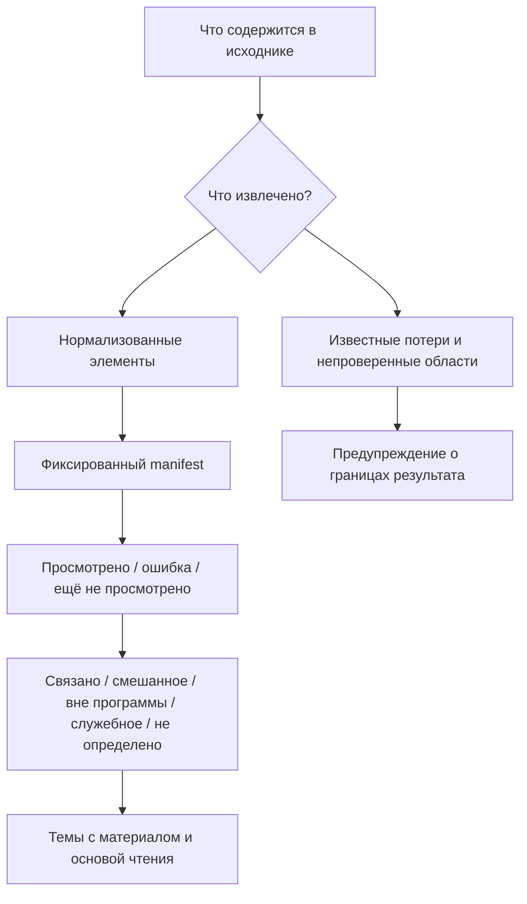
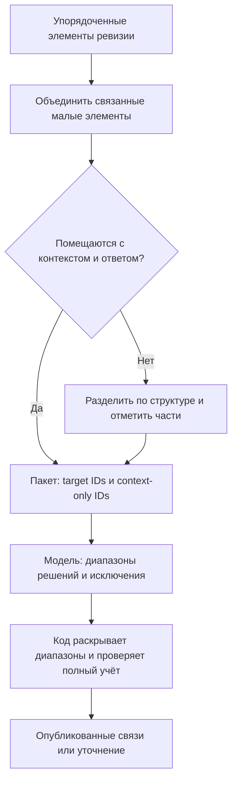
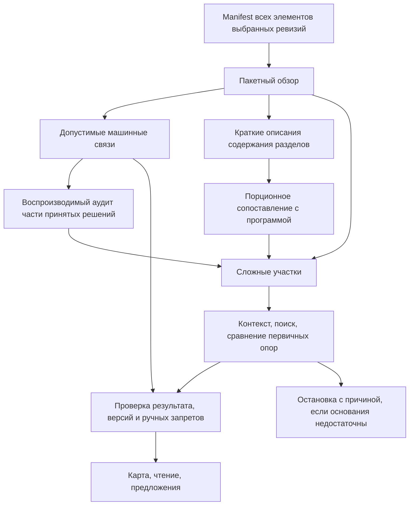
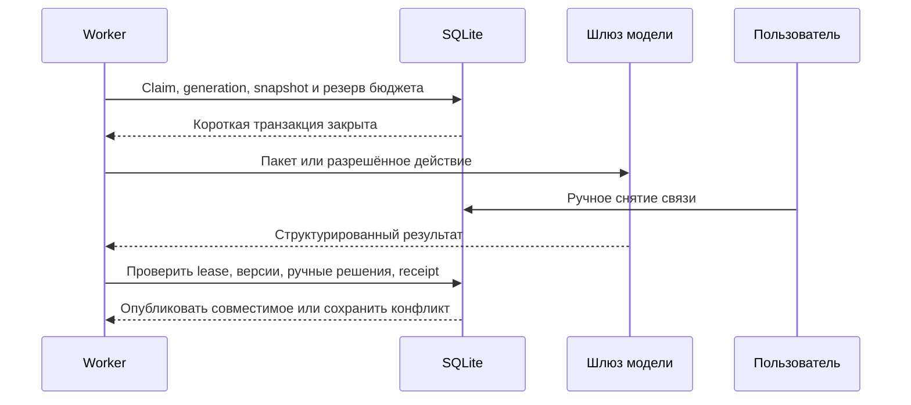

# Исследование материалов и двустороннее покрытие: разбор решений для курсовой

**18.09.2026 · база кода `e4d1475` · проектирование, не реализованная функция.** Документ проверяет [план интеграции](README.md), уточняет его и даёт обоснование для пояснительной записки и ТЗ. Код приложения не изменён. Проверки ниже выполнены на синтетических данных без вызовов моделей и без рабочей БД.

**Дополнено после прогонов на стенде (18.09, вечер).** Часть допущений этого разбора проверена на реальных учебниках с реальными вызовами; результаты и обязательные следствия — в [контракте П5](06-verified-contract.md). Числа §8 остаются расчётом, а не замером: сравнения «пакеты против отдельных запросов» на одном корпусе не проводилось. Где этот документ расходится с контрактом, действует контракт.

Для чтения: §§1–4 — проблемы и модель данных; §§5–8 — алгоритм, форматы и экономия; §§9–12 — надёжность, состав функций и приёмка. [Интерактивная обзорная схема](diagrams/research-overview.html) дополняет точные схемы ниже. Основное решение: **полный детерминированный учёт нормализованного материала, пакетное сопоставление с программой и ограниченное исследование сложных мест**. Это обоснованная адаптация идей RLM, а не заявление о реализации исходной RLM-архитектуры.

## 1. Что оставить и что исправить в предыдущем плане

Хорошая основа уже есть: общий материал с опубликованными ревизиями; фрагменты с координатами и временными метками; проектная программа и привязки; единый worker; шлюз моделей; ручной контроль; три представления покрытия. Их замена увеличит объём курсовой и риск регрессий без доказанного выигрыша.

| Приоритет | Найденная проблема | Решение | Практический результат |
|---|---|---|---|
| Обязательный | Полнота blocks принималась за полноту исходника | Отдельно учитывать возможности/потери извлечения и обработку manifest | Нельзя показать «вся книга исследована», потеряв таблицу до pass2 |
| Обязательный | Блок по заголовку может быть всей лекцией или одним ложным заголовком | Сохранить блок как структуру, пакеты модели строить независимо по элементам и token budget | Единый алгоритм для книг, TXT и транскриптов |
| Обязательный | Флаги OCR/координат не равнозначны смысловой читаемости | Передавать происхождение, качество, missing-content и locator reliability | Система отличает неизвестное содержание от служебного |
| Обязательный | Повтор всей программы и UUID для каждой мелкой строки дорог | Один контекст на пакет, локальные aliases, диапазоны одинаковых решений | Меньше служебных входных и выходных токенов без пропуска исходников |
| Обязательный | Глобальный synthesis может сам стать длинным контекстом | Порционное сведение описаний разделов; проверка кандидатов по оригиналам | Ограниченный размер каждого вызова, нет сравнения всех блоков со всеми |
| Обязательный | Имеющийся FTS индексирует только активную ревизию | После смены ревизии завершать устаревший run с причиной и перепланировать | Инструмент не подмешивает новый текст в старый снимок |
| Упрощение | Отдельная таблица 1:1 для метаданных Binding | Добавить небольшие nullable-поля в Binding; доказательства оставить в результатах задач | Пять новых таблиц вместо шести, без отдельного join для каждой связи |
| Упрощение | «Агентность» может разрастись в платформу с подагентами | Один контроллер, один протокол действий, одна очередь; подзадачи только при доказанной пользе | Алгоритм можно объяснить и воспроизвести на защите |

Упрощение схемы не является измеренным ускорением SQL. Оно уменьшает число сущностей и мест записи; фактическую скорость надо измерить. Не убираем manifest, ручные запреты, версии или причины остановки ради уменьшения количества таблиц.

## 2. Проверенные факты текущего кода

В этой сессии инструменты codebase-memory-mcp не предоставлены, поэтому выполнено адресное чтение исходников. Пути ведут в текущую копию проекта; база проверки зафиксирована выше.

| Код | Факт и следствие |
|---|---|
| [storage.py](../backend/app/materials/storage.py), [native.py](../backend/app/materials/parsers/native.py) | Whitelist обычной загрузки: PDF, DOCX, TXT, MD, JPG/JPEG/PNG, MP3/WAV/M4A/OGG/FLAC. Не обещать PPTX/XLSX/EPUB как уже поддержанные |
| [segmentation.py](../backend/app/materials/segmentation.py) `build_blocks` | Каждый heading начинает блок; прочее продолжается до следующего heading. Нет ограничения длины и отдельного дерева разделов. Название «Предисловие» сразу помечает весь блок служебным |
| [native.py](../backend/app/materials/parsers/native.py) `_docx_page` | Обход document.paragraphs и изображений; таблицы не обходятся. Нужен упорядоченный обход Paragraph/Table и диагностика остальных объектов |
| Там же `parse_text_page` | Построчная эвристика; `#` внутри fenced code может стать заголовком, таблицы Markdown теряют тип |
| [external.py](../backend/app/materials/external.py) | HTML превращается в простой текст; таблицы/заголовки/медиа не сохраняются как исходная структура. YouTube сохраняет текстовые timestamps, не duration каждого сегмента |
| [audio.py](../backend/app/materials/parsers/audio.py) | Faster-whisper, одна логическая страница, time_from/time_to у сегментов; язык принудительно ru. Page quality возвращается native, хотя это результат ASR |
| [base.py](../backend/app/materials/parsers/base.py), [library.py](../backend/app/materials/library.py) | ParsedElement имеет bbox_reliable; element_to_json/element_to_parsed его не сохраняют. После round-trip False превращается в True |
| [context.py](../backend/app/materials/context.py), [typst.py](../backend/app/materials/typst.py) | Typst context выбирает до 3 chunks активной ревизии; source_chunks даёт грубое сопоставление каждого chunk со всеми страницами. Этого нельзя использовать как полный или точный контекст pass2 |
| [search.py](../backend/app/bindings/search.py) `reindex_material` | FTS содержит только активную ревизию. Материал прошлой версии нельзя «искать по снимку» простым вызовом нынешнего поиска |
| [models.py](../backend/app/models.py), [revisions.py](../backend/app/materials/revisions.py) | Старые опубликованные страницы/фрагменты сохраняются; происхождение ревизии существует. Не нужно дублировать полный текст в CoverageRun |

### Минимальные воспроизведения

Локальный Python импортировал действующие функции проекта. TemporaryDirectory использован для DOCX; сеть, БД и OCR-модели не запускались. Результат 18.09.2026:

| Вход | Наблюдение |
|---|---|
| DOCX: абзац → таблица с UNIQUE_TABLE_FACT → абзац | Маркер таблицы отсутствует в plain_text |
| Markdown: fenced Python с `# Not a document heading` | Внутренняя строка стала heading |
| `[00:10] First explanation` и `[01:15] Second explanation` | time_from/time_to обоих элементов = None |
| Заголовок «Предисловие» и два содержательных абзаца | Один service-блок preface со всеми тремя элементами |
| ParsedElement с bbox_reliable=False → JSON → ParsedElement | bbox_reliable=True |
| HTML-таблица Term/Meaning, WAL/Log | Только текст `Term Meaning WAL Log`, без структуры ячеек |
| 100 строк без заголовков | 100 элементов, один блок |

Это свидетельства конкретных ограничений, не оценка качества всех файлов. На этом основании нужны исправления подготовки данных до оценки семантики моделей. Тесты на реальные формулы, слайды, вложенные таблицы и длинное аудио ещё не выполнены.

## 3. Модель данных: оригинал → элемент → пакет → решение


**Разделить назначения, а не размножить хранилища.** Page/Fragment/Block уже существуют. Пакет — список локаторов существующих фрагментов/частей в coverage_tasks, не новая копия текста и не новый глобальный «семантический блок». У одного фрагмента возможны разные назначения и темы. Смысловые связи принадлежат проекту; извлечение и структура — общему материалу.

Уровни заголовков восстанавливают section path стеком при последовательном проходе. Этот путь сохраняется в manifest/сводке как производная структура; отдельный универсальный граф документов не нужен. Раздел без надёжных заголовков получает искусственную границу рабочего окна с явной отметкой, но не выдуманное название главы автора.

### Что добавить, что переиспользовать

| Данные | Размещение и причина |
|---|---|
| Исходники, версии, элементы, фрагменты | Существующие Material/MaterialRevision/Page/Fragment; один источник истины |
| Запуск, scope, snapshots, limits | coverage_runs; lifecycle только в BackgroundJob |
| Участие каждого блока и его результат | coverage_block_results; включение пустых/нечитаемых областей явно |
| Пакеты, уточнения, сведение, receipts | coverage_tasks; состояния локальной работы, без второго worker/брокера |
| Кандидат темы/предпосылки/merge/split | coverage_findings; ещё не часть программы |
| Личный выбор, отказ, запрет восстановления | coverage_decisions; должен пережить смену fragment ID |
| Текущая связь | Существующий Binding с semantic_kind, roles, evidence_ref, semantic_revision; старое значение unknown |
| Расходы и вызовы | AiRun и context_manifest + ограниченные attempt receipts в задаче; не новый журнал биллинга |

Поля Binding добавляются обратно совместимо, а экзаменационные потребители продолжают использовать прежние статусы. evidence_ref указывает на версию результата задачи и локальный ключ; полный JSON результата не копируется в каждую связь. manual/confirmed/removed защищают пользовательский выбор; ручная корректировка роли имеет свой decision и приоритет над машинной меткой. Актуальность вычисляется по версиям зависимостей; сохранённый stale-флаг допустим как обновляемая проекция, но не вторая независимая истина.

semantic_revision — локальная версия назначения связи для конкурентной правки, не номер parse revision. Исходные ревизии и fingerprints доступны через evidence_ref. При ручном назначении основание и авторство хранятся в decision, ссылка на машинный результат не выдумывается. Метаданные возможности извлечения сохраняются в MaterialRevision.summary и diagnostics; отдельной шестой таблицы для них не нужно.

Пять новых таблиц сохраняют пять разных сроков жизни и задач. Слияние всех в BackgroundJob.checkpoint упростило бы миграцию, но усложнило бы фильтры, частичное применение и восстановление. JSON оставляем для ограниченных payload, типизированные индексируемые поля — для отбора по проекту, run, material, kind/state и topic.

### Локатор

Обязательны material_id, revision, fragment_id и тип адреса. Типы адреса: page+bbox; logical-unit+element-order; time_from/time_to; Typst path+line-range как дополнительная опора. Синтетический bbox TXT или ASR не является координатой реальной страницы. Добавить/сохранить locator_kind и bbox_reliable в сериализации элементов и выдаче; time и structural origin передавать без реконструкции из красивой подписи.

Для DOCX/MD пользователь видит «Раздел …, абзац …», для аудио «12:08–12:36», для PDF «стр. 42». Слово «страница 1» в БД не должно быть единственным адресом всей часовой лекции. Asset и original source остаются доступны при проблеме распознавания.

Текущий RecognitionSource не содержит ASR, а ElementKind — отдельного code. Эти значения нельзя просто начать писать только в одном parser. В И0а согласовать хранение происхождения и code/table structure от ParsedElement через JSON/Fragment до viewer и контекста; существующее строковое element_kind не требует отдельной таблицы. ASR не является разновидностью OCR, а native quality не доказывает точность речи. Источник распознавания и его диагностические признаки должны передаваться отдельно от старого PageQuality; изменения enum требуют миграции и проверки потребителей.

## 4. Три полноты вместо одного вводящего в заблуждение процента



1. **Подготовка:** перечислить известные типы элементов, ошибки страниц, неподдержанные объекты и неоценённое визуальное содержание. Нельзя честно измерить процент неизвестного содержимого исходника по одному извлечённому тексту. Использовать capability/diagnostic flags, не выдуманный extraction completeness=100%.
2. **Просмотр:** какие элементы/блоки manifest получили успешный учитываемый ответ. Это полнота работы системы на выбранном представлении.
3. **Покрытие:** сколько программы обеспечено содержательными связями и какие части материалов в программу вошли. Наличие определения+объяснения — отдельная характеристика основы чтения. Знание пользователя здесь не измеряется.

Пример подписи: «Все 120 блоков подготовленного текста просмотрены. В 4 областях изображения не исследованы; 7 блоков остаются неопределёнными». Запрещена замена этого текста на «Материал изучен полностью».

Основную обратную метрику сохраняем в блоках по плану, но с оговоркой: один гигантский TXT-блок и одна короткая глава не сопоставимы по объёму. Поэтому рядом показывать распределение элементов и прочитанный объём **внутри одного материала**, без смешанного процента из секунд, страниц и токенов разных типов. В mixed-блоке явно показать известные части и неизвестный остаток. Между ревизиями с другим разбиением сравнивать сами диапазоны/смысловые связи, а не изменение числа blocks как улучшение качества.

## 5. Подготовка всех поддержанных семейств

Формат контейнера, способ извлечения и жанр документа — разные признаки. PDF может содержать книгу, слайды, задачи и сканы одновременно. Поэтому сначала определить технический путь по формату, затем учитывать структуру конкретной области. Не запускать платный «агент определения типа файла» для каждого документа.

| Семейство | Действующий путь | Рекомендуемое уточнение и честная граница |
|---|---|---|
| PDF с текстом | PyMuPDF/layout, физические страницы, элементы | Сохранить порядок колонок, заголовки, таблицы/формулы/assets; текстовый слой не доказывает полноту векторной схемы |
| Скан PDF, смешанный PDF | Локальный/облачный OCR по страницам | Выбирать путь по странице/области; не OCR-ить повторно качественный текст. Плохая область остаётся unresolved, оригинал доступен |
| JPG/JPEG/PNG | Одна страница и OCR/vision | Изображение может быть схемой без слов. Отсутствие OCR-текста не означает пустую/служебную страницу |
| DOCX | Одна логическая страница, абзацы, изображения | Использовать document.iter_inner_content для Paragraph/Table в исходном порядке; рекурсивно обработать содержимое ячеек. Диагностировать text boxes, revisions, неподдержанную математику/объекты; не заявлять извлечение всего ZIP-содержимого |
| TXT | UTF-8, строки | Собирать абзацы, учитывать пустые строки/нумерацию; при отсутствии структуры bounded windows, без требования оглавления |
| Markdown, вставленный текст | Тот же построчный parser | Уважать fenced code, heading, списки, таблицы, формулы и ссылки. Первый шаг — выбрать и закрепить совместимый parser; проверять установленный пакет, не писать полный Markdown-парсер с нуля. Локальные недоступные assets отмечать, не скачивать внешние изображения молча |
| Аудио MP3/WAV/M4A/OGG/FLAC | Faster-whisper и временные сегменты | Сгруппировать соседние сегменты до границ фразы/паузы и token budget; сохранить время каждого. ASR обозначать как распознанную речь; ru не применять молча ко всем языкам, использовать выбранный/определённый язык |
| Субтитры YouTube | Локальный MD-снимок | При получении сохранять start/duration и источник субтитров; display Markdown отдельно от структурных time anchors. Старые текстовые stamps можно восстановить приблизительно, последнее окончание не выдумывать. Исследуются субтитры, не видеоряд |
| Статья по URL | Локальный Markdown-снимок извлечённого HTML/plain | Сохранять заголовки, таблицы и ссылки при преобразовании; область article/main при наличии, без молчаливого удаления содержания. Снимок может быть неполон из-за JS/доступа — это видимая граница. Нет обещания прочитать весь сайт |
| Typst: файл/ZIP/папка | Bundle → опубликованный PDF + source_chunks | Полный manifest по представлению PDF. Raw Typst запрашивать дополнительно по достижимым chunks для формул/определений, с explicit revision. Coarse page mapping не выдавать за точный. `.bib`, `.csv`, картинки внутри bundle не становятся отдельными материалами и не считаются дважды |

Готовый упорядоченный обход DOCX есть в уже используемой библиотеке; отдельный конвертер ради Paragraph/Table не нужен. При этом документация предупреждает об ограничениях списков paragraphs/tables для некоторых объектов, поэтому диагностика остаётся обязательной. [python-docx: Document](https://python-docx.readthedocs.io/en/latest/api/document.html).

PPTX, XLSX/CSV как отдельные материалы, EPUB, HTML-файл, произвольные архивы и видеофайлы сейчас не входят в whitelist. Для ТЗ надо либо перечислить их как отложенные, либо добавить отдельную вертикаль адаптера и приёмки. В данной редакции они **не включаются молча** под фразу «все типы файлов». Если нужны слайды сейчас, поддерживается экспорт в PDF с обозначенными ограничениями; это не нативная поддержка PPTX.

## 6. Умное разбиение без отдельного агента-сегментатора

### Правило границ

Поток элементов → section path → группы тесно связанных элементов → пакеты в пределах входного и выходного бюджета. Исходные IDs/порядок сохраняются. Малые соседние элементы объединяются, большой — делится; разделение не изменяет исходную ревизию и привязки.

| Содержание | Что сохранять вместе | Как делить слишком большое |
|---|---|---|
| Объяснение | Заголовок, абзац и определение, на которое он прямо ссылается | По абзацам, затем предложениям; последняя вынужденная граница отмечается |
| Формула | Выражение, расшифровка обозначений, ближайшие условия применимости | Формула целиком, объяснение порциями; огромная нечитаемая формула требует другого представления |
| Таблица | Заголовок/подпись, схема столбцов, логические строки | По строкам с повторением шапки как context-only; широкая строка отдельно с отмеченными колонками, без потери связей ячеек |
| Код/алгоритм | Заголовок, fenced block, вход/выход/условия | По функциям/шагам или строкам при вынужденном лимите; не распознавать комментарии как заголовки книги |
| Задача | Условие, рисунок, связанные варианты ответа | Отделять задачи по явной нумерации, не разрывать вопрос и его данные; решение отдельно с relation к условию |
| Слайд PDF | Страница, заголовок, подпись и схема | Несколько соседних слайдов только если помещаются; смена страницы не доказывает смену темы |
| Речь | Несколько последовательных utterances и границы времени | До лимита по сегментам; малая пауза — подсказка, не обязательная смена темы |

Планировщик использует token budget выбранной модели с запасом под output/reasoning. При недоступном точном tokenizer применяется консервативная оценка и проверка preflight; фиксированное «символы / 4» не считается точным для русского текста, таблиц и кода. Предел размера применяется и к одному элементу: oversized input не может навсегда застрять в бесконечном retry.



Идея «структурные границы → ограничение токенов → объединение малых соседей» имеет готовый пример в HybridChunker Docling. Там же есть повторение заголовков таблиц. Это основание адаптировать алгоритм поверх существующих элементов Tentex, а не основание немедленно заменить весь parser на Docling или добавить векторный поиск. [Docling: Chunking](https://docling-project.github.io/docling/concepts/chunking/).

### Компактный протокол ответа

В одном пакете сервер задаёт aliases `F1…F30`, `T1…T12` и хранит их отображение на UUID+revision. Модель возвращает, например:

```json
{
  "assignments": [
    {"from": "F1", "to": "F4", "topic": "T3", "roles": ["explanation"], "evidence": ["F2"]},
    {"from": "F5", "to": "F5", "outcome": "outside_program"}
  ],
  "unresolved": [{"from": "F6", "to": "F7", "reason": "needs_definition"}]
}
```

Это иллюстрация части схемы, не готовый API. Диапазон определяется порядком элементов **этого пакета**, не сортировкой UUID и не страницами. Код раскрывает spans, проверяет принадлежность, пробелы/перекрытия и все target IDs. Несколько тем допускаются отдельными assignments, но coverage accounting у каждого target один. Остаток нельзя считать service по умолчанию. Общая цитата F2 не доказывает автоматически каждый F1–F4: семантический валидатор/аудит проверяет распространение роли на весь диапазон.

Выходные роли и enum человекочитаемы; сокращать названия до непонятных цифр ради пары токенов не нужно. Не повторять полный текст исходника в ответе: короткая опора и locator достаточно, оригинал доступен отдельно.

## 7. Исследовательский алгоритм, который можно защитить



**Слой 1:** каждый target участвует в обязательном обзоре; машина связывает содержание, выделяет mention/context, outside, service и unresolved. Служебный заголовок — подсказка, не разрешение пропустить всё под ним. Чистый повтор колонтитула можно учитывать детерминированно при сохранении доказательства повтора; порог/ошибки проверять на fixtures.

**Слой 2:** уточнение конкретного вопроса и синтез коллекции. Исследователь читает соседей, начало раздела, далёкие определения, сравнивает программу и источники, при необходимости смотрит страницу. Содержимое материалов не является инструкцией для него. Доступ ограничен объявленным scope проекта.

**Синтез:** все описания разделов участвуют в bounded batches. Короткие извлечённые понятия и термины помогают собрать кандидатов по разделам/ветвям и FTS; overlap текущих связей даёт кандидатов похожих тем. Затем модель сравнивает кандидатов с исходниками. Не вычислять все пары блоков и не посылать все сводки одной растущей строкой. Слияние сводок сохраняет ссылки и список нерешённых понятий; уверенная потеря понятия в сводке проверяется выборочным аудитом исходников. Новые темы ищутся и среди уже linked, не только outside.

Маленькая программа передаётся полностью. Большая — компактные названия/пути и определения релевантных ветвей, остальные доступны инструментом. Кандидаты FTS ускоряют доступ, но для «темы нет» нужно проверять дерево, а не отсутствие в top-k. Новые синонимы из источников могут расширять поиск, но не становятся утверждёнными определениями темы сами.

**Остановка:** достаточно оснований; нет новых сведений; неоднозначность; недоступный контекст; лимит; техническая ошибка; изменённый снимок; пользовательская остановка. Только первая означает смысловое решение участка. Неисполненное остаётся видимым. Полнота обхода и качество понимания не смешиваются.

RLM обосновывает внешний доступ к большому контексту и его выборочное исследование с возможностью подзадач. В Tentex первоначально достаточно ограниченных предметных инструментов; REPL и рекурсивное дерево агентов не обязательны. Статья не измеряет качество этой адаптации на учебниках Tentex. [Zhang, Kraska, Khattab, Recursive Language Models, v3](https://arxiv.org/abs/2512.24601v3).

Эксперименты Lost in the Middle показывают, что у исследованных моделей качество использования длинного контекста зависело от положения нужной информации. Это аргумент проверять связные ограниченные окна, а не считать максимальное окно гарантией качества. Перенос численных результатов на выбранную современную модель без проверки недопустим. [Liu et al., Lost in the Middle](https://arxiv.org/abs/2307.03172).

## 8. Где ожидается экономия и как её проверять

Пусть N — число малых единиц; L — средний текст единицы; P — повторяемые инструкции и программа; H — служебные данные; k — единиц в пакете; W — дополнительный контекст пакета; Hb — его метаданные. Для равномерного примера:

`T_single = N × (L + P + H)`

`T_batch = ceil(N/k) × (kL + P + W + Hb)`

Последний неполный пакет в точном расчёте считается по фактическому тексту. Эти выражения оценивают **входные токены**, не деньги и не общий расход reasoning/output/vision/retries.

Иллюстрация, не замер: N=1200, L=300, P=2400, H=50, k=8, W=300, Hb=80. Отдельные запросы: 3 300 000 входных токенов. Пакеты: 777 000, арифметическое сокращение 76,45%. Если 30 участков углубления требуют ещё по 4000 входных токенов, итог 897 000, сокращение 72,82%. Удорожание вывода, ошибки пакетирования и другое качество моделей могут изменить итоговую выгоду. Порог равенства в этом примере — ещё 2 523 000 входных токенов дополнительных действий; финансовый порог иной при разных ценах ролей.

| Оптимизация | Что экономит | Чем рискуем / ограничение | Как проверить |
|---|---|---|---|
| Связные пакеты | Повторы P и число запросов | Большой ответ, размытые границы | A/B с одинаковой моделью и полным учётом |
| Spans и aliases | Длинные UUID, повторные роли, текст ответа | Ошибка диапазона может размножить неверную связь | Точные fragment-level precision/recall, размер JSON, malformed cases |
| Контекст по необходимости | Массовые большие окна вокруг простых мест | Триггер пропустил уверенную ошибку | Аудит уверенных решений и missed-trigger rate |
| Один и тот же прочитанный участок | Локальную загрузку/сборку; иногда повторный модельный вызов | Кэш не знает новую цель/вопрос | Reuse только при совпадении dependency/protocol fingerprints |
| Пересчёт по зависимостям | Повторное чтение неизменного | Отрицательный поиск зависит от всего scope | Новая тема/книга меняет прежние negative results |
| Fast/strong cascade | Дорогие вызовы сильной модели | Сильная наследует неверный пересказ дешёвой | Обе читают первичные опоры; сравнить с single-model |

**Что из этой таблицы уже измерено (18.09).** Ни одна строка не проверена как заявленная оптимизация: сравнений «с оптимизацией против без неё» на одном корпусе не было, кроме изоляции пакета, которой в таблице нет. Известен только фактический порядок стоимости целого прохода на выбранной модели: **$0,20 за 424 блока** учебника по ОС и **$0,25 за 669 блоков** методички по автоматам, включая углубление и синтез. Это ориентир для лимитов, а не подтверждение расчётной экономии 72–76%.
| Vision только нужных областей | Изображения целых страниц и повторный OCR | Неувиденная схема и неверный crop | Known visual cases, надёжность bbox и fallback whole page |
| Структурные сведения один раз | Повтор extraction/section path | Межпроектное смешение смысла | Переиспользовать общую структуру, не project-specific решения |

Реальное prompt caching провайдера не предполагается. Даже cache hit приложения не всегда означает бесплатный полный pipeline. Полная история tool responses не передаётся заново в каждом шаге: компактное состояние задачи и прямой доступ к evidence. Краткая сводка не может заменить первичные основания при итоговом сравнении.

Каскады моделей имеют исследовательское основание, но выбор дешёвой/сильной роли и порога эскалации нужно калибровать отдельно. Экономию из FrugalGPT не переносим на Tentex. [Chen, Zaharia, Zou, FrugalGPT](https://arxiv.org/abs/2305.05176).

Однопроходная подготовка пакетов линейна по объёму нормализованного содержимого при инкрементальном подсчёте размера: не токенизировать весь растущий пакет заново после каждого элемента. Стек заголовков обрабатывается за O(E); сохранение развёрнутых путей дополнительно стоит их суммарной длины. Перекрывающийся context должен иметь ограничение, иначе линейность теряется. Синтез не обещает линейного числа модельных действий при произвольной неоднозначности: его ограничивают budgets и batching. Для SQL нужен измеренный query plan, а не обещание ускорения из числа таблиц.

## 9. Надёжность без распределённой платформы



Не добавлять Redis, брокер и отдельную графовую БД: действующие SQLite WAL, BackgroundJob и AiRun дают основу, которую план расширяет бюджетом запуска, точной паузой и generations/receipts. Один выполняемый исследовательский запуск на проект не мешает читать и редактировать; сеть вне write transaction. Generations/receipts защищают от позднего worker и повторной публикации, а не гарантируют однократную оплату провайдера.

Дневной бюджет и бюджет запуска учитывают каждую попытку gateway, schema repair и неизвестный расход после обрыва. Более сильная модель недоступна — видимая остановка/выбор, без скрытой подмены. Pause и cancel имеют один путь управления через экран и панель «Фон».

Предварительный разбор файла имеет собственную историю расходов; ранее оплаченный OCR не становится расходом pass2 повторно. Если исследователь вызывает vision или дополнительное распознавание, этот вызов входит в его лимит. Preflight сам не запускает платную обработку под видом оценки.

При публикации новой ревизии run со старым snapshot останавливается до следующего чтения/публикации: job=cancelled, stop_reason=snapshot_changed. В UI — «Остановлено: материалы изменились», а не обвинение пользователя в отмене. Старый результат остаётся доступным для истории; новый явный run переиспользует совместимые receipts и актуальные точные anchors. Не оставлять несовместимый run paused: его нельзя продолжить, но он заблокировал бы новый запуск. Проверка активных ревизий и поиск выполняются в одном коротком read snapshot; публикация снова проверяет версии после внешнего вызова. Это проще и честнее второго FTS-индекса всех исторических версий. В будущем потребность продолжать старые snapshots параллельно потребует отдельного индекса/поиска; сейчас такой функционал не обещается.

Ручные запреты нельзя переносить только по порядковому номеру. Нужны материал, ревизия, точный текст/asset anchor и тема; неоднозначность отображается. Исправление OCR не делает прежнюю машинную трактовку подтверждённой. Уроки сохраняют точные источники и порядок, изменения карты не переписывают их автоматически.

## 10. Конкретный состав функций для ТЗ

Формулировки ниже — рекомендуемая окончательная граница этой подсистемы. Они не означают, что код готов или что все пункты уже входят в сданный внешний DOCX. В STATUS.md есть отметка о сдаче ТЗ 17.09; пользователь сообщает о предстоящей сдаче. Внешний файл ТЗ в этой работе не открывался и не редактировался, потому здесь нет утверждения о его актуальной версии.

| ID | Проверяемое требование | Что показать при приёмке |
|---|---|---|
| ИМ-01 | Подготовка перечисленных в §5 поддерживаемых семейств с версиями и адресуемым содержимым | По одному представителю, корректный locator; выявленные неподдержанные элементы отмечены |
| ИМ-02 | Отдельные состояния подготовки, просмотра и смыслового решения | Неуспешный OCR и неразобранная схема не исчезают за 100% |
| ИМ-03 | Программа из оглавлений/цели или вручную, редактирование и подтверждаемые дифы | Несколько источников, пользовательская корректировка дерева |
| ИМ-04 | Запуск из мастера с пропуском, позже из Материалов и Покрытия, выбор одного/нескольких/всех | Основной источник не ограничивает scope; новый файл не запускает расход сам |
| ИМ-05 | Полный учёт выбранных нормализованных областей, включая служебное и ошибки | Пропуск/дубль в ответе модели обнаружен; данные не потеряны |
| ИМ-06 | Пакетный обзор и автоматическое исследование сложных мест | Ссылка на другой раздел/конец книги разрешается по первичному тексту |
| ИМ-07 | Обнаружение тем вне программы и похожих/совместно изучаемых тем относительно цели | Новая тема находится в нескольких источниках и внутри широкой linked-темы |
| ИМ-08 | Содержательное соответствие, mention/context и неопределённость различаются | Одно упоминание не закрывает тему; упражнение не выдаётся за объяснение |
| ИМ-09 | Обзор, матрица тема×источник и двусторонний граф с детализацией | Тема → источник → участок и обратный путь; одинаковые counts |
| ИМ-10 | Показ фактической основы чтения и границ покрытия | Definition+explanation отдельно от content; ниже 100% материала — нейтральный результат |
| ИМ-11 | Контроль привязок, разные ответы на предложения, защита ручных решений | Confirm/remove/reassign/role, вне цели/другая тема/отложить; отмена |
| ИМ-12 | Предпросмотр и отменяемое улучшение программы с привязками | New/rename/move/split/merge/prerequisite/joint-study; последствия для уроков видны до apply |
| ИМ-13 | Частичная перепроверка при новой теме, книге или ревизии | Проверяются также уже распределённые кандидаты; новые версии не смешиваются |
| ИМ-14 | Прямое чтение хорошего объяснения с доступом ко всем альтернативам | Источник выбран по качеству/цели, пользователь может скрыть и вернуть результат |
| ИМ-15 | «Предложено» и ручная вставка точных участков в существующий/новый урок | Несколько тем и источников; вставка без нового model call; урок не перестраивается фоном |
| ИМ-16 | Прогресс, расходы, остановка/продолжение и восстановление | Crash/retry/lease; ошибки не превращаются в outside; нет скрытого превышения доступного лимита |
| ИМ-17 | Просмотр/ручные действия при отключённых моделях, архив — read-only | Исследование недоступно, сохранённые данные и чтение доступны |

**Условные расширения, не потерянные функции:** углублённый полный pass1 — если оглавлений/поиска недостаточно; подзадачи и разные модели — по выигрышу в опыте. Полноценные ИИ-уроки и генерация практики, изменение экзаменационного режима, векторный поиск, произвольный интернет-поиск и дополнительные контейнерные форматы — отдельные последующие работы. Эти границы не убирают граф, synthesis или улучшение программы из полного текущего результата.

Для пояснительной записки можно использовать формулировку: «Разрабатывается алгоритм построения двусторонней карты соответствия учебной программы и коллекции материалов. Алгоритм сочетает полный учёт нормализованных элементов с пакетным модельным сопоставлением и ограниченным контекстным исследованием. Результаты представлены проверяемыми связями с исходниками, показателями покрытия и подтверждаемыми предложениями корректировки программы». Не заявлять научную новизну модели или гарантированную педагогическую достаточность без исследования.

## 11. Как доказать, что улучшения работают

К прежнему пилоту добавить независимую проверку подготовки: эталонные видимые элементы должны существовать в нормализованном представлении или иметь явную missing/unsupported отметку. Если модель не получила таблицу, это ошибка извлечения, а не её false negative. Сквозное качество оценивать отдельно, с обеими причинами.

| Проверка | Набор | Критерий |
|---|---|---|
| Форматы и извлечение | PDF 1/2 колонки, mixed scan, DOCX с таблицами, MD с code/table, TXT без headings, изображение-схема, аудио, YouTube transcript, web snapshot, Typst с include | Нет молчаливой потери известных контрольных объектов; сохранены anchors и явные ограничения |
| Пакетирование | Короткие/огромные элементы, таблицы с повторными headers, чужие aliases, partial block, media-only | Union targets = manifest; context не удваивает учёт; overflow всегда имеет выход |
| Модельный протокол | A фиксированные окна, B адаптивный контекст, опционально C/каскад | Одна модель/цена/корпус при сравнении механизма; precision/recall по точным фрагментам и типам связей |
| Расходы | Успешные, repair, timeout, uncertain, cached | Отдельно input/output/reasoning/vision, число вызовов и wall time; p50/max, p95 только при достаточном N |
| Изменения и контроль | New topic, changed goal, new source, OCR correction, user reject во время вызова | Совместимые reuse; stale/negative dependencies проверены; ручное решение не перезаписано |
| Польза для учёбы | Первое объяснение, альтернативы, ручная вставка | Нужный контекст сохранён; пользователь добирается до первичного участка без повторного поиска |

**Состояние проверок на 18.09.2026.** Строка «Модельный протокол» выполнена частично: A против B на одной модели и корпусе проведено, замороженная разметка из 20 случаев дала 14 из 20 у A и 18 из 20 у B; каскад и подзадачи не проверялись; precision/recall по всем типам связей не считались. Строка «Расходы» выполнена — раздельный учёт input/output/reasoning/cached и стоимость каждого вызова лежат в `ledger.json`. Строки «Форматы и извлечение», «Пакетирование», «Изменения и контроль» и «Польза для учёбы» не проверялись вовсе. Подробности и оговорки — в [контракте П5](06-verified-contract.md).

На размеченных контрольных случаях отдельно проверять потери парсинга, пропуски триггеров, ошибку исследования, ошибку публикации и ошибку UI-агрегации. Итоговое «95% правильных» без разбивки не позволяет улучшить алгоритм. Порог качества из предыдущего плана — gate пилота, а не гарантия ТЗ для любых учебников. Заранее зафиксировать corpus, настройки, цель, расходы и holdout; не дообучать prompt на контрольных ответах.

## 12. Изменения очереди и самокритика

До дорогого И1 добавить **И0а: подготовка представления** — устранить найденные потери DOCX/MD/YouTube/bbox, честно передавать качество ASR и границы web/Typst; затем пилот packetization. Это не новая универсальная конвертация файлов: исправляются существующие адаптеры и контракт locators.

В И2 использовать пять новых таблиц и расширение Binding; в И3 — structural/token-aware packet builder, ranges/aliases, flags извлечения и защиту чтения от несовместимой ревизии; в И4 — bounded synthesis и audit; в И7 — пользовательское перепланирование и reuse. Остальные согласованные этапы сохраняются.

**Критика этой редакции:** уменьшение числа таблиц само по себе не ускоряет продукт; compressed JSON может ухудшить точность границ; модельные summaries могут скрыть отсутствующую тему; повторяемая шапка таблицы может исказить счётчики; синтетические fixtures не доказывают качество реального учебника; общая модель элементов не устраняет форматные потери. Поэтому каждый выигрыш связан с отрицательным тестом и измерением, а утверждения о 100% относятся к manifest, не смыслу или исходному файлу.

Готовое решение не обязано понимать любой повреждённый файл. Оно обязано сохранить источник, учесть доступное содержание, показать ограничения и не подменять неопределённость ложной связью. Для курсовой это проверяемая и объяснимая граница вместо обещания «ИИ разберётся со всем».

## Проверка этой редакции

Проверены локальные ссылки, UTF-8, парность code fences, JSON-примеры и арифметика §8; факты ограничений подтверждены адресным чтением кода и синтетическими воспроизведениями §2. Документы данных, протокола, API и этапов синхронизированы с этой редакцией. В частности, проверка ревизии начинается с первого реального чтения, а snapshot_changed не оставляет невозобновимую задачу блокировать проект.

Обзорная HTML-диаграмма прошла 9/9 проверок Archify showcase, без ошибок и предупреждений. Проверка размещения прошла на 1440×900, 1600×1000, 1920×1080 и 2048×1320; четыре снимка светлой/тёмной темы на крайних размерах просмотрены. [Квитанция с хешами и измерениями](diagrams/research-overview.validation.json) относится к точным байтам [спецификации](diagrams/research-overview.json) и HTML. Mermaid-схемы в тексте проверены по структуре и смыслу; отдельный Mermaid-renderer не запускался.

Код приложения не изменён. Typecheck/build/pytest, Docker restart и оплачиваемый модельный пилот не выполнялись: текущий результат — анализ и документация. Результаты будущих моделей, качество реальных сложных файлов и величина экономии остаются предметом И0а/И1, а не объявляются выполненной проверкой.
