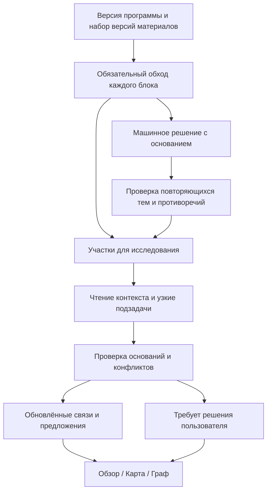

# Исследовательский слой — согласование подхода

Дата: **17.09.2026**. **Рабочий проект, не утверждённая техническая спецификация и не описание реализованного кода.** Продуктовая необходимость согласована. Инструменты, подзадачи, параметры и способы хранения ниже — предложения для проверки.

Связанные документы: [UX](01-product-and-ux.md), [отдельный эксперимент](03-experiments-and-roadmap.md), [статусы решений](README.md#как-обозначаются-решения).

## 1. Задача, которую слой должен решать

В блоке написано: «Этот механизм позволяет восстановить согласованное состояние после описанного выше сбоя». По одному предложению нельзя надёжно выбрать между восстановлением по журналу, контрольными точками и резервным копированием.

Исследователь должен найти определение механизма, проверить его по программе и вернуть привязку с конкретным основанием. Если определение не найдено или текст повреждён, правильный результат — объяснить недостающее основание и оставить решение человеку.

Более широкий случай: несколько источников объясняют журнализацию, но в программе есть только «Транзакции» и «Блокировки». Исследователь должен заметить общий смысл, проверить его отличие от существующих тем и предложить новую тему с набором проверенных участков. Нельзя ни растворять всё в широкой теме «Транзакции», ни добавлять каждый заголовок книги как отдельную тему.

**Согласованная граница ответственности:** система гарантирует учёт всего материала; модель интерпретирует содержание, выбирает дополнительный контекст и предлагает выводы. Модель не вправе исключить оставшуюся книгу из обхода.

## 2. Какие результаты статьи используем

Источник: Zhang, Kraska, Khattab, **Recursive Language Models**, [версия v3 от 11.05.2026](https://arxiv.org/html/2512.24601v3). Ниже краткий пересказ; остальные разделы этого документа — собственное предложение для Tentex.

| Наблюдение авторов | Место в статье |
|---|---|
| Исходный большой контекст хранится во внешней среде; модель получает метаданные и исследует его программно | §2, алгоритм 1 |
| Промежуточные значения и итог тоже могут оставаться во внешней среде; в историю возвращаются ограниченные сведения | §2 |
| Подвызовы помогают на информационно насыщенных задачах, но полезность глубины зависит от модели и задачи | §4, таблица 1 |
| Выбор первоначального разбиения задачи влияет на результат; примеры разбиения помогали в экспериментах | §5 |
| Средняя стоимость скрывает дорогие отдельные траектории; возможен взрыв числа подвызовов | §4, §7 |
| Один prompt не одинаково работает с разными моделями; авторы отмечают проблемы кодирования, завершения и последовательных вызовов | Приложение B |

Эти результаты получены не на задачах Tentex. Они не доказывают качество привязок, обнаружения тем или экономию на русскоязычных учебниках. Обычный цикл чтения инструментами без программной рекурсии не равнозначен RLM статьи. Предлагаемая адаптация должна оцениваться самостоятельно.

## 3. Рабочая адаптация для Tentex

Предлагается сохранить три свойства: исходники доступны вне истории разговора, промежуточные результаты имеют устойчивые ссылки, исследователь может декомпозировать сложный вопрос. Область применения — подключённые источники, цель и программа одного проекта.

| Идея адаптации | Конкретное поведение | Статус |
|---|---|---|
| Исходники вне контекста | Прочитать конкретный диапазон по ссылке, а не посылать всю книгу в каждый ход | Предлагается |
| Результаты вне истории | Сохранить сравнение двух разделов; вернуть его идентификатор и короткое резюме, детали читать отдельно | Предлагается |
| Управляемое углубление | Модель выбирает соседей, начало раздела, поиск или сравнение по текущему вопросу | Направление согласовано; протокол предлагается |
| Узкая подзадача | Отдельно выяснить, что означает «восстановление» в двух источниках, затем сопоставить ответы | Проверить экспериментом |
| Короткая рабочая память | Хранить вопрос, найденные основания, нерешённые противоречия и ссылки на результаты | Предлагается |
| Ограниченная область работы | Не разрешать менять программу, файлы или обращаться к внешнему интернету из исследования | Предлагается в рамках согласованного продуктового сценария |

Начальный кандидат — управляемый цикл с инструментами чтения. Второй кандидат добавляет один уровень узких модельных подзадач. Полноценный RLM с REPL остаётся вариантом сравнительного эксперимента, если ограничения первого подхода окажутся существенными. Это не решение навсегда отказаться от RLM; точная библиотека и среда исполнения пока не выбраны.

### 3.1. Три вида работы — новое предложение после обсуждения

Пользователь поддержал разделение по смыслу; точный состав ниже ещё не утверждён. Это внутренние виды работы одного исследования, а не три обязательных режима интерфейса.

| Вид | Пример | Результат |
|---|---|---|
| Полный обзор | Прочитать связный пакет блоков раздела о транзакциях | Учёт каждого блока, содержательные связи отдельно от упоминаний, нерешённые места; краткое описание содержания раздела независимо от названий программы |
| Уточнение участка | Найти, какой механизм назван «описанным выше», сравнить с кандидатами программы | Решение по точным фрагментам, опоры и причина остановки |
| Сопоставление коллекции и программы | Обнаружить журнализацию внутри широкой темы «Транзакции» в нескольких источниках | Проверенные кандидаты новых тем, различия/совпадения и предложения программе относительно цели |

Связные пакеты уменьшают повтор контекста, но не превращают главу в одну метку: код сверяет ответы с полным перечнем входных блоков. Недопустимы пропуски и перенос решения на весь пакет по одному его абзацу. Размер пакета и сложные границы проверяются экспериментом.

Общее сопоставление не ограничивается сомнениями первичной модели. Оно использует независимое от программы описание содержания, проверяет первичный текст и может инициировать уточнение уже распределённых участков. Оно не обязано ждать конца всей коллекции, но до завершения обхода выводы предварительны. Повторная обработка после изменений использует те же виды работы, а не отдельного четвёртого агента.

### 3.2. Несколько моделей — гипотеза для отдельной проверки

Пользователь предложил распределить массовую работу и сложные решения между моделями. Каскады моделей исследованы, например, в [FrugalGPT — Chen, Zaharia, Zou](https://arxiv.org/abs/2305.05176). Это основание проверить подход; результаты той работы не являются прогнозом стоимости или качества Tentex. Следующая схема — собственное предложение.

- Быстрая модель выполняет полный обзор связных пакетов; публикует допустимые машинные решения, отмечает упоминания и вопросы.
- Более сильная модель уточняет сложные участки и сопоставляет коллекцию с программой. Она получает первичные тексты, определения тем и ограничения цели, а не только пересказ первой модели.
- Проверка части принятых быстрых решений нужна независимо от её самооценки. Сильная модель тоже может ошибаться; разногласие не разрешается автоматически ценой модели или голосованием.
- Программа меняется после решения пользователя; «главные решения» модели означают подготовку обоснованных предложений, а не право самостоятельно переписать дерево.
- Один и тот же алгоритм должен допускать одну модель на обеих ролях. Если сильная модель недоступна, явно сохраняем незавершённое уточнение; не выдаём скрытую замену за равнозначное качество.

Первое сравнение подходов сохраняет одну модель, чтобы не смешать эффект инструментов с эффектом её качества. Следующая отдельная проверка сравнивает быструю модель на всём процессе, сильную на всём процессе и их сочетание: качество, пропуски трудных мест, общий расход и число действий человека. Конкретные модели, доля проверки и лимиты не выбраны; обязательность двух моделей не согласована.

## 4. Место в полном обходе

Быстрый слой получает блок, путь заголовков, небольшой соседний контекст, цель и доступное описание программы. Если дерево не помещается целиком, рассматривается его иерархия с возможностью открыть любую ветвь. Поисковая выдача не становится единственным перечнем допустимых тем; для вывода «темы нет» нужна отдельная проверка текущей программы.

Большой блок читается частями. В учёте он остаётся одной единицей и не считается обработанным после первой части. Обрезание текста отмечается явно, остаток доступен для чтения. Точный размер окна и способ разбиения определяются экспериментом.

Каждый блок получает запись обработки, включая служебный. Состояния работы отделяются от смысловых исходов: «не рассмотрено», «требует исследования», «требует человека», «ошибка» не заменяют исходы «отнесён», «служебный», «содержательный вне программы». Устаревание результата отмечается отдельно. Это концептуальные различия, не утверждённые перечисления БД.

Повторное чтение допускается; повторный учёт блока в знаменателе — нет. Завершение одного исследования не завершает обязательный обход материала.

## 5. Откуда берутся исследовательские задачи

| Сигнал | Пример вопроса | Какой контекст нужен сначала |
|---|---|---|
| Ссылка на предыдущее объяснение | Что здесь называется «этим методом»? | Соседи и начало раздела |
| Несколько правдоподобных тем | Здесь обе нормальные формы или только одна? | Определения тем и границы объяснения |
| Последовательность блоков вне программы | Это одна отсутствующая тема или несколько разных? | Весь участок с заголовками |
| Одинаковые участки у двух тем | Темы дублируются или источник объясняет их вместе? | Совпадающие и различающиеся участки |
| Разные названия у источников | «Журнал предзаписи» и «WAL» означают здесь одно? | Первичные определения в обоих источниках |
| Подозрительно широкая привязка | Не спрятана ли новая тема внутри «Транзакций»? | Соседний раздел и структура ветви |
| Противоречие или слабый текст | Это содержательный конфликт или ошибка OCR? | Исходная страница и отметки качества |

Предлагается объединять соседние сигналы в одну задачу с перечнем блоков, чтобы не исследовать одну главу заново для каждого абзаца. Объединение не меняет структуру исходного материала и не стирает различия решений отдельных блоков. Порог размера и правила объединения пока открыты.

Нельзя полагаться только на самооценку модели. Быстрый слой может уверенно ошибиться или отнести всё к слишком широкой теме. Поэтому предлагаются два дополнительных входа: сверка коротких описаний разделов после полного обхода и ограниченная воспроизводимая выборка машинных решений для проверки. Размер выборки — предмет эксперимента; её цена входит в общий бюджет.

Недостающие темы ищутся и среди блоков вне программы, и среди уже отнесённых. Сводки помогают выбрать места для проверки, но не служат единственным доказательством смыслового объединения. Наличие одинакового слова тоже не является достаточным основанием.

## 6. Что исследователь получает и что может сделать

Начальный пакет задачи: вопрос, целевые блоки и их версии, путь раздела, цель, кандидаты тем, уже прочитанные ссылки, ручные ограничения, причина углубления, оставшийся бюджет. Не требуется переносить в каждый ход весь запуск или всю переписку.

Предлагаемый набор действий, **не названия будущих HTTP-эндпоинтов**:

| Действие | Результат и граница |
|---|---|
| Прочитать участок | Точный текст выбранных блоков/фрагментов, страницы, версии, качество, явная отметка неполного ответа |
| Прочитать контекст раздела | Соседи или начало раздела; при плохой структуре — диапазон страниц с пометкой |
| Посмотреть программу | Дерево/ветвь, описания тем, видимость и пользовательская цель; предполагаемые темы отдельно |
| Найти в материалах | BM25 по подключённым материалам, ссылки и краткие выдержки; не гарантия полноты |
| Открыть сохранённый результат | Подробности ранее выполненного сравнения или чтения; исходные ссылки сохранены |
| Разобрать подвопрос | В экспериментальном варианте: отдельный модельный вызов с ограниченной областью и бюджетом |
| Завершить участок | Предложить результат с основаниями или передать человеку с конкретной причиной |

Числовые агрегаты, принадлежность материалов и существование ID проверяет код. Недействительная ссылка не исправляется догадкой. Доступ к чужому проекту, произвольные записи, shell и сетевые запросы не входят в этот протокол. Инструкции внутри материалов рассматриваются как изучаемый текст, а не команды исследователю.

Идея внешнего результата: сравнение может содержать много привязок и цитат; исследователь получает `сравнение-7: найдены два разных значения термина`, а детали читает по необходимости. Итог собирается из сохранённых проверенных записей, поэтому модель не обязана заново переписывать весь список блоков в последний ответ.

## 7. Узкие подзадачи: что именно проверять

Для задачи «Сопоставить журнализацию в двух источниках» можно отдельно поручить:

> По разделу 4.2 учебника A выпиши, что автор называет журналом, когда выполняется запись и как это связано с восстановлением. Для каждого вывода укажи фрагмент. Если раздел этого не объясняет, отметь отсутствие сведений.

Другой подвызов исследует соответствующий раздел лекций B. Родитель получает результаты и проверяет совместимость, включая несовпадения. Подзадачи не подтверждают друг друга голосованием: у них могут быть одинаковые ошибки модели.

Предлагаемый первый экспериментальный вариант — один уровень подзадач без порождения собственных детей. Бюджет общий на весь участок и запуск; дочерняя задача не получает новый независимый лимит. Сохраняются вопрос, область, результат, основания и расходы каждого вызова. Глубину расширяем только если отдельные случаи показывают пользу.

Между задачами передаются наблюдения с источниками, не безусловные «факты модели». Узкая подзадача не вправе менять программу, подтверждать привязки или объявлять весь источник просмотренным.

## 8. Три примера для согласования

### Пример A: «описанный выше механизм»

Иллюстративные обозначения, не существующие ID проекта: блоки A-40–A-43; темы «Резервное копирование» и «Восстановление по журналу».

1. Быстрый слой видит ссылку без определения, фиксирует необходимость контекста.
2. Исследователь читает A-40 и A-41. В A-40 определён журнал предзаписи, в A-41 описано применение записей после сбоя.
3. Проверяет описание темы «Восстановление по журналу» и текст A-42–A-43.
4. Предлагает привязку A-42–A-43 к теме с опорами A-40 и A-41. Контекстные блоки не получают привязку автоматически только потому, что их читали.
5. Если нужное определение находится в пропущенной/нечитаемой странице, результат — «Не удалось установить, о каком механизме речь» с переходом к странице.

Проверяемое поведение: система действительно читает недостающий контекст и отличает резервное копирование от журнала; не угадывает по слову «сбой».

### Пример B: отсутствующая «Журнализация»

В трёх источниках найдены 17 блоков. Часть быстрый слой оставил вне программы, часть связал с широкой темой «Транзакции».

1. Исследователь проверяет определения и конкретные участки во всех трёх источниках.
2. Сравнивает их с существующими темами и целью. Отделяет журналирование транзакций от журналов событий приложения.
3. Формирует кандидата новой темы. Включает только проверенные блоки; неподтверждённые совпадения остаются кандидатами, не прибавляются к числу 17.
4. Предлагает название, место в дереве, значение для цели и выбранные привязки.
5. Пользователь может добавить тему, связать с существующей или оставить содержание вне программы. Последний выбор не приводит к повторному навязыванию того же предложения при неизменных основаниях.

Проверяемое поведение: смысловой кластер поддержан первичным текстом и целью, а не только заголовками и общими словами. Дубли одного источника не подаются как независимые подтверждения.

### Пример C: две похожие темы

«Изоляция транзакций» и «Блокировки» получают много общих блоков.

1. Система обнаруживает совпадение, но не объединяет темы.
2. Исследователь ищет, что различает понятия: требуемое поведение изоляции и один из механизмов его обеспечения.
3. Если раздел раскрывает оба понятия, предлагает две связи с разными основаниями.
4. Если названия программы действительно дублируют одно содержание и цель, предлагает объединение с объяснением и перечнем последствий.
5. Если данных недостаточно, сохраняет обе темы и задаёт пользователю конкретный вопрос.

Проверяемое поведение: совместная встречаемость не превращается в иерархию, предпосылку или слияние без смыслового основания.

## 9. Как выглядит результат

Результат участка должен содержать: область и версии; решения по целевым блокам; точные опоры; краткое объяснение; альтернативы, если они остались; причину остановки; предложения программе; ссылки на прочитанный контекст и подзадачи.

Для одной привязки пример такой:

> A-42 → «Восстановление по журналу». Машинная связь.
>
> Основание: A-40 определяет журнал предзаписи, A-41 описывает применение его записей, A-42 продолжает этот алгоритм.
>
> Использован контекст A-40–A-43, версия материала 3, версия программы 7.
>
> Альтернатива «Резервное копирование» не поддержана прочитанным объяснением.

В пользовательском интерфейсе — объяснение и переходы к материалу. В диагностике — действия, входные версии, ссылки, расходы, ошибки и причины завершения. Скрытые внутренние рассуждения модели для этого не требуются и не являются частью контракта.

Машинное предложение публикуется только после проверки ссылок, полного состава целевых блоков и ручных ограничений. Формальная проверка не доказывает семантическую точность: правила автоматического применения калибруются на размеченных примерах. Уверенность модели не заменяет основание.

### Критерии достаточного основания — остаются на согласование

| Вывод | Предлагаемое условие завершения | Что недостаточно |
|---|---|---|
| Содержательная связь | Точный участок действительно объясняет тему или содержит относящийся к ней пример/практику; нужный контекст найден; нет неразобранной альтернативы, меняющей решение | Совпадение слова, заголовок или одно упоминание |
| Разрешена ссылка назад | Найдено определение и проверено, что целевой текст продолжает именно его | Ближайший похожий термин |
| Новая тема | Проверено общее содержание, отличие от существующих тем и значение для выбранной глубины/цели; предложен подходящий масштаб темы | Много блоков, несколько файлов, совпадающие сводки |
| Предпосылка | Объяснено, какое конкретное понятие или действие целевой темы требует этих знаний, с учётом знаний пользователя | Порядок глав или совместное упоминание |
| Объединение | Рассмотрены и совпадения, и различия; показано, почему разделение избыточно для этой цели | Общие привязки двух тем |

Это критерии проверки смысла, а не детерминированное доказательство. Пример для следующего разговора: упражнение на блокировки есть, объяснения нет — достаточно ли этого для статуса «есть материал» и какая подробность должна оставаться видна. До согласования не вводим оценку «тема обеспечена полностью».

При конфликте с ручной связью сохраняются ручное решение и новое предложение для просмотра. Модельное «служебное» не переписывает глобальную характеристику материала во всех проектах: область действия такой коррекции требует отдельного решения. «Вне цели» всегда относится к конкретному проекту.

## 10. Остановка, расходы и возобновление

Предлагаются четыре нормальных исхода исследования: найдено достаточное основание, осталась неоднозначность, дальнейшее чтение не даёт новых сведений, достигнут лимит. Техническая ошибка учитывается отдельно. Ни один из последних трёх исходов не превращается автоматически в «вне программы» или «служебное».

Перед действием резервируется доступный бюджет вызова, включая возможный ответ; учитываются родитель, дети и повторы. Если денежная цена неизвестна, приложение не обещает точный финансовый потолок и использует доступные лимиты вызовов/токенов. Точные значения, запас и действия при исчерпании согласуются до платного эксперимента.

Одинаковое чтение той же версии возвращает сохранённый результат. Повторное действие без изменения вопроса и новых сведений останавливается с понятной причиной. Правило не запрещает возвращаться к прочитанному тексту для проверки нового противоречия.

Чекпоинт фиксирует завершённые действия и принятые записи. После сбоя нельзя обещать отсутствие повторно оплаченного вызова: возможен разрыв между ответом провайдера и сохранением. Но дублирование привязок и удвоение прогресса должны исключаться идемпотентным применением результата.

При остановке сохраняются готовые результаты и список незавершённого. Продолжение проверяет версии и ручные изменения. Ответ на старую программу может остаться диагностическим результатом, но не применяется к новому состоянию без перепроверки.

## 11. Память исследования и пересчёт

Предлагается сохранять ссылки на прочитанные фрагменты, версии материалов/программы, область каждого поиска, происхождение промежуточных выводов и причины решений. Краткая сводка нужна для навигации, первичный текст остаётся доступным для проверки.

Это пока требования к данным, а не проект новых таблиц. Сохранять произвольную глобальную базу знаний или отдельную графовую БД ради графического экрана не требуется.

Зависимости чтения помогают пересчитывать положительные выводы: изменилась опорная страница — перепроверь основанное на ней решение. Но отрицательный вывод «не найдено» зависит и от области поиска. Добавление источника или новой темы может изменить его без изменения старых страниц. Поэтому одного списка прочитанных ID для точного локального пересчёта недостаточно.

Предлагаемая политика:

- Правка текста: перепроверить затронутые блоки и использовавшие их решения; учесть, что нынешний конвейер может перестроить блоки всего материала.
- Новая тема: проверить связанные с предложением участки, затем кандидатов среди всех сохранённых результатов, включая уже распределённые.
- Новая книга: пройти её полностью в рамках выбранной области и пересмотреть связанные гипотезы, включая прежние пробелы.
- Изменение цели или крупных ветвей: явно предложить широкую проверку.
- Ручное подтверждение/снятие: обновить карту и ограничения сразу, без обязательного нового вызова модели.

Перенос старых решений на новую ревизию нельзя делать только по совпавшему порядковому номеру блока. Утраченная опора делает решение устаревшим до проверки; существующие правила переноса ручных привязок надо изучить при проектировании интеграции.

## 12. Точки интеграции, которые уже есть

Проверенная на исходном срезе `29de889` основа, не обещание готовой реализации:

| Основа | Что можно использовать | Что ещё предстоит определить |
|---|---|---|
| MaterialBlock / MaterialFragment / версии материала | Полный набор и адресуемый текст | Зависимости исследований, перенос результатов при переразборе |
| BackgroundJob и AiRun | Worker, чекпоинты, история вызовов | Состав результата исследования и общий бюджет подзадач |
| Binding со статусами и механизмами | Публикация привязок существующим потребителям | Учёт каждого блока, конфликты и защищённые ручные решения |
| Чат программы и дифы | Просмотр, частичное применение, ревизии и undo | Создание темы вместе с подтверждёнными связями; последствия merge/split |
| BM25 | Поиск дополнительного контекста | Проверка отсутствия темы/материала не ограничивается top-k |
| Вкладка «Источник» и Уроки | Просмотр найденного и дальнейшее обучение | Как показать предложения, не заменяя вручную собранный урок |

Существующий реестр чатовых инструментов зависит от ChatSession. Нельзя считать его готовой средой фонового исследования: предлагается использовать доменные функции чтения, а необходимость общего адаптера решать по коду. Новая очередь, векторный движок и замена шлюза моделей для первого эксперимента не нужны.

## 13. Таблица согласования

| ID | Решение | Статус на 17.09.2026 | Что нужно дальше |
|---|---|---|---|
| R-01 | Полный обход задаёт код; исследователь углубляется автоматически | Согласовано | Уточнить учёт ошибок и состав запуска |
| R-02 | Машинные связи видны сразу; ручные решения и изменения программы защищены | Согласовано | Проверить критерии применения на разметке |
| R-03 | Обзор / Карта / Граф и предложения новых тем входят в цикл | Согласовано | Пройти UX-примеры до вёрстки |
| R-04 | Первичные и промежуточные данные вне истории модели, доступ по ссылкам | Предлагается | Проверить, хватает ли короткого рабочего контекста |
| R-05 | Предметные инструменты вместо произвольного REPL в первом кандидате | Предлагается | Сравнить пользу и ограничения в эксперименте |
| R-06 | Один уровень узких подзадач | Проверить экспериментом | Сравнить с тем же исследователем без подзадач |
| R-07 | Межраздельная сверка и выборочная проверка уверенных решений | Предлагается | Измерить пропуски триггеров и стоимость |
| R-08 | Конкретная модель, бюджеты, окно, глубина и правила группировки | Открытый вопрос | Выбрать до контрольного прогона, не по его результатам |
| R-09 | Полноценный RLM с REPL как отдельный кандидат | Условный эксперимент | Вернуться, если R-05/06 не решают выявленные случаи |
| R-10 | Формат хранения, HTTP-контракт, библиотека графа | Открытый вопрос | После согласования подхода и отдельной проверки |
| R-11 | Упоминания сохраняются, но не закрывают содержательное покрытие | Согласовано | Уточнить границы примера/упражнения и смешанного блока |
| R-12 | Новые темы и предпосылки зависят от цели, глубины и знаний пользователя | Согласовано в принципе | Определить ввод глубины и масштаб темы |
| R-13 | Полный обзор / уточнение / сопоставление коллекции как внутренние виды работы | Предлагается; разделение поддержано | Согласовать поведение и связь с UX |
| R-14 | Быстрая и сильная модели на разных видах работы | Проверить экспериментом; идея пользователя | Сравнить с одной моделью и проверить пропущенные ошибки |
| R-15 | Критерии достаточного основания по типам выводов | Открытый вопрос | Разобрать конкретные примеры, включая отрицательные |
| R-16 | Несколько вариантов обратной связи вместо массового подтверждения | Согласовано в принципе | Уточнить действия и последствия; UX §10 |
| R-17 | Учебниковый режим; интеграция только после согласования поведения | Согласовано | Экзаменационный сценарий сейчас не расширять |

Следующее обсуждение начинает с учебникового UX (§10 связанного документа), затем проходит основания и примеры A–C, уточняет R-04–R-07 и R-11–R-16. До результатов эксперимента нельзя отмечать исследовательскую архитектуру как доказанную, обещать экономию или переносить экспериментальный код в приложение.
