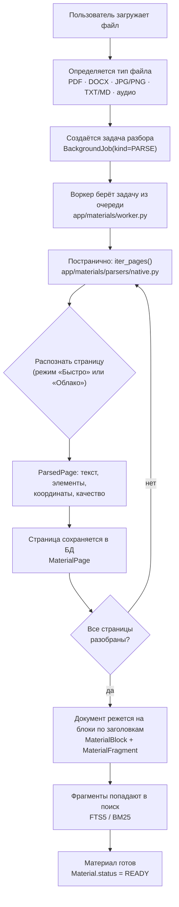
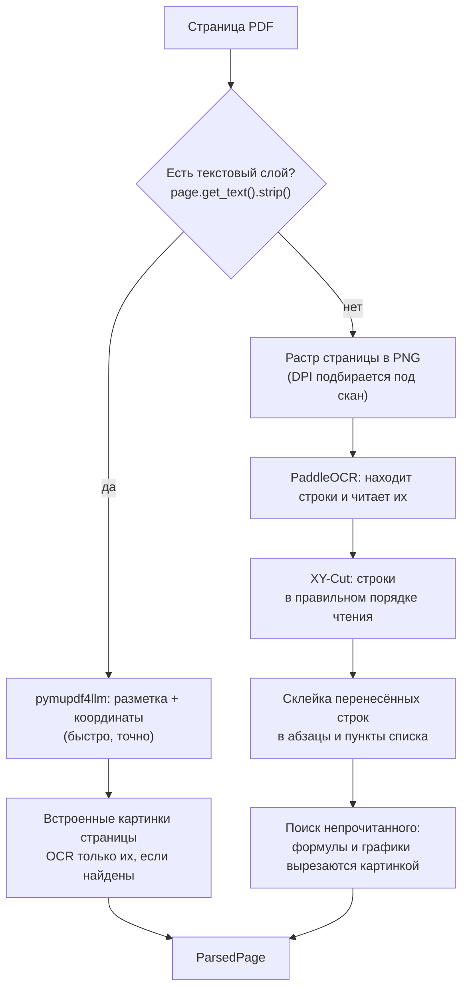
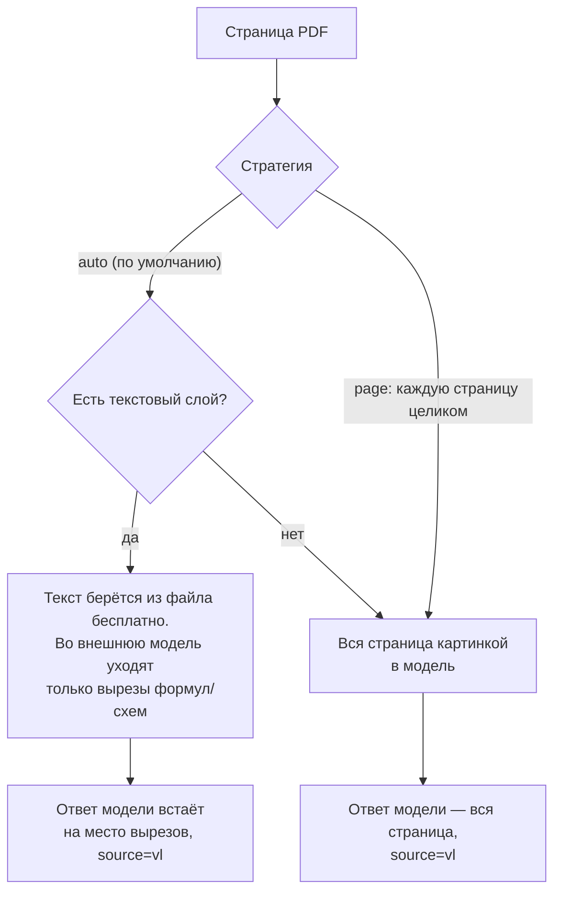
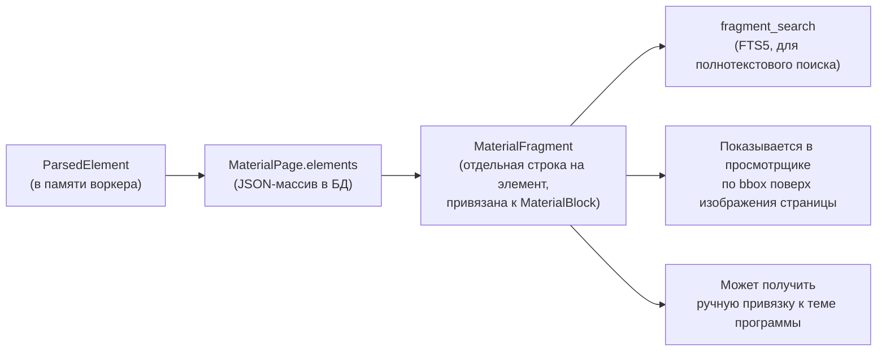

# Как устроено распознавание в Tentex

Объяснение для тех, кто не разбирался в OCR-конвейерах раньше. Ссылки на код
даны везде, где утверждение можно проверить глазами — на защите это и есть
доказательство, что написанное не выдумано.

## Зачем вообще нужен этот конвейер

Пользователь приносит файл: PDF учебника, скан методички, фотографию доски,
DOCX с конспектом. Все они превращаются в одно и то же — **страницы с
текстом, формулами, списками и таблицами**, с координатами каждого куска на
странице. Это единый формат (`ParsedPage`, `app/materials/parsers/base.py`),
и дальше — поиск, привязка к темам программы, показ в просмотрщике — работает
с ним одинаково, не зная, приехал текст из PDF-слоя, из PaddleOCR или из
внешней модели.

Термин **OCR** (optical character recognition, оптическое распознавание
символов) — это когда компьютер смотрит на *картинку* с текстом и превращает
её обратно в буквы. Если в файле уже есть настоящий текстовый слой (как в
любом PDF, экспортированном из Word или LaTeX), распознавать нечего — текст
просто читается напрямую, это быстрее и без ошибок.

## Словарь на одну страницу

| Термин | Что это |
| --- | --- |
| **Текстовый слой PDF** | Невидимый набор символов с координатами внутри PDF-файла. Есть у «нормальных» PDF, нет у скана (там страница — просто картинка) |
| **Растр / растеризация** | Превращение страницы PDF в обычную картинку (PNG), как скриншот. Нужно, когда текстового слоя нет — распознавать можно только картинку |
| **DPI** (dots per inch) | Точек на дюйм — разрешение картинки. Чем выше, тем крупнее и чётче буквы, тем дольше считается |
| **Bounding box (bbox)** | Прямоугольник вокруг куска текста: `[x0, y0, x1, y1]`, доли от размера страницы (`0..1`). По нему просмотрщик подсвечивает фрагмент на изображении |
| **Элемент страницы** | Один кусок: заголовок, абзац, пункт списка, таблица, формула, картинка. У каждого — вид (`kind`), текст, `bbox`, уверенность |
| **Confidence (уверенность)** | Число `0..1` — насколько распознаватель уверен в этом куске текста |
| **Reading order (порядок чтения)** | В каком порядке идут куски текста. На странице с двумя колонками порядок «сверху вниз по всей ширине» — неправильный, надо «сначала левая колонка целиком, потом правая» |
| **VLM** (vision-language model) | Языковая модель, которая понимает не только текст, но и картинки — ей можно показать страницу и попросить прочитать |
| **LaTeX** | Язык записи формул текстом: `$x^2 + y^2 = z^2$`. KaTeX в браузере рисует по нему красивую формулу |

## Общая картина: от файла до готового текста

Путь один и тот же для обоих режимов распознавания — разница только внутри
одного прямоугольника «Распознать страницу».



Каждый прямоугольник — отдельный шаг, они разобраны ниже по порядку.

### Шаг 1 — определение типа файла

`iter_pages()` смотрит на расширение и решает, какой из шести путей запускать
(`app/materials/parsers/native.py:iter_pages`):

| Расширение | Кто разбирает |
| --- | --- |
| `.pdf` | Постранично, у каждой страницы своя развилка (см. ниже) |
| `.docx` | `python-docx`, всегда нативно, без распознавания вообще |
| `.jpg` / `.jpeg` / `.png` | Одна «страница» — снимок целиком, режим влияет на то, кто его читает |
| `.txt` / `.md` | Простой текстовый парсер, режим игнорируется — распознавать тут нечего, текст уже текст |
| аудио (`.mp3`, `.wav`, …) | `faster-whisper`, отдельная история, не про OCR |

### Шаг 2 — задача попадает в очередь

Нажатие «Подготовить материал» создаёт `BackgroundJob` с видом `PARSE` и
выбранным режимом (`fast` или `cloud`). Задачи разбора и вызовы моделей ИИ
живут в одной очереди — контракт в
[`docs/architecture/background-jobs.md`](docs/architecture/background-jobs.md).

### Шаг 3 — воркер разбирает файл постранично

Воркер (`app/materials/worker.py`) — отдельный процесс, арендует задачу на
60 секунд и сохраняет прогресс **после каждой страницы отдельной транзакцией**
(`_save_page`). Если воркер упадёт на середине учебника в 300 страниц, при
перезапуске он продолжит с той страницы, на которой остановился, а не начнёт
заново.

### Шаг 4 — единый формат страницы

Что бы ни распознавало страницу — PaddleOCR или внешняя модель, — результат
всегда один и тот же тип, `ParsedPage`:

```python
@dataclass(frozen=True, slots=True)
class ParsedPage:
    page_number: int
    width: float
    height: float
    markdown: str            # вся страница одним Markdown-текстом
    plain_text: str          # то же самое, но без разметки — для поиска
    quality: str              # "native" | "ocr" | "ocr_low"
    elements: tuple[ParsedElement, ...]   # заголовки, абзацы, формулы...
    diagnostics: tuple[str, ...] = ()     # что пошло не так, если пошло
    confidence: float | None = None
```

А один элемент страницы:

```python
@dataclass(frozen=True, slots=True)
class ParsedElement:
    kind: str            # heading | paragraph | list | table | formula | image
    text: str
    bbox: tuple[float, float, float, float]   # [x0, y0, x1, y1], доли 0..1
    level: int | None = None                  # уровень заголовка/списка
    confidence: float | None = None
    asset_path: str | None = None             # вырезанная картинка, если есть
    recognition_source: str = "native"        # native | ocr | vl | manual
```

`recognition_source` — это честный ответ на вопрос «откуда взялся этот
текст»: `native` — был в файле как есть, `ocr` — прочитан локальным
PaddleOCR, `vl` — прочитан внешней моделью, `manual` — исправлен человеком
руками в просмотрщике. Ничего не выдаётся за более точное, чем оно есть.

### Шаг 5 — качество страницы

`quality` — это не оценка «хорошо/плохо», а честный флаг происхождения:

- **`native`** — текст был в файле как есть, распознавание вообще не
  участвовало;
- **`ocr`** — текст распознан (локально или облаком), и уверенность выше
  порога (по умолчанию 0.75, настраивается в `Параметры → Распознавание →
  Качество`);
- **`ocr_low`** — распознано, но уверенность ниже порога, **или** у страницы
  есть диагностика (например, сломанная формула). Такая страница попадает в
  список «нужно проверить» — экран честно предупреждает, а не притворяется,
  что всё точно.

### Шаг 6 — от страниц к блокам

Пока каждая страница разобрана отдельно, документ ещё не поделён смыслово.
После того как **все** страницы ревизии сохранены, `_finish` запускает
`rebuild_structure` (`app/materials/library.py`): она проходит по всем
страницам подряд и режет их на **блоки** по заголовкам
(`app/materials/segmentation.py:build_blocks`) — например, «§ 7.4. Формула
Ньютона — Лейбница» открывает новый блок, следующий заголовок того же или
более высокого уровня его закрывает. Каждый элемент внутри блока становится
**фрагментом** (`MaterialFragment`) — минимальной единицей, к которой потом
привязывается тема программы и которую находит поиск.

```
Страница → элементы (заголовок, абзац, формула, …)
    → Блок (от заголовка до следующего заголовка)
        → Фрагмент (один элемент внутри блока)
```

Если на странице не нашлось ни одного заголовка (типично для плохого скана),
блок всё равно строится — по всей странице целиком, — а `degraded_structure`
ставится в `True`: честная пометка «границы блока не там, где реальный
смысл», а не молчаливая деградация.

### Шаг 7 — поиск

Текст каждого фрагмента попадает в полнотекстовый индекс SQLite (FTS5,
`app/bindings/search.py:reindex_material`) — по нему работает и обычный
поиск, и подбор кандидатов при ручной привязке темы к материалу.

### Шаг 8 — материал готов

`Material.status` становится `READY`. Если материал помечен как файл с
ответами, тут же запускается автопривязка ответов к вопросам
(`_link_answers_projects`) — но её сбой не откатывает уже готовый разбор.

---

## Режим «Быстро»: локально, на процессоре

Код: `app/materials/parsers/native.py`, `paddle_fast.py`, `raster.py`,
`reading_order.py`. Работает офлайн, без интернета и без видеокарты.

### Развилка внутри PDF



**Если текстовый слой есть** — распознавания в строгом смысле нет вовсе:
`pymupdf4llm` читает готовый текст и координаты прямо из файла. Это касается
и заголовков, и таблиц (они приходят Markdown-таблицей). Единственное, что
всё равно может понадобиться, — встроенные в PDF картинки: если на странице
есть растровые вставки (например, скан-фото внутри иначе цифрового файла), их
можно прогнать через PaddleOCR отдельно.

**Если текстового слоя нет** (сама страница — картинка), происходит вот что:

1. **Растеризация с адаптивным DPI.** Раньше масштаб был постоянным
   (144 dpi независимо от исходника), из-за чего у 300-точечного скана
   выбрасывалось больше половины пикселей. Теперь `raster.render_scale`
   считает разрешение самого скана и подбирает такое DPI, которое реально
   есть в файле: настройка «Обычный» = 300 dpi, «Повыше» = 450 dpi, но не
   выше исходного разрешения умноженного на 1,5 — рисовать несуществующие
   пиксели бессмысленно.
2. **PaddleOCR (PP-OCRv5)** находит текстовые строки на картинке и читает
   каждую отдельно, с координатами и уверенностью.
3. **XY-Cut** (`reading_order.py`) расставляет найденные строки в порядке
   чтения. Это рекурсивный алгоритм 1984 года (Nagy & Seth): разрезать
   страницу полосой пустоты сначала по горизонтали (заголовок / тело /
   колонтитул), а внутри каждой полосы — по вертикали, если там есть
   вертикальный разрыв (граница между колонками). Без этого шага
   двухколоночная статья читалась бы построчно поперёк обеих колонок —
   бессмысленным винегретом.
4. **Склейка переносов.** Строка «Формула Ньютона —» и следующая строка
   «Лейбница:» — это один абзац, а не два. Решение принимается по геометрии
   (совпадает левый край, зазор небольшой) и по пунктуации (предыдущая строка
   не заканчивается точкой).
5. **Поиск непрочитанного.** PaddleOCR находит только *строки текста* —
   формулу или график он просто не видит. `raster.unread_regions` находит
   такие места по остаткам «чернил» (тёмных пикселей) вне рамок уже
   распознанных строк и сохраняет их отдельной картинкой с координатами —
   подписанной честно `[Изображение]`, а не выдуманным текстом.

### Что режим «Быстро» не умеет

Формулы он **не читает** — только вырезает картинкой, чтобы они хотя бы не
пропадали молча. Если материал явно завязан на формулы, их нужно либо
проверять глазами по вырезу, либо разбирать этот же материал режимом
«Облако».

---

## Режим «Облако»: внешняя зрительная модель

Код: `app/materials/parsers/cloud_vlm.py`, `app/ocr/cloud_catalog.py`. Работает
через тот же шлюз внешних моделей, что и весь остальной ИИ в проекте
(`app/ai/gateway.py`) — ключи, лимиты трат и учёт стоимости общие.

### Идея: не отправлять лишнее

Отправлять во внешний сервис каждую страницу целиком — дорого и не нужно,
если текст уже есть в файле. Поэтому есть две стратегии
(`Параметры → Распознавание → Режимы → Облако`):



**`auto`** — стратегия по умолчанию и самая выгодная: если текстовый слой
есть, наружу уезжают только вырезы формул, графиков и таблиц-картинок
(отрендеренные из PDF в 300 dpi с полем в 4 пункта вокруг, чтобы не обрезать
верхний индекс формулы), а обычный текст остаётся нативным и бесплатным.
Экономия — не только в деньгах: страница целиком не покидает компьютер,
уходят только выделенные картинки.

**`page`** — каждая страница уходит модели целиком, даже если текстовый слой
есть. Дороже и медленнее, но модель сама разбирает вёрстку, а не разметчик
PDF — полезно на очень нестандартной вёрстке.

### Как выглядит запрос к модели

Модели даётся инструкция на русском и картинка. Для целой страницы:

```
Ты распознаёшь страницу учебного документа.
Верни JSON по схеме и ничего кроме него.

1. Переписывай текст дословно. Не исправляй опечатки, не сокращай,
   не пересказывай и ничего не добавляй от себя.
2. Формулы — в LaTeX: внутристрочные $...$, выносные $$...$$.
   Номер формулы, напечатанный на странице, ставь в \tag{...}.
3. Таблицы — в Markdown, в ячейке допустим LaTeX.
4. Порядок элементов — порядок чтения. Две колонки: сначала левая
   целиком, потом правая.
5. Колонтитул, номер страницы и маргиналия — отдельные элементы
   своего вида, не части соседнего абзаца.
6. Нечитаемое место передавай как ⟨?⟩ и ставь этому элементу
   confidence ниже 0.5.
7. bbox — доля от размера страницы: [x0, y0, x1, y1] в диапазоне
   0..1, считая от левого верхнего угла.
```

Схема ответа (Pydantic-модель, `CloudPage`) заставляет модель отвечать
**строго структурированным JSON**, а не вольным текстом — иначе разобрать
ответ автоматически было бы невозможно:

```python
class CloudElement(BaseModel):
    kind: Literal["heading", "paragraph", "list", "table",
                   "formula", "image", "header", "footer",
                   "margin_note", "caption", "code"]
    text: str
    bbox: list[float]
    level: int | None
    confidence: float

class CloudPage(BaseModel):
    elements: list[CloudElement]
    page_confidence: float
```

Для отдельных вырезов (стратегия `auto` с текстовым слоем) инструкция короче
— модели показывают уже вырезанную картинку формулы и просят вернуть только
её LaTeX, без bbox (координата и так известна — это координата исходного
элемента на странице).

### Ответу не доверяют вслепую

Зрительная модель не столько ошибается, сколько **пересказывает** — текст
выглядит гладким и грамотным, но абзаца в нём может не быть вовсе. Поэтому
перед сохранением ответ проверяется:

1. **Координаты.** Если `bbox` вне `0..1` или вырожден (правый край левее
   левого), элемент получает координаты-заглушку и в диагностику страницы
   попадает `bbox_missing:<N>`.
2. **Синтаксис формул** (`latex_issues`). Дешёвая проверка без полноценного
   разбора TeX: чётность `$` и `$$`, чётность фигурных скобок, парность
   `\begin{...}`/`\end{...}`. Формула, которую фронтенд не сможет отрисовать
   KaTeX'ом, — это брак распознавания, и его дешевле поймать здесь, чем
   увидеть кракозябры в интерфейсе.
3. **Метка `⟨?⟩`** — если модель сама призналась, что не смогла прочитать
   место, уверенность элемента принудительно опускается.

Любая из этих находок опускает `confidence` элемента и переводит страницу в
`ocr_low` — «требует проверки», а не тихую порчу материала.

### Сколько это стоит и как выбирается модель

Цена картинки в токенах считается не по мегабайтам файла, а по «плиткам»
768×768 пикселей (так тарифицируют почти все зрительные модели): страница A4
при обычном разрешении — это около 6 плиток ≈ 1850 входных токенов плюс
примерно 1300 токенов на плотный ответ с формулами. Модель для распознавания
выбирается на экране `Параметры → Распознавание → Режимы` из каталога уже
подключённых провайдеров (OpenRouter, Mistral, любой OpenAI-совместимый) —
подходят только модели, которые (а) принимают изображения и (б) умеют
структурированный JSON-ответ; правило целиком — `app/ocr/cloud_catalog.py`.

Повторный разбор того же материала не платится дважды: результат кэшируется
по содержимому запроса (`AiCacheEntry`), а не по времени.

---

## Пример 1: PDF учебника (смешанная страница)

Возьмём страницу типа «§ 7.4. Формула Ньютона — Лейбница»: заголовок и текст
набраны нормально (есть текстовый слой), но сама формула на старом скане
вставлена **картинкой**, а не текстом. Такое реально встречается — старые
издания сканировали, формулы дорисовывали вручную.

### Режим «Быстро»

```
1. page.get_text() возвращает непустой текст → берём текстовую ветку.
2. pymupdf4llm читает заголовок, абзацы, координаты — без единой ошибки,
   потому что это настоящий текст, не картинка.
3. Среди объектов страницы находится встроенное растровое изображение
   (сама формула). В режиме «Быстро» это запускает PaddleOCR автоматически
   (`ocr_images=True` для этого режима) — но формула не строка из букв,
   и результат либо мусорный, либо пустой.
4. Картинка остаётся элементом kind="image", asset_path указывает
   на сохранённый вырез, текст — "[Изображение]".
```

**Итог:** заголовок и текст — точные, формула — картинка без текста рядом.
Пользователь смотрит на неё глазами в просмотрщике.

### Режим «Облако», стратегия `auto`

```
1. page.get_text() непустой → это не "скан", отправлять всю страницу
   не нужно.
2. Текст (заголовок, абзацы) берётся из pymupdf4llm — так же, как
   в режиме «Быстро», бесплатно и точно.
3. Единственный элемент kind="image" на странице — это и есть вставленная
   формула. Она вырезается PNG-картинкой (300 dpi, +4pt поля) и уходит
   отдельным маленьким запросом во внешнюю модель с инструкцией
   "прочитай эту формулу в LaTeX".
4. Модель отвечает, например:
       {"regions": [{"index": 0, "kind": "formula",
         "content": "$$\\int_{a}^{b} f(x)\\,dx = F(b) - F(a). \\tag{7.1}$$",
         "confidence": 0.94}]}
5. latex_issues() проверяет ответ: скобки и $ парные — брака нет.
6. Элемент в базе заменяется: kind="formula", текст — та самая
   LaTeX-строка, recognition_source="vl".
```

**Итог:** то же самое, что и «Быстро», плюс формула теперь в LaTeX и
рендерится KaTeX'ом на экране — а не остаётся немой картинкой. Заплатили
только за один маленький вырез, а не за всю страницу.

### Если бы это была страница без текстового слоя (чистый скан)

И в `auto`, и в `page` она уходит модели **целиком**: `page.get_text()`
пустой, значит развилка сразу ведёт в «растеризовать и распознать всё».
Разница с режимом «Быстро» только в том, кто читает картинку — локальный
PaddleOCR построчно или внешняя модель сразу с разметкой и формулами.

---

## Пример 2: DOCX (конспект в Word)

DOCX устроен принципиально иначе: это не набор картинок с текстом поверх, а
структурированный XML — Word **всегда** хранит настоящий текст, стили
заголовков и нумерацию списков как данные, а не как рисунок. Поэтому OCR
здесь **не участвует вообще**, ни в одном режиме — распознавать нечего.

```
1. iter_pages видит расширение .docx → сразу _docx_page(), режим (fast/cloud)
   в этой ветке не смотрится вовсе.
2. python-docx читает документ абзац за абзацем.
3. Для каждого абзаца:
   - Стиль "Heading 2" → kind="heading", level=2 (число берётся из
     названия стиля регуляркой).
   - Абзац начинается с маркера нумерации Word (numId/ilvl из
     numbering.xml) → kind="list", а номер пункта достраивается
     из формата (decimal, lowerLetter и т.д.) — Word хранит "какой это
     по счёту пункт", а не готовую строку "3.", это восстанавливается
     кодом (_docx_numbering, _list_marker).
   - Обычный текст → kind="paragraph".
4. Картинки абзаца достаются из связанных частей документа
   (Word хранит их отдельными файлами, абзац на них только ссылается
   по идентификатору rId) и сохраняются как элементы kind="image" —
   но не распознаются: recognition_source остаётся "native", потому
   что для DOCX ни разу не вызывается ни PaddleOCR, ни внешняя модель.
5. Вся страница нумеруется как "одна большая страница" — DOCX не делится
   на страницы так же однозначно, как PDF (разбиение на печатные листы
   зависит от принтера и шрифта), поэтому весь документ разбирается
   как единый список абзацев.
```

**Итог:** результат ParsedPage тот же формат, что и у PDF (заголовки,
абзацы, списки, картинки с координатами), но получен он **без единого
вызова OCR** — это просто чтение структуры файла. Единственное, чего DOCX
не даёт, — картинка внутри такого файла (например, вставленная фотография
графика) не читается ни «Быстро», ни «Облаком»: элемент останется
`[Изображение]`. Если нужен текст с такой картинки, материал стоит
пересохранить как PDF или распознать вручную.

---

## Куда что записывается: путь одного элемента



`element_to_json` / `element_to_parsed` (`app/materials/library.py`) —
единственное место, где `ParsedElement` превращается в JSON и обратно; никакой
второй сериализации в проекте нет, чтобы поля не разъезжались.

---

## Частые вопросы (на случай защиты)

**Почему не отдать всё распознавание внешней модели по умолчанию?**
Дороже, дольше, и файл уходит с компьютера. Если формул на странице нет,
локальный текстовый слой ничем не хуже — платить незачем. Экономия — прямое
следствие того, что стратегия `auto` не разбирает заново уже готовый текст.

**Почему нельзя доверять ответу модели полностью?**
Зрительная модель — не OCR-движок с гарантией дословности, а языковая
модель: она может «улучшить» текст по своему усмотрению или пропустить
предложение, оставшись при этом уверенной в ответе. Проверка координат и
синтаксиса формул — не формальность, а способ поймать именно этот класс
ошибок до того, как он попадёт в материал.

**Что если PaddleOCR или внешняя модель ошиблись, а страница всё равно
попала в `ocr` (не `ocr_low`)?**
Порог уверенности (0.75 по умолчанию) — компромисс, не гарантия. Именно
поэтому у каждого элемента остаётся `recognition_source` и `confidence`, а
не только общий флаг страницы: пользователь в любой момент может открыть
страницу рядом с оригиналом и свериться, независимо от итогового качества.

**Почему разбиение на блоки и фрагменты происходит только после того, как
разобраны все страницы, а не сразу по ходу?**
Заголовок, который закрывает блок, может быть на следующей странице —
блоки свободно пересекают границы страниц. Резать раньше времени значило бы
резать неправильно.

**Почему DOCX не участвует в выборе режима вообще?**
Потому что режим решает, *как читать картинку*, а в DOCX текст никогда не
является картинкой — он уже данные. Выбор между «Быстро» и «Облако» для
DOCX был бы вопросом без разницы в ответе.

**Что произойдёт, если во время разбора учебника на 300 страниц упадёт
воркер?**
Ничего катастрофического: прогресс сохраняется постранично, отдельной
транзакцией на каждую сохранённую страницу. При перезапуске воркер продолжит
с той страницы, на которой остановился, — не с начала.

---

## Куда смотреть дальше

- Полный фактический контракт (модель данных, миграции, API) —
  [`docs/architecture/ocr-settings.md`](docs/architecture/ocr-settings.md) и
  [`docs/architecture/stage-5-material-pipeline.md`](docs/architecture/stage-5-material-pipeline.md).
- Разведка перед реализацией, сравнение с внешними инструментами, метрики
  качества — [`docs/research/ocr-pipeline-v2.md`](docs/research/ocr-pipeline-v2.md).
- Тесты как живая документация поведения:
  `backend/tests/test_reading_order.py` (XY-Cut, наклон, растр),
  `backend/tests/test_ocr_cloud.py` (выбор модели, проверка формул),
  `backend/tests/test_cloud_pipeline.py` (что уходит наружу, а что нет).
