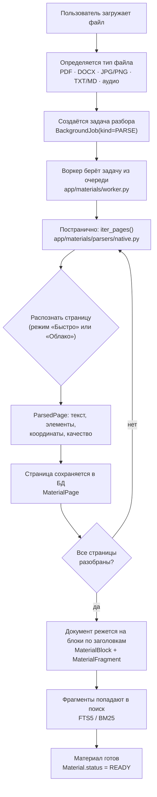
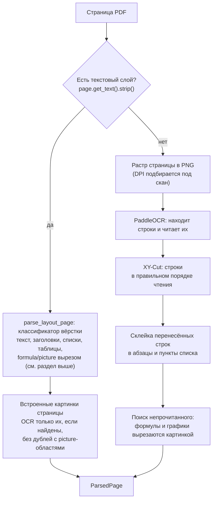
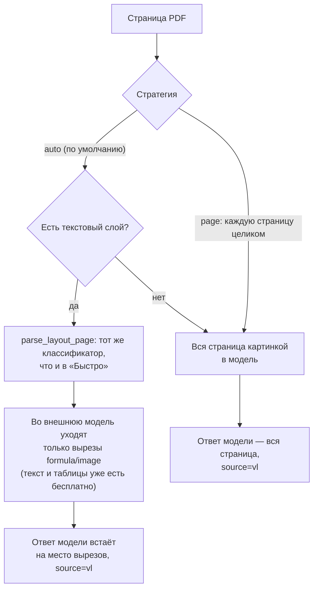
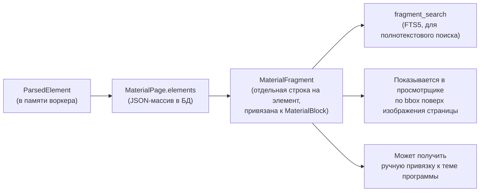

# Как устроено распознавание в Tentex

Объяснение для тех, кто не разбирался в OCR-конвейерах раньше. Ссылки на код
даны везде, где утверждение можно проверить глазами — на защите это и есть
доказательство, что написанное не выдумано. Документ обновлён 05.09.2026 —
после правки, закрывшей пропажу схем и формул при разборе, и с отдельным
разделом про провайдеров и модели: как выбирается модель для распознавания и
что вообще значит «совместимый провайдер».

## Зачем вообще нужен этот конвейер

Пользователь приносит файл: PDF учебника, скан методички, фотографию доски,
DOCX с конспектом. Все они превращаются в одно и то же — **страницы с
текстом, формулами, списками и таблицами**, с координатами каждого куска на
странице. Это единый формат (`ParsedPage`, `app/materials/parsers/base.py`),
и дальше — поиск, привязка к темам программы, показ в просмотрщике — работает
с ним одинаково, не зная, приехал текст из PDF-слоя, из PaddleOCR или из
внешней модели.

Термин **OCR** (optical character recognition, оптическое распознавание
символов) — это когда компьютер смотрит на *картинку* с текстом и превращает
её обратно в буквы. Если в файле уже есть настоящий текстовый слой (как в
любом PDF, экспортированном из Word или LaTeX), распознавать нечего — текст
просто читается напрямую, это быстрее и без ошибок.

## Словарь на одну страницу

| Термин | Что это |
| --- | --- |
| **Текстовый слой PDF** | Невидимый набор символов с координатами внутри PDF-файла. Есть у «нормальных» PDF, нет у скана (там страница — просто картинка) |
| **Растр / растеризация** | Превращение страницы PDF в обычную картинку (PNG), как скриншот. Нужно, когда текстового слоя нет — распознавать можно только картинку |
| **DPI** (dots per inch) | Точек на дюйм — разрешение картинки. Чем выше, тем крупнее и чётче буквы, тем дольше считается |
| **Bounding box (bbox)** | Прямоугольник вокруг куска текста: `[x0, y0, x1, y1]`, доли от размера страницы (`0..1`). По нему просмотрщик подсвечивает фрагмент на изображении |
| **Элемент страницы** | Один кусок: заголовок, абзац, пункт списка, таблица, формула, картинка. У каждого — вид (`kind`), текст, `bbox`, уверенность |
| **Confidence (уверенность)** | Число `0..1` — насколько распознаватель уверен в этом куске текста |
| **Reading order (порядок чтения)** | В каком порядке идут куски текста. На странице с двумя колонками порядок «сверху вниз по всей ширине» — неправильный, надо «сначала левая колонка целиком, потом правая» |
| **Класс бокса (boxclass)** | Ярлык, который классификатор вёрстки (`pymupdf4llm`) ставит куску страницы *до* всякого распознавания: `text`, `section-header`, `list-item`, `table`, `formula`, `picture`... Это анализ геометрии и шрифтов уже готового текстового слоя, а не OCR |
| **Векторная графика** | Рисунок, нарисованный в PDF линиями и кривыми (`m`/`l`/`c` в языке PDF), а не вставленный как файл-картинка. Схема, диаграмма Эйлера или график функции почти всегда именно такие — в файле нет ни одного пикселя, только координаты линий |
| **VLM** (vision-language model) | Языковая модель, которая понимает не только текст, но и картинки — ей можно показать страницу и попросить прочитать |
| **LaTeX** | Язык записи формул текстом: `$x^2 + y^2 = z^2$`. KaTeX в браузере рисует по нему красивую формулу |
| **Провайдер** | Сохранённое подключение к поставщику моделей: имя, адрес API, зашифрованный ключ. Провайдер — это *не* модель, это дверь, за которой их много |
| **Роль (role)** | Именованное назначение вызова модели в коде, например `material_page_recognition`. У роли своя модальность (`vision`), свои обязательные возможности и своя политика кэша — от неё нельзя отступить, выбирая модель |
| **OpenAI-совместимый API** | Формат HTTP-запроса/ответа, который ввела OpenAI (`/v1/chat/completions`, вложенные части сообщения, `response_format` для строгого JSON) и который повторили почти все остальные поставщики. Если провайдер говорит на этом языке — Tentex может с ним работать, кто бы модель ни обучил |

## Общая картина: от файла до готового текста

Путь один и тот же для обоих режимов распознавания — разница только внутри
одного прямоугольника «Распознать страницу». Более того, как будет видно
дальше, для PDF с текстовым слоем **оба режима на старте используют один и тот
же код классификации вёрстки** — расходятся они только в том, что делают
дальше с уже найденными кусками.



Каждый прямоугольник — отдельный шаг, они разобраны ниже по порядку.

### Шаг 1 — определение типа файла

`iter_pages()` смотрит на расширение и решает, какой из шести путей запускать
(`app/materials/parsers/native.py:iter_pages`):

| Расширение | Кто разбирает |
| --- | --- |
| `.pdf` | Постранично, у каждой страницы своя развилка (см. ниже) |
| `.docx` | `python-docx`, всегда нативно, без распознавания вообще |
| `.jpg` / `.jpeg` / `.png` | Одна «страница» — снимок целиком, режим влияет на то, кто его читает |
| `.txt` / `.md` | Простой текстовый парсер, режим игнорируется — распознавать тут нечего, текст уже текст |
| аудио (`.mp3`, `.wav`, …) | `faster-whisper`, отдельная история, не про OCR |

### Шаг 2 — задача попадает в очередь

Нажатие «Подготовить материал» создаёт `BackgroundJob` с видом `PARSE` и
выбранным режимом (`fast` или `cloud`). Задачи разбора и вызовы моделей ИИ
живут в одной очереди — контракт в
[`docs/architecture/background-jobs.md`](docs/architecture/background-jobs.md).

### Шаг 3 — воркер разбирает файл постранично

Воркер (`app/materials/worker.py`) — отдельный процесс, арендует задачу на
60 секунд и сохраняет прогресс **после каждой страницы отдельной транзакцией**
(`_save_page`). Если воркер упадёт на середине учебника в 300 страниц, при
перезапуске он продолжит с той страницы, на которой остановился, а не начнёт
заново.

### Шаг 4 — единый формат страницы

Что бы ни распознавало страницу — PaddleOCR или внешняя модель, — результат
всегда один и тот же тип, `ParsedPage`:

```python
@dataclass(frozen=True, slots=True)
class ParsedPage:
    page_number: int
    width: float
    height: float
    markdown: str            # вся страница одним Markdown-текстом
    plain_text: str          # то же самое, но без разметки — для поиска
    quality: str              # "native" | "ocr" | "ocr_low"
    elements: tuple[ParsedElement, ...]   # заголовки, абзацы, формулы...
    diagnostics: tuple[str, ...] = ()     # что пошло не так, если пошло
    confidence: float | None = None
```

А один элемент страницы:

```python
@dataclass(frozen=True, slots=True)
class ParsedElement:
    kind: str            # heading | paragraph | list | table | formula | image
    text: str
    bbox: tuple[float, float, float, float]   # [x0, y0, x1, y1], доли 0..1
    level: int | None = None                  # уровень заголовка/списка
    confidence: float | None = None
    asset_path: str | None = None             # вырезанная картинка, если есть
    recognition_source: str = "native"        # native | ocr | vl | manual
```

`recognition_source` — это честный ответ на вопрос «откуда взялся этот
текст»: `native` — был в файле как есть, `ocr` — прочитан локальным
PaddleOCR, `vl` — прочитан внешней моделью, `manual` — исправлен человеком
руками в просмотрщике. Ничего не выдаётся за более точное, чем оно есть.

### Шаг 5 — качество страницы

`quality` — это не оценка «хорошо/плохо», а честный флаг происхождения:

- **`native`** — текст был в файле как есть, распознавание вообще не
  участвовало;
- **`ocr`** — текст распознан (локально или облаком), и уверенность выше
  порога (по умолчанию 0.75, настраивается в `Параметры → Распознавание →
  Качество`);
- **`ocr_low`** — распознано, но уверенность ниже порога, **или** у страницы
  есть диагностика (например, сломанная формула). Такая страница попадает в
  список «нужно проверить» — экран честно предупреждает, а не притворяется,
  что всё точно.

### Шаг 6 — от страниц к блокам

Пока каждая страница разобрана отдельно, документ ещё не поделён смыслово.
После того как **все** страницы ревизии сохранены, `_finish` запускает
`rebuild_structure` (`app/materials/library.py`): она проходит по всем
страницам подряд и режет их на **блоки** по заголовкам
(`app/materials/segmentation.py:build_blocks`) — например, «§ 7.4. Формула
Ньютона — Лейбница» открывает новый блок, следующий заголовок того же или
более высокого уровня его закрывает. Каждый элемент внутри блока становится
**фрагментом** (`MaterialFragment`) — минимальной единицей, к которой потом
привязывается тема программы и которую находит поиск.

```
Страница → элементы (заголовок, абзац, формула, …)
    → Блок (от заголовка до следующего заголовка)
        → Фрагмент (один элемент внутри блока)
```

Если на странице не нашлось ни одного заголовка (типично для плохого скана),
блок всё равно строится — по всей странице целиком, — а `degraded_structure`
ставится в `True`: честная пометка «границы блока не там, где реальный
смысл», а не молчаливая деградация.

**Это же правило объясняет, почему разбор картинок и формул так важен.** Если
элемент страницы вообще не существует (был выброшен при разборе), у него не
может быть ни блока, ни фрагмента — привязать к теме программы или найти
поиском попросту нечего. Именно это происходило со схемами и формулами до
правки 05.09.2026, описанной ниже: не «распозналось плохо», а «не
существовало вовсе».

### Шаг 7 — поиск

Текст каждого фрагмента попадает в полнотекстовый индекс SQLite (FTS5,
`app/bindings/search.py:reindex_material`) — по нему работает и обычный
поиск, и подбор кандидатов при ручной привязке темы к материалу.

### Шаг 8 — материал готов

`Material.status` становится `READY`. Если материал помечен как файл с
ответами, тут же запускается автопривязка ответов к вопросам
(`_link_answers_projects`) — но её сбой не откатывает уже готовый разбор.

---

## Как страница делится на куски — общий шаг для «Быстро» и «Облака»

Прежде чем читать про режимы, важно понять один общий механизм: **для PDF с
текстовым слоем оба режима сначала пропускают страницу через один и тот же
классификатор вёрстки**, и только потом расходятся в том, что делать с
результатом. Без этого шага непонятно, почему правка одного модуля разом
изменила поведение и «Быстро», и «Облака».

### Что делает классификатор

Функция `parse_layout_page` (`app/materials/parsers/pdf_layout.py`)
использует библиотеку `pymupdf4llm` — она не распознаёт картинку, а **читает
уже существующий текстовый слой** и раскладывает страницу на прямоугольные
«боксы», каждому из которых присваивает класс (`boxclass`):

| `boxclass` от `pymupdf4llm` | Во что превращается (`kind` в `ParsedElement`) |
| --- | --- |
| `text` | `paragraph` (обычный абзац) |
| `section-header` | `heading`, уровень — из `header_level` |
| `list-item` (или строка начинается с `•`, `-`, цифры) | `list`, уровень — по отступу от левого края |
| `table` | `table`, содержимое — уже готовый Markdown |
| что-то с `formula` в названии | `formula` |
| `picture` / `figure` / `image` / `chart` / `diagram` | `image` |
| `page-header` / `page-footer` | не становится фрагментом, если он и правда пуст (см. ниже) |

Ключевой нюанс, который и стал причиной бага: **у боксов классов `formula` и
`picture` внутри `textlines` пусто почти всегда**. Это не ошибка
классификатора — формула набрана мелкими символами вперемешку с индексами и
скобками, а рисунок вообще нарисован линиями (векторная графика, см.
словарь), а не буквами. `pymupdf4llm` честно говорит «здесь что-то есть, вот
класс и координаты», но строк текста внутри не даёт — их там просто нет.

### Баг, который был до 05.09.2026, и как его нашли

Старый код реагировал на пустой бокс одинаково для всех классов:

```python
text = _join_box_lines(_text_lines(box)).strip()
if not text:
    continue   # ← бокс без единой строки текста молча пропускается
```

Для обычного абзаца это разумно: пустой текстовый бокс — реальная пустота.
Но для `formula` и `picture` это означало: **элемент никогда не создавался**.
Не «распознан с ошибкой», не «показан как заглушка» — его не было в списке
`elements` вообще, значит не было фрагмента, значит его нельзя было ни
увидеть в просмотрщике, ни найти поиском, ни привязать к теме программы.

Замер на реальном файле (`Лекции Горяинова В. Б., 40 страниц из 118`):

| Класс бокса | Найдено разметчиком | Дошло до фрагмента (было) |
| --- | --- | --- |
| `formula` | 194 | 0 |
| `picture` | 20 | 0 |

Все 194 формулы и все 20 схем на этих 40 страницах терялись без следа — не
частично, а полностью. На одной странице так пропадал целый перечень
подмножеств вероятностного пространства (шесть формул), на другой — сразу три
диаграммы Эйлера подряд.

### Что исправлено

Правка не «доучила» распознавание — она перестала выбрасывать то, что уже
было найдено:

```python
bbox = _normalized_bbox(box, page.rect.width, page.rect.height)
if not text:
    # Отбрасываем только то, где содержания и не было: пустой колонтитул
    # и полоску тоньше пальца — линейку, точку списка, обрезок рамки.
    if box_class in SERVICE_CLASSES or not _region_is_large_enough(box):
        continue
    if kind not in {"image", "formula", "table"}:
        # Класс обещал текст, а строк у бокса нет. Молча выбрасывать такое
        # нельзя: содержание страницы исчезает. Сохраняем как рисунок.
        kind = "image"
        textless_count += 1
    text = IMAGE_PLACEHOLDER
if owner and kind in {"image", "formula", "table"}:
    asset_path = store_material_asset(
        owner, f"p{page_index + 1}-{kind}{index}.png",
        raster.region_image(page, bbox),
    )
```

Теперь:

- `picture` → элемент `kind="image"` с текстом-заглушкой `[Изображение]` и
  **вырезом оригинала** (`asset_path`) — это обычный фрагмент: виден в
  просмотрщике, попадает в «привязать всю страницу», ищется поиском по
  подписи;
- `formula` → элемент `kind="formula"`, текст — либо реальная строка (если у
  формулы всё же нашлись подписи), либо тот же вырез оригинала;
- бокс *текстового* класса (`text`, `section-header`, ...), у которого вдруг
  не оказалось строк, — раньше он тоже тихо пропадал бы. Теперь он тоже
  сохраняется вырезом-картинкой и считается отдельно в диагностике
  `textless_boxes:N` — это сигнал «здесь разметчик что-то не смог прочитать
  как текст», не норма, а сообщение для внимательного взгляда;
- по-настоящему пустое по-прежнему выбрасывается: пустой колонтитул
  (`page-header`/`page-footer` без текста — это и есть честная пустота, а не
  потеря) и полоски тоньше `MIN_REGION_SIDE_PT = 24` пунктов по любой стороне
  — то есть линейка, засечка или обрезок рамки, а не содержание.

Диагностика страницы теперь показывает три новых счётчика:
`pictures:N`, `textless_boxes:N` (только если больше нуля), и старый
`formulas:N` считает то же самое, что и раньше, только теперь не теряя
формулы по пути.

### Одна и та же картинка не должна давать два фрагмента

У «Быстро» и «Облака» с текстовым слоем есть ещё один источник картинок —
старый, независимый от `pymupdf4llm`: код (`_native_pdf_page`) отдельно ищет
**встроенные растровые изображения** — это блоки PDF типа `image` в терминах
PyMuPDF (буквально вставленный PNG/JPEG файл, например отсканированное фото
внутри иначе цифрового документа). Это не то же самое, что `picture` у
`pymupdf4llm`: встроенный растр — это файл-картинка внутри PDF, а `picture` у
классификатора чаще всего — **векторный рисунок**, нарисованный линиями,
которого в виде файла-картинки в PDF нет вовсе (график функции, диаграмма
Эйлера, блок-схема, нарисованная прямо в LaTeX или PowerPoint и вставленная
как вектор).

Но иногда это один и тот же рисунок — например, скан-фото, которое разметчик
классифицировал ещё и как `picture`. Чтобы страница не получала два
одинаковых фрагмента на одну иллюстрацию, добавлена проверка перекрытия
(`app/materials/parsers/native.py`, функция `_text_layer_page`):

```python
layout_pictures = tuple(
    element.bbox for element in parsed.elements if element.kind == "image"
)
images = tuple(
    element for element in legacy.elements
    if element.kind == "image"
    and not any(_bbox_overlap(element.bbox, box) >= 0.6 for box in layout_pictures)
)
```

Если область встроенного растра перекрывается с уже найденной `picture`-
областью классификатора больше чем на 60% — она не добавляется второй раз.

### Где этот шаг используется, а где нет

Это важно понимать, чтобы не путать, к каким страницам правка применяется:

| Сценарий | Используется ли `parse_layout_page` |
| --- | --- |
| PDF, есть текстовый слой, режим «Быстро» | Да, всегда |
| PDF, есть текстовый слой, «Облако», стратегия `auto` | Да, сначала классификатор находит куски, потом «Облако» решает, что из них дочитать сам |
| PDF, есть текстовый слой, «Облако», стратегия `page` | **Нет** — вся страница уходит модели как одна картинка, классификатор не вызывается вовсе |
| PDF, нет текстового слоя (чистый скан) | **Нет**, ни в одном режиме — читать нечего, страница целиком растеризуется |
| DOCX | **Нет**, никогда — там не PDF и не работает `pymupdf4llm`, структура берётся из XML документа напрямую |

**Уже разобранные материалы правка не чинит задним числом.** Разбор хранится
ревизией: чтобы новые фрагменты появились, материал нужно разобрать заново
(Материалы → «Обработка» → «Запустить заново»). Старые привязки при этом
переносятся автоматически (`transfer_bindings_on_revision`), а новые формулы
и схемы добавляются к тому, что уже было — ничего не стирается.

---

## Режим «Быстро»: локально, на процессоре

Код: `app/materials/parsers/native.py`, `paddle_fast.py`, `raster.py`,
`reading_order.py`. Работает офлайн, без интернета и без видеокарты.

### Развилка внутри PDF



**Если текстовый слой есть** — распознавания в строгом смысле нет вовсе: за
текст и координаты отвечает классификатор вёрстки из раздела выше, а не OCR.
Это касается и заголовков, и таблиц (они приходят Markdown-таблицей), и,
после правки, схем с формулами — просто их «текст» это вырез-картинка, а не
распознанные буквы. Единственное, что всё равно может понадобиться, —
встроенные в PDF растровые картинки: если на странице есть скан-вставки
внутри иначе цифрового файла, их можно прогнать через PaddleOCR отдельно.

**Если текстового слоя нет** (сама страница — картинка), происходит вот что:

1. **Растеризация с адаптивным DPI.** Раньше масштаб был постоянным
   (144 dpi независимо от исходника), из-за чего у 300-точечного скана
   выбрасывалось больше половины пикселей. Теперь `raster.render_scale`
   считает разрешение самого скана и подбирает такое DPI, которое реально
   есть в файле: настройка «Обычный» = 300 dpi, «Повыше» = 450 dpi, но не
   выше исходного разрешения умноженного на 1,5 — рисовать несуществующие
   пиксели бессмысленно.
2. **PaddleOCR (PP-OCRv5)** находит текстовые строки на картинке и читает
   каждую отдельно, с координатами и уверенностью.
3. **XY-Cut** (`reading_order.py`) расставляет найденные строки в порядке
   чтения. Это рекурсивный алгоритм 1984 года (Nagy & Seth): разрезать
   страницу полосой пустоты сначала по горизонтали (заголовок / тело /
   колонтитул), а внутри каждой полосы — по вертикали, если там есть
   вертикальный разрыв (граница между колонками). Без этого шага
   двухколоночная статья читалась бы построчно поперёк обеих колонок —
   бессмысленным винегретом.
4. **Склейка переносов.** Строка «Формула Ньютона —» и следующая строка
   «Лейбница:» — это один абзац, а не два. Решение принимается по геометрии
   (совпадает левый край, зазор небольшой) и по пунктуации (предыдущая строка
   не заканчивается точкой).
5. **Поиск непрочитанного.** PaddleOCR находит только *строки текста* —
   формулу или график он просто не видит. `raster.unread_regions` находит
   такие места по остаткам «чернил» (тёмных пикселей) вне рамок уже
   распознанных строк и сохраняет их отдельной картинкой с координатами —
   подписанной честно `[Изображение]`, а не выдуманным текстом. Это тот же
   принцип, что теперь применяется и к текстовому слою: лучше честный вырез,
   чем молчаливая потеря.

### Что режим «Быстро» не умеет

Формулы он **не читает** — только вырезает картинкой, чтобы они хотя бы не
пропадали молча. Схему или график он тоже не описывает словами — только
показывает вырезом, привязать его к теме можно, а прочитать содержание
глазами придётся самостоятельно. Если материал явно завязан на формулы, их
нужно либо проверять глазами по вырезу, либо разбирать этот же материал
режимом «Облако», где формула и подпись к схеме могут превратиться в
настоящий текст (см. ниже).

**На практике это значит:** после правки в режиме «Быстро» вы **видите**
каждую формулу и схему как картинку и можете их привязать к вопросу — но сам
текст формулы (LaTeX) и подпись к схеме появляются только в «Облаке».
«Быстро» решило проблему пропажи, «Облако» дополнительно решает проблему
чтения.

---

## Режим «Облако»: внешняя зрительная модель

Код: `app/materials/parsers/cloud_vlm.py`, `app/ocr/cloud_catalog.py`. Работает
через тот же шлюз внешних моделей, что и весь остальной ИИ в проекте
(`app/ai/gateway.py`) — ключи, лимиты трат и учёт стоимости общие.

### Идея: не отправлять лишнее

Отправлять во внешний сервис каждую страницу целиком — дорого и не нужно,
если текст уже есть в файле. Поэтому есть две стратегии
(`Параметры → Распознавание → Режимы → Облако`):



**`auto`** — стратегия по умолчанию и самая выгодная: страница сначала
проходит через тот же классификатор вёрстки, что и «Быстро» (раздел выше), и
только куски с `kind` `image` или `formula` — то, что классификатор не смог
разложить в строки текста, — вырезаются картинкой (300 dpi, с полем в 4
пункта вокруг, чтобы не обрезать верхний индекс формулы) и уходят отдельным
маленьким запросом во внешнюю модель. Обычный текст остаётся нативным и
бесплатным. Экономия — не только в деньгах: страница целиком не покидает
компьютер, уходят только выделенные картинки.

**Важное следствие правки 05.09.2026 касается именно этой стратегии.** До
неё `picture`-боксы (векторные схемы) вообще не становились элементами
страницы — значит, они не могли попасть и в список того, что нужно дочитать
внешней моделью. Схема пропадала в «Облаке» ровно так же, как и в «Быстро»,
несмотря на то, что инструкция для вырезов (`REGION_INSTRUCTION`) с самого
начала содержала правило именно на этот случай:

> 3. График, схему или фотографию описывай одной фразой по-русски: что
>    изображено.

Правило существовало, но до него не доходило дело — отправлять было нечего.
Теперь `picture` становится фрагментом `kind="image"`, попадает в список
целей `_recognized_regions`, и модель действительно присылает одну фразу
вида «Диаграмма Эйлера: пересечение множеств A и B» вместо того, чтобы схема
просто отсутствовала.

**`page`** — каждая страница уходит модели целиком, даже если текстовый слой
есть. Дороже и медленнее, но модель сама разбирает вёрстку, а не разметчик
PDF — полезно на очень нестандартной вёрстке. У этой стратегии есть свой
нюанс: `parse_layout_page` здесь не вызывается вовсе, значит правка от
05.09.2026 её не касается напрямую. Модель получает всю страницу картинкой и
сама решает, есть ли на ней рисунок (`kind: "image"` в её собственном
ответе) — инструкция для целой страницы (`PAGE_INSTRUCTION`) не содержит
явного правила «опиши схему одной фразой», в отличие от инструкции для
вырезов. На практике современные зрительные модели обычно справляются и без
явного правила, но это асимметрия между двумя стратегиями, о которой стоит
знать: `auto` просит описание явно, `page` полагается на общее понимание
модели.

### Как выглядит запрос к модели

Модели даётся инструкция на русском и картинка. Для целой страницы
(стратегия `page`, либо любая страница без текстового слоя в любой
стратегии):

```
Ты распознаёшь страницу учебного документа.
Верни JSON по схеме и ничего кроме него.

1. Переписывай текст дословно. Не исправляй опечатки, не сокращай,
   не пересказывай и ничего не добавляй от себя.
2. Формулы — в LaTeX: внутристрочные $...$, выносные $$...$$. Обрамляй
   знаками $ каждую формулу без исключения, включая ту, что стоит
   отдельной строкой — голый LaTeX без $ не отрисуется. Номер формулы,
   напечатанный на странице, ставь в \tag{...}.
3. Таблица — только Markdown с вертикальными чертами и строкой-
   разделителем, ровно в таком виде (в ячейке допустим LaTeX):
   | № | Функция | Первообразная |
   |---|---------|---------------|
   | 1 | $x^n$ | $\frac{x^{n+1}}{n+1} + C$ |
   Перечисление ячеек через перевод строки таблицей не считается.
4. Порядок элементов — порядок чтения. Две колонки: сначала левая
   целиком, потом правая.
5. Колонтитул, номер страницы и маргиналия — отдельные элементы
   своего вида, не части соседнего абзаца.
6. Нечитаемое место передавай как ⟨?⟩ и ставь этому элементу
   confidence ниже 0.5.
7. bbox — доля от размера страницы: [x0, y0, x1, y1] в диапазоне
   0..1, считая от левого верхнего угла. Если удобнее в пикселях
   присланной картинки — присылай в пикселях, но одинаково для всех.
```

Схема ответа (Pydantic-модель, `CloudPage`) заставляет модель отвечать
**строго структурированным JSON**, а не вольным текстом — иначе разобрать
ответ автоматически было бы невозможно:

```python
class CloudElement(BaseModel):
    kind: Literal["heading", "paragraph", "list", "table",
                   "formula", "image", "header", "footer",
                   "margin_note", "caption", "code"]
    text: str
    bbox: list[float]
    level: int | None
    confidence: float

class CloudPage(BaseModel):
    elements: list[CloudElement]
    page_confidence: float
```

Для отдельных вырезов (стратегия `auto` с текстовым слоем) инструкция короче
и явно перечисляет, что делать с каждым видом выреза — формулой, таблицей
или графикой:

```
Тебе даны вырезы со страницы учебного документа.
Текст страницы уже прочитан, нужно прочитать только эти куски.
Верни JSON по схеме и ничего кроме него.

1. Формулу передавай в LaTeX без окружения: \int_a^b f(x)\,dx = F(b) - F(a).
   Номер формулы, напечатанный рядом, ставь в \tag{...}.
2. Таблицу передавай Markdown с вертикальными чертами и строкой-
   разделителем: | № | Функция |, ниже |---|---------|, ниже строки
   данных. В ячейке допустим LaTeX.
3. График, схему или фотографию описывай одной фразой по-русски:
   что изображено.
4. Обычный текст переписывай дословно.
5. index в ответе — тот же, что и в подписи к вырезу; порядок ответов
   неважен.
6. Нечитаемое место передавай как ⟨?⟩ и ставь confidence ниже 0.5.
```

### Ответу не доверяют вслепую

Зрительная модель не столько ошибается, сколько **пересказывает** — текст
выглядит гладким и грамотным, но абзаца в нём может не быть вовсе. Проверка
одинакова для обеих стратегий и для любого провайдера — она смотрит только
на форму ответа, а не на то, кто его прислал:

1. **Координаты.** Если `bbox` вне `0..1` или вырожден (правый край левее
   левого), элемент получает координаты-заглушку и в диагностику страницы
   попадает `bbox_missing:<N>`.
2. **Синтаксис формул** (`latex_issues`). Дешёвая проверка без полноценного
   разбора TeX: чётность `$` и `$$`, чётность фигурных скобок, парность
   `\begin{...}`/`\end{...}`. Формула, которую фронтенд не сможет отрисовать
   KaTeX'ом, — это брак распознавания, и его дешевле поймать здесь, чем
   увидеть кракозябры в интерфейсе.
3. **Метка `⟨?⟩`** — если модель сама призналась, что не смогла прочитать
   место, уверенность элемента принудительно опускается.

Любая из этих находок опускает `confidence` элемента и переводит страницу в
`ocr_low` — «требует проверки», а не тихую порчу материала.

---

## Провайдеры и модели: что можно подключить и почему это работает с кем угодно

Этот раздел отвечает на вопрос «а если у меня не тот провайдер, что в
примерах — заработает ли вообще». Коротко: да, если провайдер говорит на
языке OpenAI Chat Completions — а так устроено подавляющее большинство
сервисов на рынке, потому что это стало отраслевым стандартом де-факто.

### Что такое «провайдер» в терминах проекта

Провайдер (`AiProviderConnection`) — это сохранённая связка: имя, адрес API
(`base_url`), зашифрованный ключ, профиль каталога. Это **не модель** — у
одного провайдера может быть подключено сразу несколько моделей, и разные
роли (текстовый помощник, распознавание страниц, судья ответа) могут
использовать разные модели одного и того же провайдера или вовсе разных
провайдеров. Хранение и HTTP-контракт целиком описаны в
[`docs/architecture/ai-provider-model-settings.md`](docs/architecture/ai-provider-model-settings.md).

Два профиля каталога, которые сейчас поддержаны:

| Профиль | Что это | Пример |
| --- | --- | --- |
| `openrouter` | Агрегатор: один ключ и один адрес дают доступ к моделям десятков разных разработчиков сразу (Qwen, Google Gemini, Mistral, DeepSeek и другие) | `openrouter.ai` |
| `openai_compatible` | Прямое подключение к одному конкретному поставщику, который сам реализует OpenAI-совместимый API | Mistral напрямую, self-hosted сервер, локальный шлюз в формате OpenAI |

Разница для пользователя — только в том, откуда берётся список моделей и по
какому адресу идёт запрос. Дальше по конвейеру (сборка запроса, проверка
ответа, кэш, стоимость) оба профиля обрабатываются совершенно одинаково —
единый транспорт `OpenAICompatibleTransport` (`app/ai/provider.py`) не знает
и не спрашивает, кто на самом деле обучил модель.

### Почему совместимость — это вопрос формата, а не бренда

Правило простое и одно: **если провайдер принимает запрос в формате `/v1/chat/
completions`** (сообщения с текстовыми и графическими частями, параметр
`response_format` для строгого JSON-ответа по схеме) **— он совместим**,
независимо от того, кто именно продаёт доступ к модели. Это и есть смысл
термина «OpenAI-совместимый API» из словаря: OpenAI задала формат, почти всё
остальное индустрия скопировала, чтобы не писать интеграцию под каждого
поставщика заново.

Из этого следует несколько практических выводов:

- Подключить можно и агрегатор (OpenRouter), и одного конкретного
  поставщика напрямую (Mistral), и свой сервер, если он отвечает в том же
  формате — код проекта не делает для них разных веток;
- **Не поддержаны и не имитируются**: подключение через Ollama (локальные
  модели без сетевого API, у которых другой протокол), автоматическое
  переключение на второй провайдер при отказе первого (никакого fallback —
  если выбранная пара провайдер+модель недоступна, разбор страницы
  останавливается с ошибкой, а не тихо уезжает к другому поставщику), любая
  модальность помимо текста/речи/зрения;
- Для распознавания страниц (`vision`) провайдер и модель выбираются один
  раз в `Параметры → Распознавание → Режимы → Облако` и хранятся как пара
  `AiSettings.default_vision_provider_id` + `default_vision_model_id` —
  никакого «на лету выбрать другую модель посреди разбора учебника» нет и не
  планируется в эту вертикаль.

### Как решается, какая именно модель прочитает страницу

Цепочка разрешения для роли `material_page_recognition` короче, чем для
текстовых ролей (там ещё есть override на уровне отдельного запроса, у
распознавания страниц его нет — точность важнее гибкости):

```text
override роли (если задан явно на экране настроек)
        ↓
пара по умолчанию для модальности vision
        ↓
конкретный провайдер + конкретная модель → ModelGateway
```

Роль зарегистрирована в `app/ai/roles.py` так:

```python
AiRoleSpec(
    "material_page_recognition",
    "Распознавание страницы",
    "Читает страницу или вырез из неё картинкой и возвращает текст "
    "с формулами в LaTeX. Работает в режиме распознавания «Облако».",
    "vision",                                            # модальность
    frozenset({"image_input", "structured_output"}),      # обязательные возможности
    "content_hash",                                       # политика кэша
    "page-recognition-v1",
    {"max_output_tokens": 8000, "temperature": 0},
)
```

`temperature: 0` — не опечатка: для распознавания нужна повторяемость, а не
творчество. `content_hash` вместо `exact` означает, что кэш ключуется по
содержимому *картинки*, а не по тексту всего запроса — одна и та же
формула, встреченная в двух разных материалах, распознаётся один раз.

### Какие модели вообще годятся — правило отбора

Не любая модель, принимающая изображения, автоматически появится в списке
«Распознавание». Правило (`app/ocr/cloud_catalog.py:verdict`) проверяет по
порядку — от жёсткого требования к более мягкому:

| № | Проверка | Что бывает, если не проходит |
| --- | --- | --- |
| 1 | Принимает `image` во входных модальностях | Модель вообще не показывается годной — без этого разговаривать не о чем |
| 2 | Умеет `response_format` (строгий JSON по схеме) | Без этого текст пришёл бы прозой, и половина страниц терялась бы при разборе ответа. Пустой список параметров у каталога значит «неизвестно», а не «не умеет» — так бывает у моделей, добавленных вручную |
| 3 | Контекст не меньше 32 000 токенов | Меньше — не хватит места под страницу целиком со схемой ответа |
| 4 | Потолок ответа не меньше 4 000 токенов | Меньше — плотная страница с формулами обрежется на середине |

Непригодные модели не прячутся из списка — рядом честно написано, чем
именно они не подошли (например, «Не умеет отвечать по схеме»), а не молча
исчезают, будто их не существует.

### Сколько это стоит

Цена считается не по мегабайтам файла, а по **токенам, в которые превращается
картинка** — так тарифицируют почти все зрительные модели, разбивая
изображение на «плитки» 768×768 пикселей:

- страница A4 при обычном разрешении ≈ 6 плиток ≈ 1850 входных токенов
  (`PAGE_INPUT_TOKENS`);
- плотный ответ с формулами и таблицей в Markdown ≈ 1300 выходных токенов
  (`PAGE_OUTPUT_TOKENS`);
- итоговая цена = `цена_за_токен_на_входе × 1850 + цена_за_токен_на_выходе ×
  1300`, и разница между моделями здесь получается в десятки раз — её нужно
  видеть *до* разбора, а не после счёта.

### С чего начать: рекомендованные модели

Список подсказок на экране (`RECOMMENDED` в `cloud_catalog.py`) — не белый
список и не ограничение, выбрать можно любую подходящую модель у любого
подключённого провайдера. Это просто разумные отправные точки:

| Модель | Чем берёт |
| --- | --- |
| `qwen/qwen3.8-flash` | Дёшево и уверенно читает документы — разумный выбор по умолчанию |
| `qwen/qwen3.7-flash` | Ещё дешевле, но качество ниже на плотных формулах |
| `google/gemini-3.8-flash` | Лучше всех держит формулы и сложную вёрстку, но дороже остальных |
| `qwen/qwen3-vl-30b-a3b-instruct` | Специализированная зрительная модель, сильна на таблицах и схемах |
| `mistral-small-2603` | Работает и на бесплатном тарифе Mistral напрямую, без OpenRouter — пример прямого `openai_compatible` подключения |
| `dots-studio/dots-3-note-preview:free` | Бесплатная, заточена под разбор документов, но ограничена по числу запросов |

Идентификаторы приведены как у OpenRouter; у прямого подключения к
провайдеру они обычно короче (например, у Mistral напрямую не нужен префикс
`mistral/`), поэтому сравнение при подсказке идёт по вхождению строки, а не
по точному совпадению.

Повторный разбор того же материала не платится дважды: результат
кэшируется по содержимому картинки (`AiCacheEntry`), а не по времени — можно
без опаски перезапускать разбор после правки конвейера или смены настроек
качества.

### Проверка перед тем, как платить за весь учебник

Кнопка «Тест модели» на экране настроек выполняет один короткий вызов
скрытой ролью `settings_model_test` — без кэша, без записи в основной
журнал разбора, но с обычным безопасным `AiRun` (токены, стоимость, время).
Это способ убедиться, что выбранная пара провайдер+модель действительно
отвечает, прежде чем отправлять на неё все 300 страниц учебника.

---

## Пример 1: PDF учебника (смешанная страница, формула вставлена картинкой)

Возьмём страницу типа «§ 7.4. Формула Ньютона — Лейбница»: заголовок и текст
набраны нормально (есть текстовый слой), но сама формула на старом скане
вставлена **встроенным растром** — файлом-картинкой, а не текстом и не
векторной графикой. Такое реально встречается — старые издания сканировали,
формулы дорисовывали вручную и вклеивали как изображение.

### Режим «Быстро»

```
1. page.get_text() возвращает непустой текст → берём текстовую ветку.
2. parse_layout_page (классификатор вёрстки) читает заголовок, абзацы,
   координаты — без единой ошибки, потому что это настоящий текст,
   не картинка.
3. Среди объектов страницы находится встроенное растровое изображение
   (сама формула, блок PDF типа image). В режиме «Быстро» это запускает
   PaddleOCR автоматически (ocr_images=True для этого режима) — но формула
   не строка из букв, и результат либо мусорный, либо пустой.
4. Картинка остаётся элементом kind="image", asset_path указывает
   на сохранённый вырез, текст — "[Изображение]".
```

**Итог:** заголовок и текст — точные, формула — картинка без текста рядом.
Пользователь смотрит на неё глазами в просмотрщике или в чтении привязанного
источника.

### Режим «Облако», стратегия `auto`

```
1. page.get_text() непустой → это не "скан", отправлять всю страницу
   не нужно.
2. Текст (заголовок, абзацы) берётся из того же классификатора вёрстки,
   что и в режиме «Быстро», — бесплатно и точно.
3. Единственный элемент kind="image" на странице — это и есть вставленная
   формула (встроенный растр). Она вырезается PNG-картинкой (300 dpi,
   +4pt поля) и уходит отдельным маленьким запросом во внешнюю модель
   с инструкцией "прочитай эту формулу в LaTeX".
4. Модель отвечает, например:
       {"regions": [{"index": 0, "kind": "formula",
         "content": "$$\\int_{a}^{b} f(x)\\,dx = F(b) - F(a). \\tag{7.1}$$",
         "confidence": 0.94}]}
5. latex_issues() проверяет ответ: скобки и $ парные — брака нет.
6. Элемент в базе заменяется: kind="formula", текст — та самая
   LaTeX-строка, recognition_source="vl".
```

**Итог:** то же самое, что и «Быстро», плюс формула теперь в LaTeX и
рендерится KaTeX'ом на экране — а не остаётся немой картинкой. Заплатили
только за один маленький вырез, а не за всю страницу.

### Если бы это была страница без текстового слоя (чистый скан)

И в `auto`, и в `page` она уходит модели **целиком**: `page.get_text()`
пустой, значит развилка сразу ведёт в «растеризовать и распознать всё».
Разница с режимом «Быстро» только в том, кто читает картинку — локальный
PaddleOCR построчно или внешняя модель сразу с разметкой и формулами.

---

## Пример 2: страница с векторной схемой (диаграмма Эйлера, до и после правки)

Возьмём страницу лекции по теории вероятностей: абзац с определением, а под
ним — диаграмма Эйлера (два пересекающихся круга), нарисованная прямо в
LaTeX-источнике **линиями**, а не вставленная файлом-картинкой. Это тот
самый случай, который был полностью сломан до 05.09.2026.

### До правки (в обоих режимах одинаково плохо)

```
1. page.get_text() непустой → текстовая ветка.
2. Классификатор находит абзац (boxclass="text") и рисунок (boxclass="picture").
3. У бокса "picture" textlines пусты — линии не текст.
4. Старый код: if not text: continue → элемент рисунка НЕ создаётся.
5. Легаси-поиск встроенных растров тоже ничего не находит: рисунок
   нарисован векторными путями, а не файлом-картинкой (блок типа image
   его не ловит).
```

**Итог до правки:** диаграмма отсутствует как элемент вообще — ни в «Быстро»,
ни в «Облаке». Привязать её к теме нельзя, в просмотрщике на её месте нет
даже рамки. Единственный способ узнать, что она была, — открыть исходный PDF
рядом.

### После правки, режим «Быстро»

```
1-2. Так же, как выше.
3. box_class="picture" → _box_kind() возвращает "image" сразу, minуя
   проверку на пустой текст.
4. Область достаточно большая (>= 24pt по обеим сторонам) → не отбрасывается.
5. Создаётся элемент kind="image", text="[Изображение]",
   asset_path указывает на вырез диаграммы в 300 dpi.
```

**Итог:** диаграмма — обычный фрагмент. Видна в просмотрщике, попадает в
«привязать всю страницу» и в ручную привязку по клику, но подписи к ней нет
— смотреть нужно глазами.

### После правки, режим «Облако», стратегия `auto`

```
1-5. Так же, как в «Быстро»: элемент kind="image" с вырезом создаётся.
6. Классификатор нашёл elements с kind в {"image", "formula"} → это цели
   для _recognized_regions. Вырез диаграммы уходит отдельным маленьким
   запросом с REGION_INSTRUCTION, правило 3: "график, схему или
   фотографию описывай одной фразой по-русски".
7. Модель отвечает, например:
       {"regions": [{"index": 0, "kind": "image",
         "content": "Диаграмма Эйлера: пересекающиеся множества A и B",
         "confidence": 0.9}]}
8. Элемент обновляется: text — эта фраза, recognition_source="vl".
```

**Итог:** диаграмма не просто видна, но и подписана словами — можно найти
поиском «диаграмма Эйлера» и увидеть её среди результатов, не открывая
документ.

### После правки, режим «Облако», стратегия `page`

Здесь классификатор `parse_layout_page` не вызывается вовсе — вся страница
уходит модели одним изображением, и правка от 05.09.2026 сюда не относится
напрямую (она про то, что происходит *до* отправки в модель, а тут отправка
происходит без промежуточного шага). Прочитает ли модель диаграмму и вернёт
ли для неё элемент `kind="image"` — зависит от самой модели: инструкция для
целой страницы не содержит явного правила «опиши рисунок», в отличие от
инструкции для вырезов. На практике современные модели обычно справляются
и так, но гарантии на уровне кода здесь нет — в этом разница между `auto` (с
явным правилом) и `page` (без него).

---

## Пример 3: DOCX (конспект в Word)

DOCX устроен принципиально иначе: это не набор картинок с текстом поверх, а
структурированный XML — Word **всегда** хранит настоящий текст, стили
заголовков и нумерацию списков как данные, а не как рисунок. Поэтому OCR
здесь **не участвует вообще**, ни в одном режиме — распознавать нечего, и
разбор `pdf_layout.py` (а значит и вся правка про `picture`/`formula`) к
DOCX тоже не применяется — у него другой парсер и другой источник структуры.

```
1. iter_pages видит расширение .docx → сразу _docx_page(), режим (fast/cloud)
   в этой ветке не смотрится вовсе.
2. python-docx читает документ абзац за абзацем.
3. Для каждого абзаца:
   - Стиль "Heading 2" → kind="heading", level=2 (число берётся из
     названия стиля регуляркой).
   - Абзац начинается с маркера нумерации Word (numId/ilvl из
     numbering.xml) → kind="list", а номер пункта достраивается
     из формата (decimal, lowerLetter и т.д.) — Word хранит "какой это
     по счёту пункт", а не готовую строку "3.", это восстанавливается
     кодом (_docx_numbering, _list_marker).
   - Обычный текст → kind="paragraph".
4. Картинки абзаца достаются из связанных частей документа
   (Word хранит их отдельными файлами, абзац на них только ссылается
   по идентификатору rId) и сохраняются как элементы kind="image" —
   но не распознаются: recognition_source остаётся "native", потому
   что для DOCX ни разу не вызывается ни PaddleOCR, ни внешняя модель.
5. Вся страница нумеруется как "одна большая страница" — DOCX не делится
   на страницы так же однозначно, как PDF (разбиение на печатные листы
   зависит от принтера и шрифта), поэтому весь документ разбирается
   как единый список абзацев.
```

**Итог:** результат `ParsedPage` тот же формат, что и у PDF (заголовки,
абзацы, списки, картинки с координатами), но получен он **без единого
вызова OCR** — это просто чтение структуры файла. Единственное, чего DOCX
не даёт, — картинка внутри такого файла (например, вставленная фотография
графика) не читается ни «Быстро», ни «Облаком»: элемент останется
`[Изображение]`. Если нужен текст с такой картинки, материал стоит
пересохранить как PDF или распознать вручную.

---

## Куда что записывается: путь одного элемента



`element_to_json` / `element_to_parsed` (`app/materials/library.py`) —
единственное место, где `ParsedElement` превращается в JSON и обратно; никакой
второй сериализации в проекте нет, чтобы поля не разъезжались.

---

## Частые вопросы (на случай защиты)

**Почему не отдать всё распознавание внешней модели по умолчанию?**
Дороже, дольше, и файл уходит с компьютера. Если формул на странице нет,
локальный текстовый слой ничем не хуже — платить незачем. Экономия — прямое
следствие того, что стратегия `auto` не разбирает заново уже готовый текст.

**Почему нельзя доверять ответу модели полностью?**
Зрительная модель — не OCR-движок с гарантией дословности, а языковая
модель: она может «улучшить» текст по своему усмотрению или пропустить
предложение, оставшись при этом уверенной в ответе. Проверка координат и
синтаксиса формул — не формальность, а способ поймать именно этот класс
ошибок до того, как он попадёт в материал.

**Что если PaddleOCR или внешняя модель ошиблись, а страница всё равно
попала в `ocr` (не `ocr_low`)?**
Порог уверенности (0.75 по умолчанию) — компромисс, не гарантия. Именно
поэтому у каждого элемента остаётся `recognition_source` и `confidence`, а
не только общий флаг страницы: пользователь в любой момент может открыть
страницу рядом с оригиналом и свериться, независимо от итогового качества.

**Почему разбиение на блоки и фрагменты происходит только после того, как
разобраны все страницы, а не сразу по ходу?**
Заголовок, который закрывает блок, может быть на следующей странице —
блоки свободно пересекают границы страниц. Резать раньше времени значило бы
резать неправильно.

**Почему DOCX не участвует в выборе режима вообще?**
Потому что режим решает, *как читать картинку*, а в DOCX текст никогда не
является картинкой — он уже данные. Выбор между «Быстро» и «Облако» для
DOCX был бы вопросом без разницы в ответе.

**Что произойдёт, если во время разбора учебника на 300 страниц упадёт
воркер?**
Ничего катастрофического: прогресс сохраняется постранично, отдельной
транзакцией на каждую сохранённую страницу. При перезапуске воркер продолжит
с той страницы, на которой остановился, — не с начала.

**Что если рисунок нарисован линиями (векторная графика), а не вставлен
файлом-картинкой?**
До 05.09.2026 такой рисунок пропадал полностью в любом режиме — ни встроенный
поиск растровых картинок, ни классификатор вёрстки не превращали его в
элемент страницы. Теперь классификатор сам отдаёт такие боксы классом
`picture`, и код перестал их выбрасывать при пустом тексте: они становятся
фрагментом `kind="image"` с вырезом оригинала. В «Быстро» рисунок просто
виден, в «Облаке» (стратегия `auto`) он ещё и получает словесное описание.

**Значит, до этой правки часть материала терялась тихо — как это вообще
заметили?**
Пользователь привязывал вопрос к странице и видел на месте формулы разрыв
в тексте — соседние абзацы стояли рядом, а между ними ничего не было, хотя
на исходной странице там были шесть формул подряд. Замер на реальном файле
(40 страниц) показал точную картину: 194 бокса `formula` и 20 боксов
`picture`, и у всех до единого текст был пуст, поэтому все они отбрасывались
старым кодом. Это не догадка «наверное, что-то не так», а измеримый факт.

**Нужно ли что-то делать с уже загруженными материалами?**
Да — правка не применяется задним числом к уже сохранённым страницам,
потому что разбор хранится ревизией. Материал нужно разобрать заново
(Материалы → «Обработка» → «Запустить заново»). Привязки при повторном
разборе переносятся автоматически, ничего не пропадает при пересборке.

**Может ли «Облако» потерять схему так же, как раньше терял «Быстро»?**
В стратегии `auto` — уже нет, обе ветки используют один и тот же
классификатор, и правка исправила обе разом. В стратегии `page` риска
такого рода в принципе не было и нет: там нет промежуточного шага
классификации вёрстки, страница уходит модели целиком, и вопрос сводится
только к тому, заметит ли рисунок сама модель.

**Можно ли подключить свою модель или провайдера, не из списка
рекомендованных?**
Да — список рекомендованных не белый список, а лишь подсказка. Подходит
любая модель, которая (а) принимает изображения и (б) умеет отвечать
структурированным JSON по схеме, у любого провайдера, чей API совместим с
форматом OpenAI Chat Completions — будь то агрегатор вроде OpenRouter,
прямое подключение к одному поставщику вроде Mistral, или собственный
OpenAI-совместимый сервер.

**А если я хочу использовать локальную модель через Ollama?**
Пока нет — Ollama использует свой протокол, не идентичный OpenAI Chat
Completions, и подключение к нему в проекте не реализовано и не
имитируется. То же касается автоматического переключения на резервного
провайдера при отказе первого: такого fallback нет, разбор просто
останавливается с понятной ошибкой.

**Почему цена по картинкам считается «плитками», а не мегабайтами файла?**
Потому что так тарифицируют почти все зрительные модели на рынке: картинка
режется на плитки фиксированного размера (768×768), и в счёт идёт число
плиток, а не вес файла. Мегабайты и итоговая цена не связаны напрямую —
поэтому единица сравнения моделей в каталоге именно токены на страницу, а не
размер файла.

## Куда смотреть дальше

- Полный фактический контракт конвейера разбора (модель данных, миграции,
  правка про схемы и формулы) —
  [`docs/architecture/stage-5-material-pipeline.md`](docs/architecture/stage-5-material-pipeline.md).
- Настройки распознавания (движки, установка моделей, экран, стратегии
  «Облака») —
  [`docs/architecture/ocr-settings.md`](docs/architecture/ocr-settings.md).
- Провайдеры, каталог моделей, роли и разрешение default/override —
  [`docs/architecture/ai-provider-model-settings.md`](docs/architecture/ai-provider-model-settings.md)
  и [`docs/architecture/ai-model-gateway.md`](docs/architecture/ai-model-gateway.md).
- Разведка перед реализацией, сравнение с внешними инструментами, метрики
  качества — [`docs/research/ocr-pipeline-v2.md`](docs/research/ocr-pipeline-v2.md).
- Тесты как живая документация поведения:
  `backend/tests/test_reading_order.py` (XY-Cut, наклон, растр),
  `backend/tests/test_pdf_layout_regions.py` (боксы без текста не
  пропадают: схема, формула, пустой колонтитул, узкая линейка),
  `backend/tests/test_ocr_cloud.py` (выбор модели, проверка формул),
  `backend/tests/test_cloud_pipeline.py` (что уходит наружу, а что нет).
