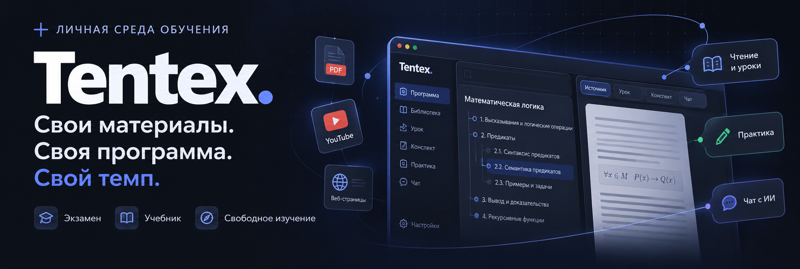
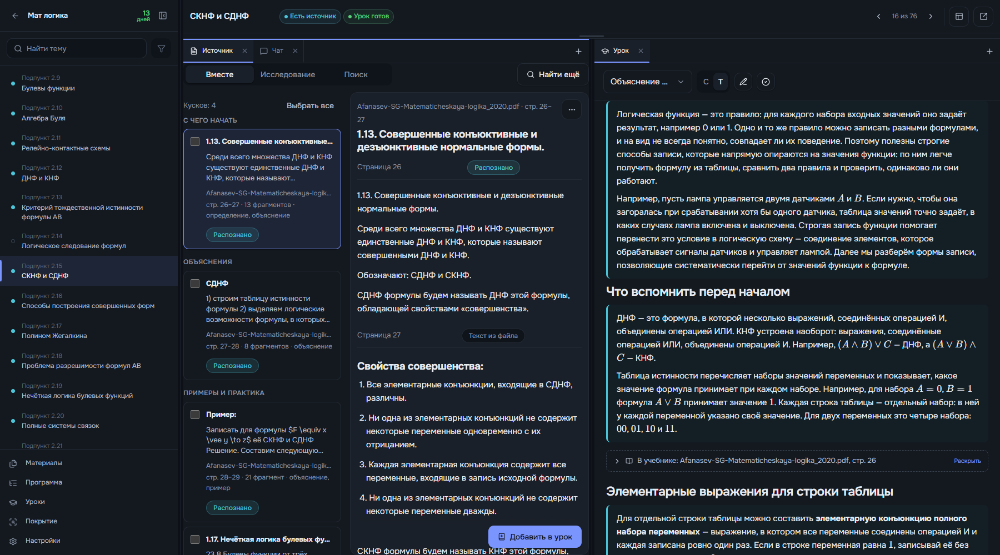

<p align="center">
  <strong>beta v1.0</strong> · проект активно развивается
</p>

<p align="center">
  
</p>

<p align="center">
  <a href="#установка">Установить</a> ·
  <a href="#три-способа-учиться">Выбрать режим</a> ·
  <a href="#первый-учебный-маршрут">Начать учиться</a> ·
  <a href="https://github.com/tneki22/Tentex/issues">Сообщить об ошибке</a>
</p>

# Tentex — единая среда для обучения

**Соберите учебники, лекции и заметки в понятный маршрут: что изучать, где читать и как проверить себя.**

Tentex связывает ваши материалы, программу и практику в одном пространстве. Готовьтесь к экзамену, проходите учебник или изучайте предмет с нуля: открывайте источник рядом с уроком, делайте конспект, задавайте вопросы и возвращайтесь к нужной теме.

Работает на вашем компьютере, хранит данные локально и рассчитан на одного человека. Учётная запись не нужна. Внешние модели подключаются по желанию.

<p align="center">
  
</p>

<p align="center"><sub>Реальная рабочая область: программа, первоисточник и урок по одной теме. Расположение вкладок можно настроить под себя.</sub></p>

## Три способа учиться

### 🎯 Подготовка к экзамену

Начните со списка вопросов, задач или билетов. Добавьте учебные материалы и эталонные ответы, распределите подготовку по календарю, повторяйте карточки и тренируйте ответы. С подключёнными моделями доступны проверка ответа и устная попытка с записью и расшифровкой.

### 📖 Изучение по учебнику

Возьмите книгу, методичку или курс. Проверьте оглавление, превратите его в программу и соберите уроки по темам: страницы первоисточника, пояснения, примеры и самопроверка. Уроки можно создавать вручную или с ИИ, проходить по расписанию и экспортировать.

### 🧭 Свободное изучение

Начните с цели: например, «разобраться в компьютерных сетях». Составьте программу вручную или в чате с ИИ, подберите источники из Библиотеки, находите дополнительные материалы через интернет-поиск и собирайте уроки по мере изучения.

Во всех режимах **Библиотека общая**: один материал можно подключить к нескольким проектам. Карточки и «Моя подготовка» доступны в экзамене; уроки — в учебнике и свободном изучении; планирование занятий — в учебнике.

## От материала к пониманию

**Материалы → программа → чтение и уроки → практика → возвращение к теме.**

- **Свои источники.** PDF, DOCX, TXT, Markdown, фотографии страниц, аудио, веб-страницы и субтитры YouTube. Для Typst есть отдельная загрузка исходников со сборкой в PDF.
- **Программа как маршрут.** Дерево тем или экзаменационных вопросов: вручную, из оглавления или с помощью ИИ. Предложенные изменения можно просмотреть перед применением и отменить.
- **Всё рядом с темой.** До трёх рабочих зон с вкладками источника, урока, конспекта и чата. Можно читать книгу и сразу работать с её содержанием.
- **Поиск с возвратом к источнику.** По словам и, после установки локальной модели, по смыслу. Учебный чат с внешней моделью отвечает по материалам и даёт ссылки на найденные места.
- **Исследование материалов.** ИИ сопоставляет содержимое с программой: предлагает куски для чтения, показывает темы без найденного объяснения и материал вне программы. Связи можно проверить и использовать в уроках. Этот контур ещё дорабатывается.
- **Практика и результаты.** В экзамене — попытки, оценки, карточки и календарь; в уроках с ИИ — задания разных форм. Конспекты помогают сохранять собственное понимание темы.
- **Работа остаётся с вами.** Резервные копии установки, перенос проектов и уроков. Уроки экспортируются в PDF, LaTeX и Markdown.

> Покрытие описывает связь материалов с программой, а не уровень ваших знаний. Книга может выходить за рамки цели, поэтому покрытие ниже 100% — нормальный результат.

## Установка

Основной способ запуска — **Docker Compose**. Он поднимает интерфейс, API и фоновые службы. Python и Node.js на компьютере для этого не нужны.

Первый запуск требует интернета: Docker скачивает зависимости и собирает образы. Модели распознавания и поиска устанавливаются отдельно из интерфейса, когда понадобятся. API-ключи для первого запуска не нужны.

### Windows — запуск двойным кликом

1. Установите [Docker Desktop](https://docs.docker.com/desktop/setup/install/windows-install/) с **WSL 2**, выполните перезагрузку, если её просит установщик, и запустите Docker Desktop в режиме **Linux containers**.
2. [Скачайте ZIP проекта](https://github.com/tneki22/Tentex/archive/refs/heads/main.zip) и **распакуйте** его в папку с правом записи. Либо клонируйте репозиторий через Git. Из ZIP без распаковки запускать нельзя.
3. Откройте **`Запустить Tentex.cmd`**. При первом запуске дождитесь сборки контейнеров; браузер откроется после готовности приложения.
4. Интерфейс доступен по адресу **[localhost:5173](http://localhost:5173)**.

Для запуска из ZIP Git не требуется. Если Docker Desktop установлен, но выключен, запускатор попробует открыть его сам.

| Файл в корне проекта | Что делает |
| --- | --- |
| **`Запустить Tentex.cmd`** | Запускает Tentex. При изменении исходников пересобирает контейнеры; без изменений использует установленную сборку |
| **`Обновить Tentex.cmd`** | Получает новую версию, сохраняет копию данных, пересобирает и запускает приложение |
| **`Остановить Tentex.cmd`** | Останавливает Tentex, сохраняя проекты, материалы, модели и образы |
| **`Диагностика Tentex.cmd`** | Показывает состояние контейнеров, последние логи и пути к данным |

Закрытие браузера не останавливает службы. Закончили работу — откройте **`Остановить Tentex.cmd`**, чтобы освободить ресурсы компьютера.

<details>
<summary><strong>Как устроено обновление на Windows</strong></summary>

- **ZIP-установка:** скачивается ветка `main` этого публичного репозитория. Git не нужен. Изменённые после первого запуска исходники блокируют автоматическую замену; личные файлы, `.env`, данные и модели сохраняются.
- **Git-клон:** обновляется upstream текущей ветки, только через fast-forward. Нужны Git и tracking-ветка. При локальных правках, неотслеживаемых файлах или расходящейся истории обновление останавливается.
- Перед заменой версии службы останавливаются. База, материалы, настройки и ключ шифрования копируются в `.tentex-launcher/updates/<дата>/data/`. Модели и прежние резервные копии остаются в `data/` и не дублируются.
- После локальных изменений достаточно снова открыть файл запуска. Файл обновления нужен для получения новой версии с GitHub.

Если обновление оборвалось, копия остаётся: устраните причину и повторите запуск. После миграций базы для отката нужны согласованные прежние **код и данные**, а не только старый код. Старые копии обновлений можно удалить после проверки новой версии.

</details>

### Linux — запуск из терминала

Установите [Docker Engine](https://docs.docker.com/engine/install/) и [плагин Docker Compose](https://docs.docker.com/compose/install/linux/) по инструкции для своего дистрибутива. Убедитесь, что Docker запущен и доступен текущему пользователю. Для клонирования нужен Git; также можно скачать и распаковать ZIP.

```bash
git clone https://github.com/tneki22/Tentex.git
cd Tentex
docker compose up -d --build --wait
```

После запуска откройте **[localhost:5173](http://localhost:5173)**. Все дальнейшие команды выполняйте из папки проекта.

```bash
# Повторный запуск установленной версии, в том числе без сети
docker compose up -d --no-build --pull never --wait

# Остановка с сохранением данных
docker compose stop --timeout 60

# Состояние и последние логи
docker compose ps --all
docker compose logs --tail 60
```

<details>
<summary><strong>Обновление на Linux</strong></summary>

Для Git-клона сначала сохраните свои изменения: вывод `git status --short` должен быть пустым. Затем остановите службы, скопируйте данные и обновите код:

```bash
git fetch
docker compose stop --timeout 60
cp -a data "../tentex-data-before-update-$(date +%Y%m%d-%H%M%S)"
git pull --ff-only
docker compose up -d --build --wait
```

Для ZIP-установки: остановите Tentex, сохраните копию `data/`, распакуйте новую версию **в отдельную папку** и перенесите туда прежние `data/` и `.env`, если он был. Запустите новую установку командой `docker compose up -d --build --wait`. Старую папку сохраняйте до проверки результата. ZIP не стоит накладывать поверх прежнего кода: могут остаться файлы, удалённые в новой версии.

После миграций базы откатывайте согласованную пару кода и данных.

</details>

<details>
<summary><strong>Если приложение не открылось</strong></summary>

- На Windows откройте `Диагностика Tentex.cmd`; на Linux проверьте `docker compose ps --all` и `docker compose logs --tail 60`.
- Убедитесь, что Docker работает и первая сборка завершилась. Окно Windows-запускатора при ошибке остаётся открытым.
- Если порты заняты другой установкой, задайте свободные `TENTEX_WEB_PORT`, `TENTEX_API_PORT` и `TENTEX_SEARXNG_PORT` в `.env`. Для отдельной установки также задайте другое `COMPOSE_PROJECT_NAME`.
- Для описания проблемы откройте [Issue](https://github.com/tneki22/Tentex/issues), укажите ОС, способ запуска, шаги и текст ошибки. Перед отправкой логов проверьте, что в них нет ключей и личных материалов.

</details>

## Первый учебный маршрут

Начать можно **без внешних моделей**, на обычном PDF с текстовым слоем:

1. Создайте проект **«Изучение по учебнику»** и добавьте книгу.
2. Подготовьте текст материала, проверьте оглавление и импортируйте нужные пункты в программу. Если оглавления нет, темы можно вписать вручную.
3. Выберите тему и соберите быстрый урок из её страниц или ручной урок из нужных кусков книги.
4. Откройте урок рядом с первоисточником, добавьте вкладку **«Мой конспект»** и запишите главное своими словами.
5. Отметьте урок пройденным и переходите к следующей теме. ИИ и планирование занятий можно настроить позже.

Подробное **[руководство пользователя](http://localhost:5173/guide)** встроено в приложение: кнопка с книгой внизу боковой панели. Оно объясняет режимы, материалы, уроки, карточки, настройки и перенос данных.

## Локально по умолчанию

| Без внешних моделей | С дополнительной настройкой |
| --- | --- |
| Проекты, Библиотека и ручная программа | Локальные модели OCR для сканов и фотографий |
| Чтение, конспекты и ручные уроки | Локальная модель для поиска по смыслу |
| Поиск по словам, ручные привязки | Внешние модели для чата, программы, исследования и ИИ-уроков |
| Ручные карточки и календарь экзамена | Внешние модели для проверки ответов и ИИ-карточек |
| Экспорт уроков и резервные копии | Распознавание речи и устные попытки |

После установки базовые функции работают офлайн. Получение веб-страниц, YouTube и интернет-поиск требуют сети; загрузка моделей и пакетов Typst — тоже. У внешних провайдеров могут быть платные вызовы: доступные модели, расходы и лимиты настраиваются в **«Параметры → ИИ»**. При вызове провайдер получает отправляемый текст, изображение или аудио.

**Берегите папку `data/`.** В ней база, материалы, модели и `installation.secret` — ключ шифрования настроек. Для полной копии используйте **«Параметры → Хранилище»**; для переноса одного проекта — экспорт проекта. Не удаляйте `data/` при обновлении. По умолчанию интерфейс и API доступны только на локальном компьютере.

## Что означает beta

**beta v1.0 — рабочая версия, которая ещё требует доводки и проверки на разных материалах.** Названия и поведение отдельных функций могут меняться; ответы моделей, распознавание и найденные связи нужно сверять с источником.

Сейчас в фокусе — качество материалов и исследования, история попыток заданий, цитаты и экспорт конспектов, проверка трёх режимов и переноса данных. Глубокий синтез покрытия, новая карта знаний, каталог готовых программ, календарь свободного изучения и Telegram-бот остаются в планах.

Нашли неудобство или ошибку — [расскажите о сценарии в Issues](https://github.com/tneki22/Tentex/issues). Конкретный файл, ожидаемый результат и шаги воспроизведения помогают улучшать Tentex.

## Для разработки

Стек: **React · TypeScript · Vite · FastAPI · SQLite**. Обработка материалов и локальные модели вынесены в фоновые службы; полнотекстовый поиск использует FTS5/BM25, гибридный — embeddings и `sqlite-vec`.

<details>
<summary><strong>Запуск из исходников и режим Docker с автоперезагрузкой</strong></summary>

Нужны **Node.js ≥22.12.0** и **Python 3.13+**. Установите зависимости из корня репозитория:

```bash
npm install
cd frontend
npm install
cd ../backend
python -m pip install -r requirements-dev.txt
cd ..
```

Для API и интерфейса откройте два терминала:

```bash
npm run dev:api
```

```bash
npm run dev:web
```

Для обработки материалов, распознавания и локальных моделей поиска установите зависимости worker. Для сборки Typst и PDF-экспорта уроков нужен CLI **Typst 0.15.1** в `PATH` либо путь в `TENTEX_TYPST_BINARY`. Системные зависимости OCR зависят от платформы; контейнерный worker уже содержит их.

```bash
cd backend
python -m pip install -r requirements-worker.txt
cd ..
npm run dev
```

`npm run dev` поднимает API, worker, сервис локальных моделей поиска и интерфейс. Для интернет-поиска дополнительно нужен SearXNG.

У Docker есть отдельный режим разработки с автоперезагрузкой:

```bash
docker compose -f docker-compose.yml -f docker-compose.dev.yml up --build
```

Обычный Docker-запуск отдаёт готовую сборку. После изменения фронтенда пересоберите её: `docker compose up -d --build web`.

Проверки исходников:

```bash
npm run typecheck
npm run build
cd backend
python -m ruff check app migrations
```

Тестовые стенды, бенчмарки и внутренняя документация разработки остаются в локальном окружении автора и не входят в публичный checkout. Для запуска приложения они не нужны.

Интерфейс: [localhost:5173](http://localhost:5173) · API: [localhost:8000](http://localhost:8000) · описание API: [localhost:8000/docs](http://localhost:8000/docs).

</details>

Тексты встроенного руководства находятся в [`frontend/src/screens/guide/pages/`](./frontend/src/screens/guide/pages/), правила работы с кодом — в [`AGENTS.md`](./AGENTS.md). Tentex создаётся как курсовой проект по ТРПС в МГТУ им. Н. Э. Баумана.
