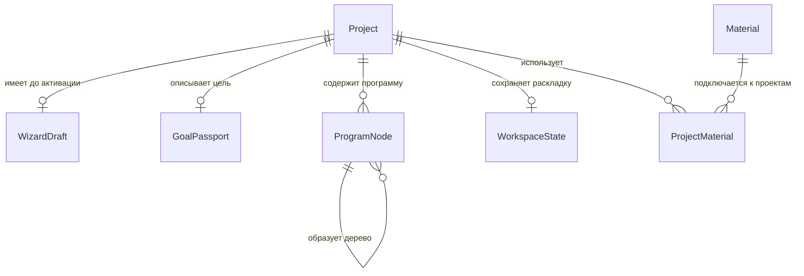

# Ядро данных и API — этап 2

Документ описывает уже реализованную основу Tentex. Семь доменных таблиц создаёт миграция
`34158831e181`; следующая узкая миграция `6c7ad9e40c82` переводит `Project.color` из строки в
целое `1..8`, сохраняет `null` и заменяет неизвестные прежние значения безопасным цветом `1`.

## Модель данных

| Сущность | Что хранит | Главное ограничение |
|---|---|---|
| `Project` | Название, пресет, вариант Рабочей области, статус, срок и включённые модули | Все ветки мастера создают один и тот же тип проекта |
| `WizardDraft` | Шаг мастера, номер редакции и незавершённый веточный ввод | После активации удаляется; устаревшее сохранение отклоняется |
| `GoalPassport` | Предмет, цель, исходный и целевой уровень, формат и учебный ритм | Один структурированный паспорт на проект |
| `Material` | Хеш, исходное имя, относительный путь, тип и размер файла | Один файл может использоваться несколькими проектами |
| `ProjectMaterial` | Роль, приоритет и инструкция материала внутри проекта | Связь не дублирует сам файл |
| `ProgramNode` | Раздел, тему или подпункт и его учебные свойства | Родитель из того же проекта, без циклов, глубина до четырёх уровней |
| `WorkspaceState` | Выбранный узел, раскрытые ветви и группы вкладок | Одна версионированная раскладка на проект |

Физической таблицы пользователя нет: Tentex работает для одного пользователя на одной
установке, поэтому такой внешний ключ сейчас ничего не различал бы. Пользовательские шаблоны,
страницы, фрагменты и привязки появятся вместе со своими сценариями, а не заранее.

## Где допустим JSON

JSON используется только в трёх ограниченных местах:

- `Project.enabled_modules` — короткий список включённых модулей;
- `WizardDraft.state` — сырой ввод и состояние конкретной ветки мастера, которых нет в
  нормализованных полях;
- `WorkspaceState.layout` — проверенная API раскладка: выбранный узел, раскрытые узлы, ширина
  дерева, от одной до трёх групп вкладок и их веса.

Название, срок, паспорт цели и программа в JSON не копируются. Поэтому у каждого факта остаётся
один источник истины. Конспекты, заметки, результаты занятий и снятые привязки в раскладку не
попадают.

## Жизненный цикл

Черновик создаётся как пара `Project(status=draft)` и `WizardDraft`. Каждое полное сохранение
передаёт ожидаемый номер редакции. База атомарно увеличивает его только при совпадении; старая
вкладка получает конфликт и не может затереть более новые данные.

Первая активация выполняется одной транзакцией:

1. проверяется редакция черновика;
2. проверяются название и обязательная структура паспорта цели;
3. проверяется наличие хотя бы одной изучаемой темы или подпункта;
4. целиком проверяется дерево программы;
5. проект становится активным, а `WizardDraft` удаляется.

При любой ошибке не сохраняется ни одна часть перехода. Повторная активация уже активного проекта
безопасно возвращает его текущее состояние. Материал не входит в условие активации: в Tentex
программа первична, а источники можно подключить позднее.

После активации экран Настроек одной транзакцией изменяет только название, описание, иконку, цвет,
срок, включённые модули и существующий `GoalPassport`. Статус, шаблон, вариант Рабочей области и
порядок проекта в команду не входят. Черновик продолжает изменяться только ревизионным API мастера,
а архивный и завершённый проекты доступны в Настройках только для чтения.

## SQLite и миграции

Приложение использует синхронный SQLAlchemy 2: при одном локальном пользователе асинхронный слой не
даёт полезного выигрыша, но усложняет транзакции и объяснение проекта. SQLite на каждом соединении
включает внешние ключи, `busy_timeout=5000` и WAL. WAL позволяет чтению продолжаться во время
записи, что подходит автосохранению локального приложения.

Alembic — единственный способ создавать и менять схему. При старте FastAPI автоматически выполняет
`upgrade head`; ошибка миграции останавливает запуск. Это делает чистую установку и дальнейшие
изменения схемы воспроизводимыми без ручных команд и без `create_all()`.

## API и экраны

> Раздел ниже фиксирует границу именно этапа 2. На этапе 3 контракт расширен командами дерева,
> импортом, undo, архивом и сортировкой, а все основные экраны подключены к API. Актуальное
> продолжение: [`stage-3-live-projects.md`](stage-3-live-projects.md).

| Действие API | Экран или пользовательское действие |
|---|---|
| `POST /api/wizard-drafts` | Начать мастер проекта |
| `GET /api/wizard-drafts` | Предложить продолжить незавершённый мастер |
| `GET /api/wizard-drafts/{project_id}` | Возобновить мастер после перезапуска |
| `PUT /api/wizard-drafts/{project_id}` | Автосохранить мастер целиком |
| `POST /api/wizard-drafts/{project_id}/activate` | Нажать «Создать проект» |
| `GET /api/projects` | Показать экран «Проекты» без черновиков |
| `GET /api/projects/{project_id}` | Открыть проект с программой и раскладкой |
| `PUT /api/projects/{project_id}/settings` | Одной транзакцией сохранить Настройки активного проекта и паспорт цели |
| `POST /api/projects/{project_id}/program-nodes` | Добавить один узел программы |
| `PATCH /api/projects/{project_id}/program-nodes/{node_id}` | Изменить или перенести узел |
| `PUT /api/projects/{project_id}/workspace-state` | Автосохранить раскладку Рабочей области |

Удаление намеренно отсутствует до появления журнала отмены на этапе 3. Импорт текста и подключение
остальных React-экранов также относятся к этапу 3; сейчас API принимает уже разделённые узлы
программы, а к настоящим данным подключены только Настройки проекта.

## Короткое объяснение для защиты

1. Программа первична, поэтому `Material` не входит в инвариант активации.
2. Шаблон — пресет, поэтому одна таблица `Project` обслуживает все входы.
3. Нормализованные таблицы хранят доменные факты, JSON — только изменчивую раскладку и
   незавершённый ввод.
4. Составной внешний ключ защищает изоляцию деревьев проектов, а сервис защищает глубину и
   отсутствие циклов.
5. WAL оставляет чтение доступным при записи, Alembic делает схему воспроизводимой одной командой.

Сквозная проверка `python backend/scripts/check_stage2.py` создаёт и сохраняет черновик, отклоняет
устаревшее сохранение, активирует проект, сохраняет все группы Настроек и проверяет ошибки границы.
После перезапуска она повторным `GET` подтверждает значения и неизменность статуса, шаблона,
варианта Рабочей области и порядка, получает 409 для архивного проекта и проверяет внешние ключи,
WAL и установленную миграцию.
