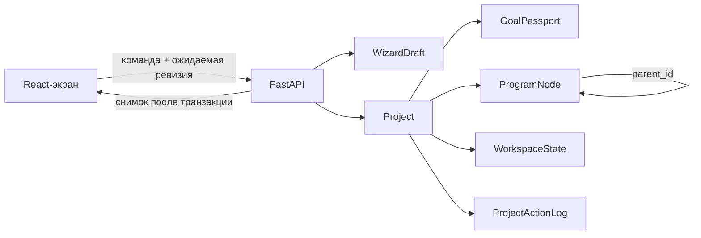

# Этап 3. Живые проекты и Программа

Документ фиксирует реализованный контракт этапа 3. Историческое описание ядра этапа 2 остаётся
в [`stage-2-core.md`](stage-2-core.md); если маршруты пересекаются, актуален этот документ.

## Результат и граница

Проекты, обе ветки Мастера, Программа и базовая Рабочая область читают и изменяют SQLite только
через обычный `/api`. Экзаменационная ветка импортирует вставленный список, даёт проверить
канонические `ProgramNode` и активирует проект. Учебниковая ветка сохраняет возобновляемый
черновик, паспорт и ручную программу, но до этапа 5 не изображает загрузку файла и не активирует
проект без источника.

Единственные новые хранимые механизмы этапа — `Project.program_revision` и
`ProjectActionLog`. Ответы, страницы, фрагменты, привязки, активности, карточки и План здесь не
создаются. Миграция `20260808_0003` добавляет эти поля поверх схемы этапа 2.

## Поток состояния

- `WizardDraft.revision` защищает форму мастера, импорт и переход статуса.
- `Project.program_revision` защищает каждую прямую мутацию дерева.
- `ProjectActionLog.sequence` — непрозрачный токен команды «отменить последнее увиденное
  действие»; клиент не вычисляет обратную операцию.
- Изменение Программы в черновике атомарно увеличивает обе ревизии.
- `WorkspaceState` не увеличивает ревизию Программы и не меняет `Project.updated_at`.
- Сервер возвращает новый полный снимок после каждой команды. UI заменяет им локальное состояние,
  а не пытается повторить серверные инварианты.

## Контракт API

### Мастер и жизненный цикл

| Метод | Маршрут | Назначение |
| --- | --- | --- |
| `POST` | `/api/wizard-drafts` | создать экзаменационный или учебниковый черновик |
| `GET` | `/api/wizard-drafts` | получить список возобновляемых черновиков |
| `GET` | `/api/wizard-drafts/{project_id}` | получить паспорт, состояние и Программу черновика |
| `PUT` | `/api/wizard-drafts/{project_id}` | сохранить форму с `expected_revision` |
| `DELETE` | `/api/wizard-drafts/{project_id}?expected_revision=…` | удалить только черновик и его дочерние данные |
| `POST` | `/api/wizard-drafts/{project_id}/exam-import` | разобрать текст и атомарно заменить черновую Программу |
| `POST` | `/api/wizard-drafts/{project_id}/activate` | проверить паспорт и дерево, затем активировать проект |

Импорт принимает форматы `questions`, `questions_tasks` и `tickets`, сохраняет строки продолжения,
различает вопросы и задачи и возвращает реальные счётчики и предупреждения. Лимит сырого текста —
1 МБ. Повторный импорт не наращивает дубликаты: он заменяет черновое дерево одной транзакцией.

### Проекты, Программа и Рабочая область

| Метод | Маршрут | Назначение |
| --- | --- | --- |
| `GET` | `/api/projects` | активные, архивные и завершённые проекты |
| `PUT` | `/api/projects/order` | полный порядок активных проектов |
| `GET` | `/api/projects/{project_id}` | проект, паспорт, Программа, workspace и последнее действие |
| `PUT` | `/api/projects/{project_id}/settings` | только разрешённые настройки и паспорт |
| `POST` | `/api/projects/{project_id}/archive` | идемпотентно архивировать |
| `POST` | `/api/projects/{project_id}/restore` | идемпотентно вернуть в активные и поставить в конец |
| `POST` | `/api/projects/{project_id}/program-nodes` | создать узел |
| `PATCH` | `/api/projects/{project_id}/program-nodes/{node_id}` | изменить формулировку или тип |
| `POST` | `/api/projects/{project_id}/program-nodes/{node_id}/move` | переместить узел и уплотнить порядок |
| `POST` | `/api/projects/{project_id}/program-nodes/{node_id}/target-level` | изменить целевой уровень, при необходимости для поддерева |
| `POST` | `/api/projects/{project_id}/program-nodes/{node_id}/remove` | скрыть поддерево без физического удаления |
| `POST` | `/api/projects/{project_id}/program-nodes/{node_id}/restore` | вернуть корень скрытого поддерева |
| `POST` | `/api/projects/{project_id}/actions/undo` | отменить последнее доступное действие |
| `PUT` | `/api/projects/{project_id}/workspace-state` | сохранить выбранную тему и раскладку |

Тела команд имеют `extra=forbid`: неизвестное поле — ошибка, а сервер сам выводит
`workspace_variant`, `origin`, порядок, дату изменения статуса и начальный `target_level`.
Основные доменные коды ошибок: `not_found`, `program_invariant`, `project_read_only`,
`unsupported_template`, `stale_draft_revision`, `stale_program_revision` и
`stale_action_sequence`.

## Дерево и undo

Сервер проверяет отсутствие циклов, максимальную глубину 4, принадлежность родителя тому же
проекту, допустимые типы для варианта проекта и плотный `sort_order` среди соседей. У активного
проекта удаление означает `is_in_current_program=false` для поддерева: `ProgramNode.id` остаётся
стабильным для будущих ответов, привязок и прогресса.

| `action_type` | Что восстанавливает undo |
| --- | --- |
| `exam_import` | точный предыдущий набор узлов с прежними UUID |
| `node_create` | скрывает созданный узел, не удаляя его физически |
| `node_update` | прежние поля узла |
| `node_move` | прежнего родителя и позицию |
| `target_level_subtree` | уровни всех затронутых узлов |
| `node_remove` / `node_restore` | прежние флаги видимости поддерева |

Обратные данные хранятся в версионированном `inverse_data`; обработчик принимает только известную
версию payload. После перезапуска процесс читает журнал из SQLite и отменяет действие так же, как
до перезапуска.

## Клиентские правила состояния

- GET-запросы экранов можно отменить через `AbortController`; серверные мутации после отправки не
  отменяются закрытием React-компонента.
- Мастер сериализует сохранения в одну очередь и автосохраняет поля через 400 мс. При конфликте
  ревизии очередь останавливается до явной загрузки серверной версии.
- Порядок проектов меняется оптимистично, но при ошибке возвращается предыдущий серверный порядок.
- Рабочая область сериализует сохранение раскладки; 400 мс применяется только к resize.
- Параметр `?topic=` принимается только для существующей видимой темы или подпункта проекта.
- Будущие материалы, ответы, повторы и показатели не подменяются mock-данными: экран показывает
  честное пустое состояние и этап, на котором функция появится.

## Демонстрационный проект

При обычном запуске идемпотентный seed создаёт один проект
«Базы данных — экзамен (пример)» как обычные строки `Project`, `GoalPassport`, `ProgramNode` и
`WorkspaceState`. У него стабильные UUID, два билета и четыре учебных узла. Он читается,
редактируется и сохраняется теми же маршрутами, не имеет frontend-fallback и не содержит ответов,
материалов или показателей будущих этапов. Проверочные скрипты отключают seed настройкой
`TENTEX_SEED_DEMO_PROJECT=false`, когда им нужна полностью чистая база.

## Совместимость следующих этапов

| Следующий этап | Инвариант этапа 3 |
| --- | --- |
| 4, ответы | стабильный `ProgramNode.id`; rename, move и remove его не меняют |
| 5, материалы | общий `activate` нейтрален к источникам; учебниковая ветка добавит свою проверку |
| 7, пересборка | `origin` задаёт сервер, физического удаления active-узлов нет, payload журнала версионирован |
| 8, привязки | скрытые узлы остаются в БД; будущие связи не потеряются при редактировании структуры |
| 9, обучение | `target_level` получает серверный default из паспорта; новые действия расширяют общий журнал |
| 10, экспорт | канонические факты не живут только в UI или `localStorage` |

## Проверка

`python backend/scripts/check_stage3.py` проверяет seed и его идемпотентность, три формата импорта,
ошибочные и устаревшие команды, undo после перезапуска, активацию, все мутации дерева, порядок,
архив и восстановление, изоляцию workspace, учебниковый черновик, WAL, внешние ключи и состояние
Alembic. Регрессия ядра отдельно проверяется `check_stage2.py`; статические ворота — Ruff,
TypeScript и production build. Ручной browser-smoke выполняется после перезапуска контейнеров.

Финальный запуск 09.08.2026: `check_stage2.py`, `check_stage3.py`, Ruff, TypeScript и production
build завершились с кодом 0. В браузере проверены обычный seed-маршрут, add → reload → undo,
полная активация экзаменационного мастера, сохранение/возобновление/удаление учебникового черновика,
404 и отсутствие ошибок React. Docker Desktop в момент проверки не был запущен, поэтому вместо
`docker compose restart web` те же FastAPI и Vite были подняты локальной `npm run dev`; это
ограничение окружения, а не замена проверок чистой БД.
