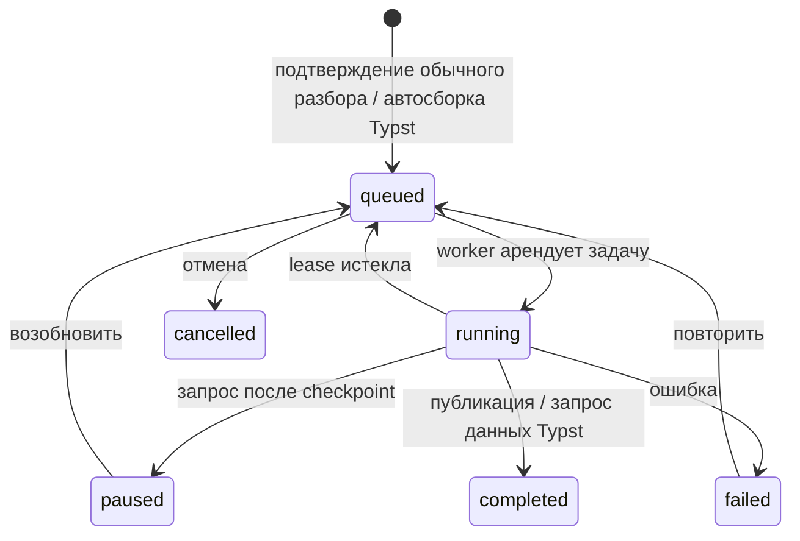

# Этап 5: загрузка и разбор материалов

Фактический контракт обновлён 25 августа 2026 года, раздел про режимы разбора —
4 сентября 2026 года. Экзаменационный путь и общая часть 5B реализованы. Режим
«Учебник» (отдельный GPU-сервис на официальном Blackwell-образе PaddleOCR 3.5) снят при
стабилизации экзамена — история и путь возврата в `docs/archive/gpu-ocr-textbook.md`
(тег `gpu-ocr-last`). Текущие режимы — `fast` (локальный CPU) и `cloud` (внешняя
зрительная модель через шлюз); оба реализованы. Практическая сквозная матрица входов,
запуска, storage, ревизий и ошибок — `../../LIBRARY_FILE_PROCESSING.md`; этот документ
не дублирует её.

## Что уже можно показать

1. Загрузить PDF, DOCX, TXT, MD, JPG, PNG или локальное аудио до 100 МБ; вставить текст,
   добавить снимок публичной веб-страницы или транскрипт публичного YouTube-видео.
2. Увидеть оценку страниц, OCR-страниц и времени, выбрать `fast` или настроенный `cloud`
   и только потом запустить фоновый разбор обычного материала.
3. Поставить задачу на паузу, возобновить или повторить после ошибки. После падения worker
   продолжает с постраничного checkpoint.
4. Открыть оригинал и безопасно построенный текст, bbox фрагментов, качество
   `native` / `ocr` / `ocr_low`, диагностику, поиск на странице, масштаб и закладки PDF.
5. Исправить текст страницы. Создаётся новая parse revision; исходный файл не меняется.
6. В глобальной Библиотеке увидеть физические материалы, качество и все использующие их
   проекты; перед удалением — последствия для проектов и эталонных ответов.
7. В «Вопросах экзамена» нажать «Импорт»: при нескольких материалах выбрать один, при
   одном сразу увидеть прокручиваемое превью, при отсутствии — загрузить. Подтверждение
   заменяет список; совпавшие вопросы сохраняют стабильные `ProgramNode.id` и данные.
8. Экзаменационный проект можно создать без списка вопросов через «Добавить вопросы
   позже», а затем заполнить тем же импортом из активного проекта.
9. В учебниковом черновике загрузить реальные источники, разобрать их, назначить роли,
   приоритет и инструкцию, удалить связь и продолжить черновик после перезапуска.
10. Создать из этого черновика активный учебниковый проект. Ручная программа может быть
    пустой: итоговая сводка показывает реальные источники, а дерево заполняется позже в
    разделе «Программа»; построение по outline/проходу 1 остаётся этапом 7.
11. Загрузить Typst-файл, папку или ZIP: это отдельная ветка без OCR, которая сразу
    ставит `BackgroundJob(kind=typst_compile)`; неоднозначный entrypoint, недостающий
    файл или пакет переводят материал в `needs_input`. Детали — `typst-materials.md`.

В датированном smoke-прогоне 10.08.2026 на приложенном `questions-photo.png` worker
получил 48 нумерованных OCR-фрагментов, quality `ocr`, среднюю confidence `0.9636`.
Это отчёт того прогона, не гарантия текущей установки. Импорт выделил все 48 вопросов, в том числе
OCR-строки без пробела после `41)`, и показывает повторяющиеся формулировки. OCR ошибается в отдельных
терминах, поэтому оригинал всегда остаётся рядом.

## Данные и миграции

- `Material` — физический источник установки: SHA-256, storage path, тип входа, URL и дата
  получения, страницы, outline, активная parse revision, качество и диагностика.
- `ProjectMaterial` — использование источника конкретным проектом: отображаемое имя,
  роль, приоритет, инструкция и назначения.
- Вкладка «Файл» редактирует эти поля через существующий `PATCH` материала и получает
  `attached_at` из `ProjectMaterial.created_at`; даты физической загрузки и изменения
  остаются полями общего `Material`.
- При назначении нового файла эталонными ответами подтверждённая замена выполняется в
  одной транзакции: со старой связи снимается `reference_answers` (пустое назначение
  становится `study_source`), затем новое назначение применяется к текущему файлу.
  Без `replace_reference_answers=true` действует прежний конфликт одного файла ответов.
- `MaterialPage`, `MaterialFragment`, `MaterialBlock` — версионированный результат
  разбора; bbox нормализован в `0..1`. Фрагмент хранит `recognition_source`
  (`native · ocr · vl · manual`), `confidence` и исходный `asset_path` для изображения,
  формулы или таблицы. Миграция `20260825_0020` совместима со старыми ревизиями и
  разрешает импортированный эталон без текста, если ответ целиком находится в изображении.
- `BackgroundJob` в `background_jobs` — общая очередь разбора, Typst, AI-ролей и локальных фоновых операций: вид, состояние, стадия, прогресс, checkpoint, lease, pause и ошибка. Один worker обрабатывает виды последовательно; второй сейчас небезопасен, см. `background-jobs.md`.
- `ProgramNode.origin_material_id` — происхождение импортированного пункта экзамена.

Миграции 0005/0006 ниже — историческая база этапа. Текущий runtime требует Alembic
`head`: позднее добавлены `background_jobs`, история и частичный разбор, page parser
mode, Typst и исправления CHECK вплоть до `20260909_0044`. Миграция 0006 была проверена
не только на пустой базе, но и на копии рабочей SQLite этапов 2–5A. Из-за ограничения
SQLite nullable происхождение вопроса добавляется без перестройки таблицы; очистку при
физическом удалении материала выполняет триггер `tr_material_delete_program_origin`.

## Конвейер и восстановление

Состояния материала и задачи — разные оси. Материал использует
`ready_to_process · queued · processing · paused · needs_input · ready · failed`;
`BackgroundJob.state` — `queued · running · paused · cancelled · failed · completed`.
`needs_input` относится только к материалу (сейчас прежде всего Typst), а
`running/completed` — только к задаче.



Worker арендует старейшую задачу на 60 секунд. Страница и новый checkpoint записываются
одной транзакцией. Повтор идемпотентен по `(material_id, revision, page_number)`, а
активная revision переключается только после успешной сегментации всего документа.
Сохранённая checkpoint-страница сразу получает временные блок и фрагменты и читается по
`task_id`; незавершённая следующая страница остаётся состоянием ожидания. Финальная
сборка заменяет временную постраничную структуру.

Общий адаптер возвращает `ParsedPage`: Markdown, plain text, элементы, координаты,
иерархию, confidence и необязательные временные метки. Поэтому PDF, OCR, HTML,
YouTube и аудио дальше используют одинаковые страницы, фрагменты и блоки.

## Входы и качество

- PDF в режиме «Быстро»: PyMuPDF/PyMuPDF4LLM извлекают нативный текст и координаты,
  PP-OCRv5 запускается только на встроенных растровых областях; целиком OCR-ится лишь
  страница без текстового слоя. Результаты объединяются по координатам, нативный текст
  выигрывает у совпавшего OCR, но исходный вырез изображения сохраняется.
- Порядок чтения страницы считает `parsers/reading_order.py` — рекурсивный XY-Cut
  (Nagy, Seth, 1984): сначала горизонтальные полосы пустоты, потом вертикальные.
  Прежняя сортировка «сверху вниз, слева направо» на двухколоночной статье чередовала
  колонки построчно, и восстановить текст после этого было уже нельзя. Наклон скана
  снимается по квадам детектора и применяется **только** как ключ сортировки:
  координаты в базе обязаны совпадать с картинкой, по которой пользователь ищет
  фрагмент глазами.
- Разрешение растра выбирается по исходнику (`parsers/raster.py`), а не постоянным
  множителем: настройка задаёт целевое качество (150 dpi за единицу), а модуль не
  рисует крупнее чем в полтора раза относительно исходного скана и держится в
  границах 150…450 dpi.
- То, чего распознаватель строк не коснулся вовсе — выносные формулы, графики,
  схемы, — не пропадает: `raster.unread_regions` находит такие области по остаткам
  чернил вне рамок распознанных строк, они сохраняются вырезом с координатами и
  подписью «[Изображение]». Вид области не угадывается: отличить формулу от графика
  по пропорциям нельзя, а неверная подпись хуже честной общей.
- Выносная формула на странице с текстовым слоем приходит от `pymupdf4llm`
  боксом `boxclass=formula` с **пустыми** `textlines`: математику в строки он не
  собирает. Такой бокс нельзя выбрасывать как пустой — на странице учебника по
  теории вероятностей так пропадали шесть формул из шести, вместе с рамками.
  `pdf_layout._formula_fallback` достаёт глифы прямо из слоя (`get_text` по
  прямоугольнику бокса) и отдаёт их линейно: как LaTeX это не годится, как
  указание «здесь формула» и строка для поиска — вполне. Настоящий вид держит
  вырезка оригинала рядом, её же просмотрщик показывает вместо KaTeX, когда в
  тексте нет ни одного признака LaTeX.
- PDF в режиме «Облако»: страница без текстового слоя уходит внешней зрительной
  модели целиком, страница с текстовым слоем — только вырезами формул и схем
  (стратегия `auto`); текст при этом берётся из файла даром и точно. Формулы
  приходят в LaTeX. Контракт, проверки ответа и правило отбора моделей —
  `docs/architecture/ocr-settings.md`.
- Стратегия `page` совмещает оба конвейера: разметку, порядок чтения и текст
  даёт модель, а картинки — PyMuPDF. Схему или график модель вернуть не может и
  описывает фразой, поэтому `native._attach_region_assets` режет страницу по
  координатам самой модели тем же вырезом, что уходит наружу в `auto`. Элемент
  с подставленным bbox (`ParsedElement.bbox_reliable is False`) не режется:
  модель вернула его без координат, и вырезка была бы куском чужого текста.
- Режим «Учебник» (PP-StructureV3 + PP-FormulaNet_plus-M на отдельном GPU-сервисе)
  снят при стабилизации экзамена — описание связки и путь возврата в
  `docs/archive/gpu-ocr-textbook.md`. Локально формулы по-прежнему не распознаются:
  «Быстро» сохраняет их вырезом, читает их «Облако».
- DOCX: одна логическая страница из `document.paragraphs` и стилей заголовков; таблицы,
  OMML-математика и содержимое image-only DOCX этим путём не извлекаются. TXT/MD:
  markdown- и нумерованные заголовки; изображения: одна OCR-страница.
- URL: безопасный снимок читаемого HTML, исходная ссылка и дата. Localhost, private и
  loopback адреса запрещены, редирект проверяется повторно.
- YouTube: Markdown-снимок субтитров `ru/en` содержит время в тексте, но обычный
  текстовый parser сейчас не заполняет поля фрагмента `time_from/time_to`. Блокировка IP
  самим YouTube возвращается отдельным штатным сообщением; материал не создаётся частично.
- Аудио: локальный `faster-whisper`, CPU int8, сегменты с временем. Реальный smoke-test
  короткой русской записи распознал обе фразы и границы `0–5.5` / `5.5–11.0` секунд.
- Формулы и низкая confidence показываются как диагностика, а не как обещание точности.

### Область страницы не пропадает молча (05.09.2026)

Разметчик `pymupdf4llm` отдаёт схему (`picture`), выносную формулу (`formula`) и иногда
таблицу боксами **без единой текстовой строки**: векторную графику и математику он в
строки не собирает. `pdf_layout.parse_layout_page` такие боксы выбрасывал по `if not
text: continue`. Замер на реальных лекциях (`Лекции Горяинова В. Б. (3TVIADD-3).pdf`,
40 страниц): 194 бокса `formula` и 20 боксов `picture` — все пустые, все терялись. На
странице 8 так исчезал весь перечень подмножеств, на странице 5 — три диаграммы Эйлера
целиком. Привязать их было нечем: фрагмента не существовало, в просмотрщике на их месте
не было даже рамки.

Теперь:

- `picture` · `figure` · `image` · `chart` · `diagram` → элемент `image` с вырезом
  оригинала (`raster.region_image`), то есть обычный фрагмент: виден, ищется, привязывается
  и попадает в «привязать всю страницу»;
- бокс текстового класса без строк не выбрасывается, а сохраняется тем же вырезом и
  считается в диагностике `textless_boxes:N` — это качество разбора, а не норма;
- отбрасывается только заведомая пустота: пустой колонтитул и полоска тоньше
  `MIN_REGION_SIDE_PT` (линейка, точка списка, обрезок рамки);
- диагностика страницы дополнена `pictures:N`.

Встроенный растр из текстового слоя и `picture`-область — два описания одной
иллюстрации, поэтому `native._text_layer_page` отбрасывает legacy-картинку, перекрытую
областью разметки больше чем на 0.6.

**Уже разобранные материалы это не чинит задним числом.** Страницы хранятся ревизией, и
новые фрагменты появятся только после повторного разбора: Материалы → «Обработка» →
«Запустить заново». Привязки при этом переносятся (`transfer_bindings_on_revision`), а
формулы и схемы добавляются к тому, что уже было.

## Удаление и версии

Удаление связи в проекте не удаляет общий файл. Физическое удаление выполняется только из
Библиотеки после preview последствий. Страницы, фрагменты и блоки удаляются cascade;
эталонный ответ сохраняет текст и подпись источника, но теряет `source_material_id`.
Происхождение пунктов программы обнуляется. Привязки, FTS5-переиндексация и автосопоставление
ответов уже входят в публикацию новой ревизии; перенос сопоставляет фрагменты в пределах
того же номера страницы, а ненайденные связи становятся `orphaned`.

## HTTP-контракт

- Глобальная Библиотека: `GET /api/materials`, `POST /api/materials/upload|text|external`,
  detail/source/search/pages/assets, delete-preview/delete и project-links.
- Версии: `GET /api/materials/{id}/revisions`,
  `POST /api/materials/{id}/revisions/{revision}/restore`.
- Разбор: `POST /api/materials/{id}/processing` и
  `POST /api/materials/{id}/processing/{pause|resume|retry|cancel}`; общая отмена также
  доступна через `/api/background-jobs/{job_id}/cancel`.
- Typst: `POST /api/materials/typst`, `/materials/{id}/typst/build`,
  `/materials/{id}/typst/files`, `GET /materials/{id}/rendered?revision=`.
- OCR-возможности и readiness: `GET /api/settings/ocr`; старый
  `/api/material-capabilities` удалён.
- Проектные `/api/projects/{projectId}/materials/...` сохраняют upload/text/external,
  чтение/правку/отключение, processing, страницы и импорт Программы/ответов, делегируя
  общее ядро Библиотеки.

## Осознанная граница

- Установка локальных весов моделей «Быстро» — глобальный раздел `Параметры → OCR`
  (`docs/architecture/ocr-settings.md`): прогресс/ошибка загрузки, объём и источник
  (Hugging Face, организация PaddlePaddle) видны там же, панель обработки материала в
  Библиотеке читает тот же реестр движков.
- «Облако» реализовано через vision-роль шлюза; настройка модели, стратегии и readiness —
  в `ocr-settings.md`. Режим «Учебник» и движки «Максимум»/«Эксперт» сняты; путь возврата
  — `docs/archive/gpu-ocr-textbook.md`.
- FTS5/BM25 внутри Библиотеки, перенос привязок между ревизиями и автосопоставление
  файла ответов реализованы. Более широкие embedding/pass-two сценарии сверяй с
  текущими `STATUS.md` и `PLAN.md`.
- Построение программы учебника по outline/проходу 1 и оставшиеся контуры покрытия не
  следует выводить из этого исторического этапа; их статус задают `STATUS.md`/`PLAN.md`.
- Бот/инбокс — только если он присутствует в текущем плане, а не по номеру старого этапа.

## Проверки

```bash
cd backend
python -m ruff check .
python -m pytest -q
python scripts/check_stage5.py

cd ..
python backend/scripts/check_stage2.py
python backend/scripts/check_stage3.py
python backend/scripts/check_stage4.py
npm run lint
npm run typecheck
npm run build
```

`check_stage5.py` проверяет upload/process, импорт эталонов, preview и замену вопросов,
сохранение стабильных id, происхождение, коррекцию страницы новой ревизией, реальную
Библиотеку, физическое удаление без потери эталонов, восстановление lease, миграцию и
`foreign_key_check`. Браузерный smoke-test отдельно проходит Библиотеку и диалог импорта.
