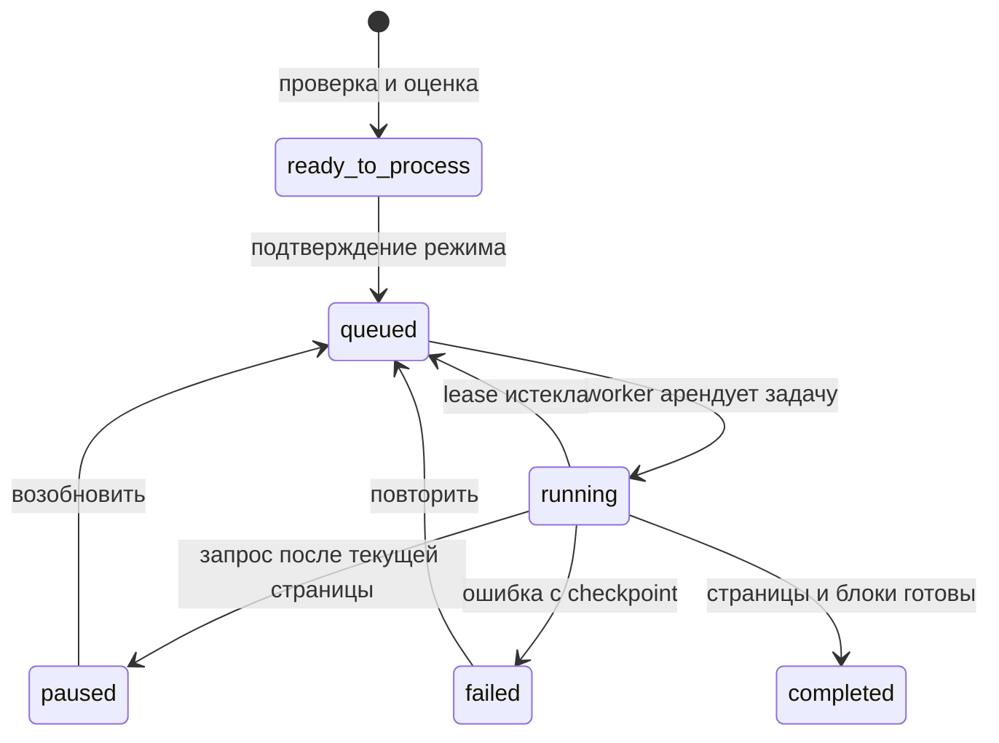

# Этап 5: загрузка и разбор материалов

Фактический контракт обновлён 25 августа 2026 года. Экзаменационный путь и общая
часть 5B реализованы. Для режима «Учебник» добавлен отдельный GPU-сервис на официальном
Blackwell-образе PaddleOCR 3.5; его доступность определяется health-check, а не
константой интерфейса. Облачные режимы не подключены.

## Что уже можно показать

1. Загрузить PDF, DOCX, TXT, MD, JPG, PNG или локальное аудио до 100 МБ; вставить текст,
   добавить снимок публичной веб-страницы или транскрипт публичного YouTube-видео.
2. Увидеть оценку страниц, OCR-страниц и времени, выбрать локальный режим и только потом
   запустить фоновый разбор.
3. Поставить задачу на паузу, возобновить или повторить после ошибки. После падения worker
   продолжает с постраничного checkpoint.
4. Открыть оригинал и безопасно построенный текст, bbox фрагментов, качество
   `native` / `ocr` / `ocr_low`, диагностику, поиск на странице, масштаб и закладки PDF.
5. Исправить текст страницы. Создаётся новая parse revision; исходный файл не меняется.
6. В глобальной Библиотеке увидеть физические материалы, качество и все использующие их
   проекты; перед удалением — последствия для проектов и эталонных ответов.
7. В «Вопросах экзамена» нажать «Импорт»: при нескольких материалах выбрать один, при
   одном сразу увидеть прокручиваемое превью, при отсутствии — загрузить. Подтверждение
   заменяет список; совпавшие вопросы сохраняют стабильные `ProgramNode.id` и данные.
8. Экзаменационный проект можно создать без списка вопросов через «Добавить вопросы
   позже», а затем заполнить тем же импортом из активного проекта.
9. В учебниковом черновике загрузить реальные источники, разобрать их, назначить роли,
   приоритет и инструкцию, удалить связь и продолжить черновик после перезапуска.
10. Создать из этого черновика активный учебниковый проект. Ручная программа может быть
    пустой: итоговая сводка показывает реальные источники, а дерево заполняется позже в
    разделе «Программа»; построение по outline/проходу 1 остаётся этапом 7.

На приложенном `questions-photo.png` worker получил 48 нумерованных OCR-фрагментов,
quality `ocr`, среднюю confidence `0.9636`. Импорт выделяет все 48 вопросов, в том числе
OCR-строки без пробела после `41)`, и показывает повторяющиеся формулировки. OCR ошибается в отдельных
терминах, поэтому оригинал всегда остаётся рядом.

## Данные и миграции

- `Material` — физический источник установки: SHA-256, storage path, тип входа, URL и дата
  получения, страницы, outline, активная parse revision, качество и диагностика.
- `ProjectMaterial` — использование источника конкретным проектом: отображаемое имя,
  роль, приоритет, инструкция и назначения.
- Вкладка «Файл» редактирует эти поля через существующий `PATCH` материала и получает
  `attached_at` из `ProjectMaterial.created_at`; даты физической загрузки и изменения
  остаются полями общего `Material`.
- При назначении нового файла эталонными ответами подтверждённая замена выполняется в
  одной транзакции: со старой связи снимается `reference_answers` (пустое назначение
  становится `study_source`), затем новое назначение применяется к текущему файлу.
  Без `replace_reference_answers=true` действует прежний конфликт одного файла ответов.
- `MaterialPage`, `MaterialFragment`, `MaterialBlock` — версионированный результат
  разбора; bbox нормализован в `0..1`. Фрагмент хранит `recognition_source`
  (`native · ocr · vl · manual`), `confidence` и исходный `asset_path` для изображения,
  формулы или таблицы. Миграция `20260825_0020` совместима со старыми ревизиями и
  разрешает импортированный эталон без текста, если ответ целиком находится в изображении.
- `ProcessingTask` — очередь, стадия, прогресс, checkpoint, lease, pause и ошибка.
- `ProgramNode.origin_material_id` — происхождение импортированного пункта экзамена.

Миграции: `20260810_0005` и `20260810_0006`. Миграция 0006 проверена не только на
пустой базе, но и на копии рабочей SQLite этапов 2–5A. Из-за ограничения SQLite nullable
происхождение вопроса добавляется без перестройки таблицы; очистку при физическом
удалении материала выполняет триггер `tr_material_delete_program_origin`.

## Конвейер и восстановление



Worker арендует старейшую задачу на 60 секунд. Страница и новый checkpoint записываются
одной транзакцией. Повтор идемпотентен по `(material_id, revision, page_number)`, а
активная revision переключается только после успешной сегментации всего документа.
Сохранённая checkpoint-страница сразу получает временные блок и фрагменты и читается по
`task_id`; незавершённая следующая страница остаётся состоянием ожидания. Финальная
сборка заменяет временную постраничную структуру.

Общий адаптер возвращает `ParsedPage`: Markdown, plain text, элементы, координаты,
иерархию, confidence и необязательные временные метки. Поэтому PDF, OCR, HTML,
YouTube и аудио дальше используют одинаковые страницы, фрагменты и блоки.

## Входы и качество

- PDF в режиме «Быстро»: PyMuPDF/PyMuPDF4LLM извлекают нативный текст и координаты,
  PP-OCRv5 запускается только на встроенных растровых областях; целиком OCR-ится лишь
  страница без текстового слоя. Результаты объединяются по координатам, нативный текст
  выигрывает у совпавшего OCR, но исходный вырез изображения сохраняется.
- PDF в режиме «Учебник»: CPU-worker постранично отправляет рендер в локальный HTTP
  сервис `textbook-ocr` (Compose profile `textbook`), concurrency и batch равны 1,
  precision `fp16`. PaddleOCR-VL 1.6 возвращает заголовки, текст, LaTeX, Markdown-таблицы
  и изображения в общую модель. При OOM сервис переключает тот же режим на
  PP-StructureV3 + PP-FormulaNet Plus и сообщает фактический исполнитель через health.
- DOCX: стили заголовков; TXT/MD: markdown- и нумерованные заголовки; изображения: одна
  OCR-страница.
- URL: безопасный снимок читаемого HTML, исходная ссылка и дата. Localhost, private и
  loopback адреса запрещены, редирект проверяется повторно.
- YouTube: субтитры `ru/en` с временными метками. Блокировка IP самим YouTube возвращается
  отдельным штатным сообщением; материал не создаётся частично.
- Аудио: локальный `faster-whisper`, CPU int8, сегменты с временем. Реальный smoke-test
  короткой русской записи распознал обе фразы и границы `0–5.5` / `5.5–11.0` секунд.
- Формулы и низкая confidence показываются как диагностика, а не как обещание точности.

## Удаление и версии

Удаление связи в проекте не удаляет общий файл. Физическое удаление выполняется только из
Библиотеки после preview последствий. Страницы, фрагменты и блоки удаляются cascade;
эталонный ответ сохраняет текст и подпись источника, но теряет `source_material_id`.
Происхождение пунктов программы обнуляется. Будущие привязки и покрытие добавляются на
этапе 8, поэтому их перенос при коррекции сейчас неприменим.

## HTTP-контракт

- `GET /api/materials`, `GET /api/materials/{id}/delete-preview`, `DELETE /api/materials/{id}`
- `GET /api/material-capabilities`
- `GET|POST /api/projects/{projectId}/materials`
- `POST .../materials/text`, `POST .../materials/external`
- `GET|PATCH|DELETE .../materials/{materialId}`
- `POST .../{materialId}/processing`, `POST .../processing/{pause|resume|retry}`
- `GET .../{materialId}/pages/{pageNumber}`, `PUT .../pages/{pageNumber}/text`
- `GET .../{materialId}/pages/{pageNumber}/image`
- `POST .../{materialId}/reference-answer-import`
- `GET .../{materialId}/exam-program-preview`, `POST .../{materialId}/exam-program-import`

## Осознанная граница

- «Учебник» видим всегда: доступен только при готовом локальном GPU-сервисе, иначе API
  и панель показывают точную причину. Модели хранятся в `data/models`; неполная ревизия
  после сбоя/OOM не активируется.
- Установка локальных весов относится к будущему глобальному разделу `Параметры → OCR`,
  а не к форме разбора файла. Он будет показывать комплекты «Быстро» и «Учебник»,
  прогресс/ошибку загрузки, объём и фактический исполнитель; пока комплект подготавливает
  разработчик, `GET /api/material-capabilities` остаётся единственным источником
  доступности режима.
- «Облако», «Максимум», «Эксперт» — этап 7.
- FTS5/BM25 и документный поиск — этап 6; сейчас поиск работает внутри открытой страницы.
- Построение программы учебника по outline/проходу 1 — этап 7.
- Привязки, дельта дозагрузки и покрытие — этап 8.
- Бот/инбокс — поздний интеграционный этап.

## Проверки

```bash
cd backend
python -m ruff check .
python -m pytest -q
python scripts/check_stage5.py

cd ..
python backend/scripts/check_stage2.py
python backend/scripts/check_stage3.py
python backend/scripts/check_stage4.py
npm run lint
npm run typecheck
npm run build
```

`check_stage5.py` проверяет upload/process, импорт эталонов, preview и замену вопросов,
сохранение стабильных id, происхождение, коррекцию страницы новой ревизией, реальную
Библиотеку, физическое удаление без потери эталонов, восстановление lease, миграцию и
`foreign_key_check`. Браузерный smoke-test отдельно проходит Библиотеку и диалог импорта.
