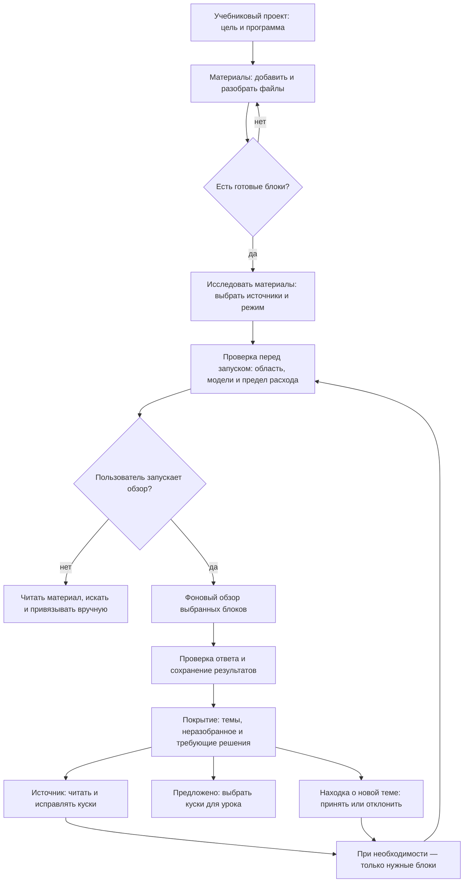
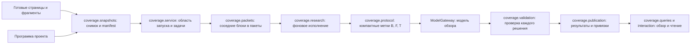
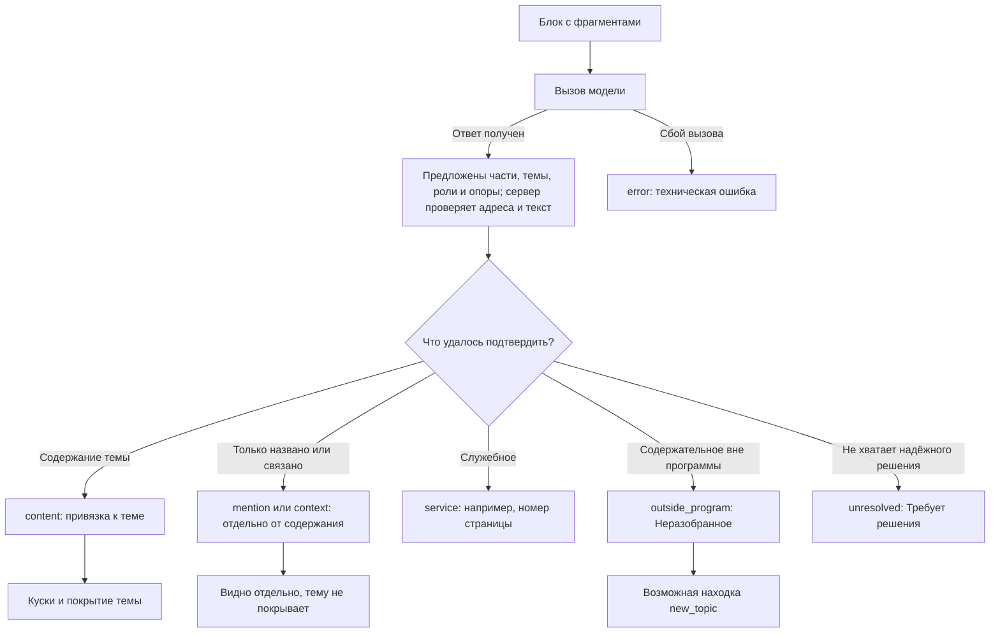
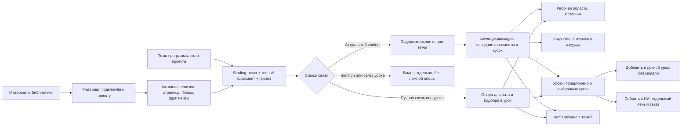
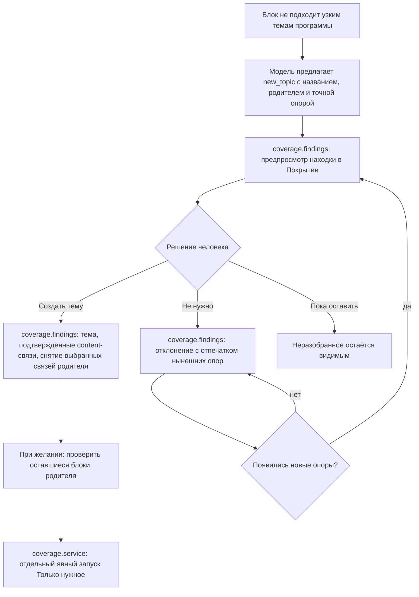

# Как работает исследование материалов (проход 2)

> Состояние на 29.09.2026 в ветке `codex/pass-two-next`. Этот документ объясняет
> работающий первичный обзор и служит основой для руководства пользователя. Живой
> повторный прогон на «Мат логике» после последних правок ещё не проводился. Углубление,
> синтез всей коллекции, Карта и Граф остаются следующими этапами.

## Зачем нужен проход 2

У учебникового проекта есть **программа** — дерево тем, по которому человек хочет
учиться. У него есть **материалы** — учебники, методички и конспекты. Разбор файла уже
умеет получить страницы и текст, но ещё не знает, какой абзац действительно объясняет
конкретную тему. Проход 2 исследует подготовленный текст относительно текущей программы:
последовательно рассматривает блоки выбранных материалов, предлагает связи с темами и
оставляет человеку проверяемый результат.

Например, тема программы — «СКНФ и СДНФ». Поиск слова «СДНФ» найдёт заголовок,
определение, упражнение и строку в оглавлении. Исследование различает эти случаи:
определение и разбор построения становятся содержанием темы, строка оглавления —
упоминанием, а номер страницы — служебной частью. Несколько соседних связанных абзацев
показываются одним **куском**, который можно прочитать целиком или взять в урок.

Представим четыре блока методички: «1.13. Совершенные формы» с определением,
«Пример построения СДНФ», «Вопросы для повторения: что такое СДНФ?» и «Нечёткая
логика». Первые два дадут материал для темы «СКНФ и СДНФ»; вопрос только упоминает
тему, а последняя глава может оказаться вне программы. В «Источнике» определения и
пример будут читаемыми кусками, а в «Неразобранном» появится глава, которую человек
может оставить вне цели или превратить в новую тему. Это иллюстрация ожидаемого
разбора, а не обещание безошибочного решения модели.

Исследование помогает ответить на три разных вопроса:

1. **Что читать по каждой теме?** «К чтению» и вкладка «Источник» показывают куски в
   порядке книги, с указанием материала и страниц.
2. **Что осталось без объяснения?** «Пробелы» показывают темы без актуального содержания
   у самой темы и её подтем. Это подсказка, где искать материал или создать его вручную.
3. **Что есть в книге сверх программы?** «Неразобранное» показывает содержательные
   блоки вне нынешней программы, отдельно от ошибок и нерешённых блоков.

Доля отнесённого материала **не обязана быть 100%**: книга может содержать полезные главы
вне учебной цели. Числа описывают результат измерения, а не оценку качества книги.

## Слова, которые легко перепутать

| Слово | Значение здесь |
| --- | --- |
| Тема программы | Узел утверждённой программы учебникового проекта. Это не экзаменационный вопрос. |
| Материал | Подключённый к проекту учебник, методичка или конспект. Его роль — основной, дополнительный или справочный — влияет на порядок показа, но не запрещает исследование. |
| Блок | Структурная единица подготовленного материала: например, часть раздела. Проход 2 рассматривает блоки, а не результаты одного поискового запроса. |
| Фрагмент | Точный адрес текста или изображения внутри блока. Привязка хранится к фрагменту. |
| Привязка | Связь фрагмента с темой **в конкретном проекте**: с происхождением, смысловым видом и, для результата исследования, опорой. |
| Кусок | Несколько соседних привязанных фрагментов одной темы, показанных как связный отрезок материала. Это способ чтения и выбора, отдельной записи куска в базе нет. |
| Опора | Фрагмент, по которому можно проверить, почему текст отнесён к теме. Не всякое упоминание темы является опорой для изучения. |

## Общий путь пользователя

Здесь **разбор файла** создаёт пригодный для чтения текст; надпись «файл разобран» ещё
не означает «содержание исследовано». Проверка перед запуском бесплатна: она считает
блоки, проверяет снимок и настройки, но не обращается к модели. Вызовы модели начинаются
после явного запуска. После обзора человек сверяет сомнительные места с исходной
страницей и решает, какие связи и новые темы оставить.

### Как запустить и что ожидать

1. В учебниковом проекте составьте программу и дождитесь готового разбора нужных
   файлов в «Материалах». Можно выбрать только один учебник, даже если подключено три.
2. Откройте «Исследовать материалы» в Материалах или Покрытии. Диалог покажет готовые
   источники, число блоков **«Только нужное»** и **«Всё заново»**, модель обзора и предел
   расхода. Неготовые файлы в запуск не войдут.
3. Для нового источника подходит полный обзор. Для уже исследованного сначала проверьте
   «Только нужное»: это новые, устаревшие, нерешённые или сбойные блоки. Если их ноль,
   такой запуск недоступен; полный повтор возможен отдельно и вновь тратит вызовы.
4. Нажмите «Начать обзор». Он идёт фоновой задачей: можно видеть прогресс выбранной
   области, поставить на паузу, продолжить или отменить. Если упёрлись в лимит,
   продолжение может потребовать нового предела. Уже сохранённые решения доступны.
5. Откройте «Покрытие → Обзор»: сначала посмотрите распределение всех блоков и список
   «Где нужна помощь», затем «К чтению», «Пробелы» и «Неразобранное». Процент «среди
   разобранных» читайте вместе с числами нерешённых и ещё не рассмотренных блоков.

Если модель для прохода 2 не настроена, запуск недоступен. Сохранённое покрытие,
обычное чтение, поиск и ручные привязки остаются доступны. Проход 2 сейчас показан в
учебниковом проекте; экзаменационная карта ответов — отдельный интерфейс.

## Что происходит внутри обзора

| Узел схемы | Что делает и почему это видно пользователю |
| --- | --- |
| Готовые страницы и фрагменты | Разбор материала дал текст, структуру и адрес исходной страницы. Номер страницы не выдаётся модели как содержание; изображение с проверяемым описанием можно рассмотреть как текст. |
| Программа проекта | Даёт список тем текущей цели. Проход 2 выбирает тему из этой программы, а не создаёт её автоматически. |
| `coverage.snapshots` | Фиксирует выбранные ревизии материалов и программу. Если источник или программа изменились во время работы, старый запуск не продолжает читать новый текст как прежний. |
| `coverage.service` | Бесплатно проверяет область и настройки, затем создаёт запуск и фоновые задачи. Режим «Только нужное» берёт лишь требующие проверки блоки и явно добавленные блоки. |
| `coverage.packets` | Складывает соседние блоки одного материала в ограниченные по размеру пакеты; очень большой блок режет на последовательные интервалы. Это даёт контекст без отдельного вызова на каждую строку. |
| `coverage.research` | Исполняет задачи, проверяет снимок перед чтением, учитывает паузу, остановку, попытки и лимиты. Блок считается рассмотренным только после полного разбора его фрагментов. |
| `coverage.protocol` | Передаёт модели блоки `B`, фрагменты `F` и темы `T`; раскрывает диапазоны и метки ответа обратно в точные адреса. |
| `ModelGateway` | Отправляет подтверждённый запрос выбранной модели роли `coverage_overview`. Текст блоков и дерево тем передаются настроенному провайдеру; при внешнем провайдере они уходят за пределы устройства. Запас на ответ и повторные попытки учитываются в лимите. |
| `coverage.validation` | Проверяет каждое решение и его опоры отдельно. Неверная связь или цитата не должны уничтожать остальные годные связи блока; непроверенный остаток остаётся видимым. |
| `coverage.publication` | Записывает исходы блоков, находки и машинные привязки только после проверки. Ручные решения и запреты человека имеют приоритет. |
| `coverage.queries` и `interaction` | Собирают распределение, темы и точные опоры для экрана. Данные других блоков сохраняются при частичном запуске. |

Это **первичный обзор**. В настройках есть отдельная роль `coverage_research` для
будущего углубления, но текущий исполнитель пакета вызывает `coverage_overview`.
Углубление и синтез коллекции в показанный алгоритм пока не входят.

### Что именно решается по блоку

**`content`** означает, что фрагмент действительно раскрывает тему; он может стать
опорой чтения, поиска «Связано с темой» и кандидатом для урока. **`mention`** — тема
лишь названа, например в оглавлении или списке вопросов. **`service`** — служебный
элемент. **`outside_program`** не является ошибкой: такой блок образует
«Неразобранное». **`unresolved`** и **`error`** требуют проверки или повторного запуска.
В смешанном блоке проверенная часть может быть опубликована, даже если другая часть
осталась нерешённой.

Модель может ошибиться в классификации. Поэтому у связи есть точный исходный фрагмент,
а меню решения позволяет подтвердить, снять, скрыть, переназначить или изменить роль
связи; действие по куску применяется ко всем его привязкам с одной отменой. Простое
чтение куска ничего не подтверждает.

## Как привязка проходит через учебник и проект

| Узел схемы | Его роль |
| --- | --- |
| Материал в Библиотеке | Файл может существовать независимо от проекта. Сам факт хранения или подключения ещё не привязывает его текст к темам. |
| Материал подключён к проекту | Проект выбирает источник и его роль. Основной обычно показывается раньше дополнительного и справочного; исследовать можно любой готовый источник. |
| Активная ревизия | Даёт адрес страницы, блока и фрагмента. При смене ревизии прежние опоры этого источника устаревают; результаты других источников сохраняются. |
| Тема программы этого проекта | Цель связи. Один и тот же учебник в разных проектах может соотноситься с разными программами. |
| `Binding` | Хранит `project_id`, `program_node_id`, `fragment_id`, источник, состояние, происхождение (`pass_two`, ручное, урок) и смысловой вид (`content`, `mention` и др.). Это точная связь, а не совпадение слов. |
| Содержательная и ручная опоры / отдельно | Показатель покрытия темы считает актуальный `content`. Чат и кандидаты урока дополнительно принимают явную ручную привязку не из урока. Упоминание, скрытая связь и привязка, созданная самим уроком, не должны кормить подбор или чат как доказательство темы. |
| `coverage.passages` | Группирует соседние привязки в читаемые куски без потери точных адресов. Граница куска зависит от порядка книги, темы, роли и длины. |
| «Источник» | Показывает связный текст, исходную страницу, другие источники темы и позволяет исправить связь. |
| «Покрытие» | Учитывает актуальное содержание темы; показывает пробелы, нерешённое и содержательные блоки вне программы отдельно. |
| «Предложено» / урок | Позволяет отметить несколько кусков и добавить их в ручной урок без вызова модели либо явно заказать ИИ-сборку урока из выбранного. Выбранные человеком куски остаются в черновике целиком. |
| «Добавить в ручной урок» / «Собрать с ИИ» | Это два разных действия после выбора кусков. Первое вставляет текст без модели, второе запускает отдельную задачу сборки урока. |
| Чат «Связано с темой» | Получает материал через те же правила опоры; одна строка оглавления не должна заполнять область чата. |

У привязки есть происхождение и степень участия человека: машинную можно подтвердить
или снять; ручная и подтверждённая связь не заменяются очередным результатом worker.
Если человек выбрал кусок для урока, сам урок создаёт свои связи для навигации, но они
не делают тему «покрытой» повторно и не становятся материалом для следующей ИИ-сборки.
Ручная привязка текста вне урока служит опорой для чата и подбора в урок; сам показатель
покрытия программы требует `content`. Добавление куска в урок не означает,
что человек подтвердил все машинные выводы прохода 2.

## Находки и доисследование после изменения программы

Предложение новой темы **не правит программу само**. В предпросмотре можно изменить
название и родителя, выбрать точные фрагменты, при необходимости снять выбранные старые
связи широкой родительской темы. «Создать тему и привязать» выполняет это одним
действием с общей отменой. «Не нужно» запоминает предложение вместе с его нынешними
опорами: повтор того же предложения на том же тексте не возвращается, а новые основания
можно рассмотреть снова. После создания темы старые блоки не перечитываются
автоматически и без согласия на расход: кнопка лишь подготавливает новый запуск.
`coverage.findings` отвечает за группировку, предпросмотр, применение и отклонение
находок; `coverage.service` строит область следующего запуска, а не применяет находку.

Новая тема рядом с прежними не делает весь материал устаревшим. Если тему
переименовать, машинные связи именно с ней требуют перепроверки; связи с другими
темами сохраняются. Изменение самого источника устаревляет его опоры. «Только нужное»
берёт блоки со статусами `pending`, `stale`, `unresolved`, `error` и явно выбранные для
повторной проверки; готовые блоки других источников не стираются.

## Чем это отличается от обычного поиска

| Задача | Поиск по материалам | Исследование, проход 2 |
| --- | --- | --- |
| Вопрос | «Где встретилось это слово или близкий по смыслу текст?» | «Как весь выбранный материал относится к моей программе?» |
| Область | Запрос и его результаты | Каждый блок выбранных готовых источников в области запуска |
| Результат | Найденные места для текущего запроса | Сохранённые исходы блоков, проверяемые связи, куски, пробелы и находки |
| Оглавление и случайное упоминание | Могут попасть в выдачу | Отделяются от содержательных опор, если классификация верна |
| Расход и время | Подходит для быстрого точечного вопроса; базовый поиск работает локально | Фоновый обзор вызывает настроенную модель после явного запуска и может стоить денег |
| Когда лучше | Нужно найти одно определение, проверить цитату или заполнить один пробел | Нужно понять распределение целой книги по программе и повторно использовать найденное в чтении и уроках |

Практический порядок: если нужен ответ на один вопрос, начните с поиска и проверьте
страницу. Если строите обучение по книге, подготовьте программу и исследуйте один
подходящий источник, затем посмотрите «Пробелы» и «Неразобранное». После правки
программы или добавления материала обычно выбирайте «Только нужное». Машинную связь
проверяйте по тексту перед включением в важный урок; спорные места можно исправить
вручную. Поиск остаётся способом найти то, что обзор пропустил или пока не исследовал.

## Где участвует ИИ и что остаётся под контролем человека

- **Разбор файла** предшествует проходу 2. Способ распознавания зависит от выбранного
  режима обработки файла; это отдельная операция, а не часть исследовательского
  запуска.
- **Проход 2** посылает выбранной модели текст пакетов и дерево тем через
  `ModelGateway`. Модель предлагает классификацию, роли, связи и находки; сервер
  проверяет адреса и сохраняет допустимые части. При отсутствии настроенной модели
  платный запуск не происходит.
- **Поиск и ручные действия** позволяют пользоваться проектом без прохода 2. Просмотр,
  исправление привязок, решение по находке и обычное добавление куска в урок сами по
  себе не вызывают модель прохода 2.
- **«Собрать с ИИ» из выбранных кусков** — отдельная команда уроков и отдельный вызов
  модели. Человек выбирает до 20 кусков в «Источнике» или «Предложено»; по умолчанию
  урок строится только из них. Сервер сохраняет все выбранные куски в черновике,
  даже если модель какой-то пропустила.

Модель не гарантирует верную связь и не меняет программу без действия человека.
Сохраняются причины остановки, нерешённые блоки и ссылки на исходный текст. Денежный
предел задаётся в диалоге запуска; пустое поле означает запуск без денежного потолка.
Проверка на новом живом прогоне «Мат логики» ещё нужна, поэтому примеры выше объясняют
контракт и прежние наблюдения, а не обещают измеренную точность последних правок.

## Куда смотреть за точным контрактом

- [Фактический контракт прохода 2](architecture/coverage-pass-two.md) — состояния,
  валидация, область запуска, публикация и решения.
- [Контракт уроков](architecture/lessons.md) — выбранные куски и ИИ-сборка.
- [Текущий интерфейс](../SCREENS.md) и [состояние ветки](../STATUS.md).
- [Разбор «Мат логики»](research/pass-two-matlogika-2026-09-29.md) — пример и
  границы измерений до нового живого прогона.
